# 🧭 Navigation Hub - When You're Lost in Code

> **START HERE when you're debugging, lost in code, or need to find something fast.**

This is your **single source of truth** for navigating the Polymarket indexer codebase.

## 🆘 Lost? Start Here

```mermaid
graph TD
    LOST[😵 I'm Lost!] --> WHAT{What do you need?}
    
    WHAT -->|Find a file| FILES[📁 File Navigator]
    WHAT -->|Understand flow| FLOW[🔄 Data Flow]
    WHAT -->|Fix a bug| DEBUG[🐛 Debug Guide]
    WHAT -->|Find function| FUNC[🔍 Function Index]
    WHAT -->|Learn system| LEARN[📚 Learning Path]
    
    FILES --> CODE[Jump to Code Section]
    FLOW --> DIAGRAMS[See Diagrams Section]
    DEBUG --> RUNBOOK[On-Call Runbook]
    FUNC --> INDEX[Function Reference]
    LEARN --> DOCS[Documentation Hub]
    
    style LOST fill:#ea4335,color:#fff
    style FILES fill:#4285f4,color:#fff
    style FLOW fill:#fbbc04
    style DEBUG fill:#ff6d00,color:#fff
    style FUNC fill:#34a853,color:#fff
    style LEARN fill:#9c27b0,color:#fff
```



---

## 📂 File Navigator - "Where is the code for X?"

### Entry Points (Start Your Journey Here)

| I Want To... | Go To File | Line Count | Purpose |
|--------------|-----------|------------|---------|
| **Start the indexer** | [cmd/indexer/main.go](../cmd/indexer/main.go) | 237 lines | Creates all components, starts syncer |
| **Start the consumer** | [cmd/consumer/main.go](../cmd/consumer/main.go) | 573 lines | Subscribes to NATS, writes to DB |
| **See example usage** | [examples/usage_example.go](../examples/usage_example.go) | - | How to use the indexer as library |
| **Run fork tests** | [test/fork_test.go](../test/fork_test.go) | - | Integration tests with Anvil |

### Core Logic - "The Brain"

| Component | File | Lines | What It Does | Key Functions |
|-----------|------|-------|--------------|---------------|
| **Syncer** | [internal/syncer/syncer.go](../internal/syncer/syncer.go) | 630 | **Orchestrator**: Manages block sync (backfill/realtime) | `Start()`, `runBackfill()`, `runRealtime()`, `syncToHead()` |
| **Processor** | [internal/processor/block_events_processor.go](../internal/processor/block_events_processor.go) | 288 | **Event Extractor**: Fetches logs from blockchain | `ProcessBlock()`, `ProcessBlockRange()`, `processLog()` |
| **Router** | [internal/router/event_log_handler_router.go](../internal/router/event_log_handler_router.go) | 98 | **Event Dispatcher**: Routes logs to handlers | `RouteLog()`, `RegisterLogHandler()` |
| **Handlers** | [internal/handler/events.go](../internal/handler/events.go) | 321 | **ABI Decoder**: Decodes events into structs | `HandleOrderFilled()`, `HandleTransferSingle()`, etc. |

### Infrastructure - "The Plumbing"

| Component | File | Lines | What It Does |
|-----------|------|-------|--------------|
| **Chain Client** | [internal/chain/on_chain_client.go](../internal/chain/on_chain_client.go) | 171 | RPC connection to Polygon, fetches blocks/logs |
| **NATS Publisher** | [internal/nats/publisher.go](../internal/nats/publisher.go) | 153 | Publishes events to JetStream |
| **Checkpoint DB** | [internal/db/checkpoint.go](../internal/db/checkpoint.go) | 133 | Saves sync progress (crash recovery) |
| **Config Loader** | [internal/util/init.go](../internal/util/init.go) | 110 | Loads config.toml, initializes logger |

### Data Models - "The Structures"

| File | Lines | What's Inside |
|------|-------|---------------|
| [pkg/models/event.go](../pkg/models/event.go) | 118 | `Event` struct (base type for all events) |
| [pkg/config/config.go](../pkg/config/config.go) | 82 | Chain config (RPC URLs, contracts, startBlock) |
| [pkg/contracts/CTFExchange.go](../pkg/contracts/CTFExchange.go) | 3566 | CTF Exchange ABI bindings (auto-generated) |
| [pkg/contracts/ConditionalTokens.go](../pkg/contracts/ConditionalTokens.go) | 1634 | Conditional Tokens ABI bindings (auto-generated) |
| [pkg/contracts/ERC20.go](../pkg/contracts/ERC20.go) | 489 | ERC20 ABI bindings (auto-generated) |

### Utilities - "The Helpers"

| File | Lines | Purpose |
|------|-------|---------|
| [pkg/txhelper/transaction.go](../pkg/txhelper/transaction.go) | 306 | Transaction parsing utilities |
| [pkg/service/ctf_service.go](../pkg/service/ctf_service.go) | 262 | CTF Exchange service layer |

---

## 🗺️ Code Map - Visual Directory Structure

```
polymarket-indexer/
│
├── 🚀 Entry Points
│   ├── cmd/indexer/main.go          ← START HERE for indexer
│   └── cmd/consumer/main.go         ← START HERE for consumer
│
├── 🧠 Core Logic (internal/)
│   ├── syncer/syncer.go             ← Block sync orchestrator (630 lines) ⭐
│   ├── processor/                   ← Event extraction
│   │   └── block_events_processor.go (288 lines)
│   ├── router/                      ← Event routing
│   │   └── event_log_handler_router.go (98 lines)
│   └── handler/                     ← ABI decoding
│       └── events.go                (321 lines)
│
├── 🔌 Infrastructure (internal/)
│   ├── chain/on_chain_client.go     ← RPC client (171 lines)
│   ├── nats/publisher.go            ← NATS publisher (153 lines)
│   ├── db/checkpoint.go             ← Checkpoint DB (133 lines) ⚠️ CRITICAL
│   └── util/init.go                 ← Config loader (110 lines)
│
├── 📦 Data & Contracts (pkg/)
│   ├── models/event.go              ← Event struct (118 lines)
│   ├── config/config.go             ← Chain config (82 lines)
│   ├── contracts/                   ← ABI bindings (auto-generated)
│   │   ├── CTFExchange.go           (3566 lines)
│   │   ├── ConditionalTokens.go     (1634 lines)
│   │   └── ERC20.go                 (489 lines)
│   ├── txhelper/transaction.go      ← TX utilities (306 lines)
│   └── service/ctf_service.go       ← CTF service (262 lines)
│
├── ⚙️ Configuration
│   ├── config.toml                  ← Runtime config (workers, batch size)
│   ├── config/chains.json           ← Chain data (RPC, contracts, startBlock)
│   └── docker-compose.yml           ← NATS + TimescaleDB
│
├── 🗄️ Database
│   └── migrations/
│       └── 001_initial_schema.up.sql ← Database schema
│
├── 📚 Documentation (docs/)
│   ├── MASTER_LEARNING_PATH.md      ← Complete learning guide ⭐
│   ├── COMPONENT_CONNECTIONS.md     ← How components connect
│   ├── DATABASE.md                  ← Database & checkpoints
│   ├── SYNCER_ARCHITECTURE.md       ← Sync strategies
│   └── ... (11 more docs)
│
├── 🧪 Testing
│   └── test/fork_test.go            ← Fork tests with Anvil
│
└── 📖 Quick Start
    ├── README.md                    ← Setup & quick start
    ├── QUICK_REFERENCE.md           ← Printable cheat sheet
    └── Makefile                     ← Build commands

Total: ~9,171 lines of Go code
```

---

## 🔄 Data Flow - "Follow the Data"

```mermaid
sequenceDiagram
    autonumber
    participant User as 🧑 You (debugging)
    participant M as 📁 main.go
    participant S as 🎯 Syncer
    participant P as 🔄 Processor
    participant R as 🧭 Router
    participant H as 🛠️ Handler
    participant N as 📨 NATS
    participant C as 💾 Consumer
    participant DB as 🗄️ TimescaleDB
    
    User->>M: Start indexer
    M->>M: Load config.toml & chains.json
    M->>M: Create: chainClient, natsPublisher, checkpointDB
    M->>M: Create: processor (creates router internally)
    M->>M: Create: syncer
    M->>S: syncer.Start(ctx)
    
    Note over S: 📍 FILE: internal/syncer/syncer.go (line 250)
    S->>S: GetOrCreateCheckpoint() → resume point
    S->>S: Determine mode: backfill or realtime?
    
    alt Backfill Mode (far behind)
        loop Process batches
            S->>P: ProcessBlockRange(from, to)
            Note over P: 📍 FILE: internal/processor/block_events_processor.go (line 150)
            P->>P: FilterLogs(blockRange, contracts)
            P->>R: For each log: RouteLog(log, timestamp, hash)
            Note over R: 📍 FILE: internal/router/event_log_handler_router.go (line 42)
            R->>R: Extract event signature (log.Topics[0])
            R->>H: handler(ctx, log, timestamp)
            Note over H: 📍 FILE: internal/handler/events.go (line 50+)
            H->>H: Decode ABI (unpack event data)
            H-->>R: Return payload
            R->>N: callback → Publish(event)
            Note over N: 📍 FILE: internal/nats/publisher.go (line 60)
            N-->>R: ACK
        end
    else Realtime Mode (near head)
        loop Every 2s
            S->>P: ProcessBlock(blockNum)
            Note over P: Same as above ↑
        end
    end
    
    Note over N,DB: Consumer Process
    N->>C: Subscribe to "POLYMARKET.events.*"
    Note over C: 📍 FILE: cmd/consumer/main.go (line 100)
    C->>C: Unmarshal JSON → Event{}
    C->>DB: INSERT INTO events (...)
    C->>DB: INSERT INTO order_fills (...) if OrderFilled
    C->>N: ACK message
```



**Key File References**:
- **Step 1-7**: [cmd/indexer/main.go](../cmd/indexer/main.go) (lines 1-150)
- **Step 8-10**: [internal/syncer/syncer.go](../internal/syncer/syncer.go) (lines 250-300)
- **Step 11-13**: [internal/processor/block_events_processor.go](../internal/processor/block_events_processor.go) (lines 150-220)
- **Step 14-16**: [internal/router/event_log_handler_router.go](../internal/router/event_log_handler_router.go) (lines 42-75)
- **Step 17-19**: [internal/handler/events.go](../internal/handler/events.go) (lines 50-321)
- **Step 20-21**: [internal/nats/publisher.go](../internal/nats/publisher.go) (lines 60-90)
- **Step 22-26**: [cmd/consumer/main.go](../cmd/consumer/main.go) (lines 100-300)

---

## 🔍 Function Index - "Where is that function?"

### Most Important Functions (You'll Debug These)

#### Syncer (`internal/syncer/syncer.go`)
```go
// Line ~250: Main entry point, loads checkpoint, determines mode
func (s *Syncer) Start(ctx context.Context) error

// Line ~320: Fast catch-up with worker pools
func (s *Syncer) runBackfill(ctx context.Context) error

// Line ~440: Low-latency polling mode
func (s *Syncer) runRealtime(ctx context.Context) error

// Line ~470: Process new blocks in realtime
func (s *Syncer) syncToHead(ctx context.Context) error

// Line ~540: Coordinate worker pool for batch processing
func (s *Syncer) processBatch(ctx context.Context, from, to uint64) error
```

#### Processor (`internal/processor/block_events_processor.go`)
```go
// Line ~150: Process single block
func (p *BlockEventsProcessor) ProcessBlock(ctx context.Context, blockNum uint64) error

// Line ~220: Process range of blocks
func (p *BlockEventsProcessor) ProcessBlockRange(ctx context.Context, from, to uint64) error

// Line ~250: Process individual log entry
func (p *BlockEventsProcessor) processLog(ctx context.Context, log types.Log, ...) error
```

#### Router (`internal/router/event_log_handler_router.go`)
```go
// Line ~42: THE KEY ROUTING METHOD
func (r *EventLogHandlerRouter) RouteLog(ctx context.Context, log types.Log, timestamp, hash) error

// Line ~36: Register event handlers
func (r *EventLogHandlerRouter) RegisterLogHandler(sig, name, handler)
```

#### Handlers (`internal/handler/events.go`)
```go
// Line ~50: OrderFilled event decoder
func HandleOrderFilled(ctx context.Context, log types.Log, timestamp uint64) (any, error)

// Line ~120: TransferSingle event decoder
func HandleTransferSingle(ctx context.Context, log types.Log, timestamp uint64) (any, error)

// Plus 7 more handlers for different event types
```

#### Chain Client (`internal/chain/on_chain_client.go`)
```go
// Line ~50: Fetch logs from blockchain
func (c *OnChainClient) FilterLogs(ctx context.Context, query ethereum.FilterQuery) ([]types.Log, error)

// Line ~80: Get latest block number
func (c *OnChainClient) GetLatestBlockNumber(ctx context.Context) (uint64, error)

// Line ~100: Get block by number
func (c *OnChainClient) GetBlockByNumber(ctx context.Context, number uint64) (*types.Block, error)
```

#### Checkpoint (`internal/db/checkpoint.go`)
```go
// Line ~60: Load or create checkpoint (CRITICAL for recovery)
func (db *CheckpointDB) GetOrCreateCheckpoint(ctx, serviceName, startBlock) (*Checkpoint, error)

// Line ~90: Save checkpoint after processing
func (db *CheckpointDB) UpdateBlock(ctx, serviceName, block, hash) error
```

#### NATS Publisher (`internal/nats/publisher.go`)
```go
// Line ~60: Publish event to JetStream
func (p *Publisher) Publish(ctx context.Context, event models.Event) error
```

---

## 🐛 Debug Scenarios - "Something's Wrong"

### Scenario 1: Indexer Not Processing Blocks

**Symptom**: `blocks_behind` metric not decreasing

**Debug Path**:
1. Check syncer is running
   ```bash
   curl http://localhost:8080/health
   ```

2. Check syncer logs
   ```bash
   docker logs polymarket-indexer --tail 50
   ```

3. **Debug in code**:
   - **File**: `internal/syncer/syncer.go`
   - **Function**: `Start()` (line ~250)
   - **Check**: Is checkpoint loading? (line ~257)
   - **Check**: Is `runBackfill()` or `runRealtime()` being called? (line ~280)

4. **Add debug logs**:
   ```go
   // internal/syncer/syncer.go, line ~260
   s.logger.Info().
       Uint64("current_block", s.currentBlock).
       Uint64("latest_block", latest).
       Uint64("behind", behind).
       Msg("DEBUG: Starting sync")
   ```

**Common Causes**:
- RPC rate limit → Check `chainClient.FilterLogs()` errors in `internal/processor/block_events_processor.go` line ~180
- Bad checkpoint → Check `internal/db/checkpoint.go` line ~60

---

### Scenario 2: Events Not Appearing in Database

**Symptom**: `SELECT COUNT(*) FROM events` returns 0 or low number

**Debug Path**:
1. **Check NATS has events**:
   ```bash
   curl http://localhost:8222/streaming/channelsz?subs=1
   ```
   Look for `msgs` count > 0

2. **Debug in code - Indexer Side**:
   - **File**: `internal/router/event_log_handler_router.go`
   - **Function**: `RouteLog()` (line ~42)
   - **Check**: Is handler being found? (line ~50)
   - **Check**: Is callback being called? (line ~70)
   
   Add debug log:
   ```go
   // internal/router/event_log_handler_router.go, line ~55
   fmt.Printf("DEBUG: Found handler for event: %s\n", r.eventNames[eventSig])
   ```

3. **Debug in code - Consumer Side**:
   - **File**: `cmd/consumer/main.go`
   - **Function**: Message handler callback (line ~150)
   - **Check**: Is consumer receiving messages?
   - **Check**: Is database insert succeeding?

**Common Causes**:
- Handler not registered → Check `internal/processor/block_events_processor.go` line ~120
- NATS connection broken → Check `internal/nats/publisher.go` line ~30
- Database connection broken → Check `cmd/consumer/main.go` line ~80

---

### Scenario 3: Duplicate Events

**Symptom**: Same event appears twice in database

**Debug Path**:
1. **Check for reorg**:
   ```sql
   SELECT block, block_hash, COUNT(*) 
   FROM events 
   WHERE tx_hash = 'PROBLEMATIC_TX_HASH'
   GROUP BY block, block_hash;
   ```
   If multiple block_hashes → reorg occurred

2. **Debug checkpoint**:
   - **File**: `internal/db/checkpoint.go`
   - **Function**: `UpdateBlock()` (line ~90)
   - **Check**: Is block_hash being saved correctly?

3. **Debug syncer**:
   - **File**: `internal/syncer/syncer.go`
   - **Function**: `runBackfill()` or `runRealtime()`
   - **Check**: Is checkpoint being updated AFTER processing? (line ~395 or ~520)

---

## 📚 Documentation Quick Links

| I Need To... | Read This | Time |
|--------------|-----------|------|
| **Learn the entire system** | [MASTER_LEARNING_PATH.md](../docs/MASTER_LEARNING_PATH.md) | 30 min |
| **Understand architecture** | [ARCHITECTURE.md](../docs/ARCHITECTURE.md) | 15 min |
| **See how components connect** | [COMPONENT_CONNECTIONS.md](../docs/COMPONENT_CONNECTIONS.md) | 20 min |
| **Understand database** | [DATABASE.md](../docs/DATABASE.md) | 25 min |
| **Understand syncer** | [SYNCER_ARCHITECTURE.md](../docs/SYNCER_ARCHITECTURE.md) | 20 min |
| **Fix production issue** | [MASTER_LEARNING_PATH.md](../docs/MASTER_LEARNING_PATH.md#on-call-runbook) | 10 min |
| **Quick reference** | [QUICK_REFERENCE.md](../QUICK_REFERENCE.md) | 5 min |

---

## 🎯 Common Tasks - "How do I...?"

### Add a New Event Handler

1. **Add event signature** in `internal/handler/events.go`:
   ```go
   var MyNewEventSig = crypto.Keccak256Hash([]byte("MyNewEvent(address,uint256)"))
   ```

2. **Create handler function** in `internal/handler/events.go`:
   ```go
   func HandleMyNewEvent(ctx context.Context, log types.Log, timestamp uint64) (any, error) {
       // Decode ABI
       // Return payload
   }
   ```

3. **Register handler** in `internal/processor/block_events_processor.go` (line ~120):
   ```go
   r.RegisterLogHandler(handler.MyNewEventSig, "MyNewEvent", handler.HandleMyNewEvent)
   ```

4. **Update consumer** in `cmd/consumer/main.go` to handle new event type

---

### Change Sync Configuration

1. **Edit** `config.toml`:
   ```toml
   [indexer]
   batch_size = 500        # Reduce from 1000 if slow
   poll_interval = "5s"    # Increase from 2s if rate limited
   workers = 3             # Reduce from 5 if overloading RPC
   ```

2. **Restart indexer**:
   ```bash
   docker restart polymarket-indexer
   ```

3. **Monitor**:
   ```bash
   curl http://localhost:8080/metrics | grep blocks_behind
   ```

---

### Manually Fix Checkpoint

1. **Connect to database**:
   ```bash
   docker exec -it polymarket-timescaledb psql -U polymarket
   ```

2. **Check current checkpoint**:
   ```sql
   SELECT * FROM checkpoints WHERE service_name = 'polymarket-indexer';
   ```

3. **Rollback if needed**:
   ```sql
   UPDATE checkpoints 
   SET last_block = 20560000  -- Roll back to known good block
   WHERE service_name = 'polymarket-indexer';
   ```

4. **Restart indexer** to resume from new checkpoint

---

## 🗂️ Configuration Files Map

| File | Purpose | When to Edit |
|------|---------|--------------|
| `config.toml` | Runtime behavior (workers, batch size, poll interval) | Tuning performance |
| `config/chains.json` | Chain data (RPC URLs, contracts, startBlock) | Adding RPC, changing contracts |
| `docker-compose.yml` | Infrastructure (NATS, TimescaleDB) | Changing ports, scaling |
| `.env` (create if needed) | Secrets (RPC keys, DB passwords) | Production deployment |
| `migrations/001_initial_schema.up.sql` | Database schema | Adding tables/columns |

---

## 🚨 Emergency Contacts & Commands

### Quick Health Checks
```bash
# Indexer health
curl http://localhost:8080/health

# Indexer metrics
curl http://localhost:8080/metrics | grep -E "(blocks_behind|syncer_height|chain_height)"

# NATS health
curl http://localhost:8222

# Database connection
docker exec -it polymarket-timescaledb psql -U polymarket -c "SELECT version();"

# Check sync progress
docker exec -it polymarket-timescaledb psql -U polymarket -c "SELECT * FROM checkpoints;"
```

### Emergency Restarts
```bash
# Restart indexer
docker restart polymarket-indexer

# Restart consumer
docker restart polymarket-consumer

# Restart all infrastructure
docker-compose restart

# Full reset (DANGER: loses data)
make infra-down
make infra-up
make migrate-up
```

---

## 📊 Codebase Statistics

| Metric | Value |
|--------|-------|
| **Total Go Files** | 20 files |
| **Total Lines of Code** | ~9,171 lines |
| **Core Logic** | ~1,700 lines (syncer, processor, router, handler) |
| **Infrastructure** | ~567 lines (chain, nats, db, util) |
| **Auto-Generated** | ~5,689 lines (contract bindings) |
| **Entry Points** | 810 lines (main.go files) |
| **Average File Size** | ~458 lines |
| **Largest File** | CTFExchange.go (3566 lines - auto-generated) |
| **Most Critical File** | syncer.go (630 lines) |

---

## 🎓 Learning Checklist

Use this to track your code navigation skills:

- [ ] I can find where the indexer starts ([cmd/indexer/main.go](../cmd/indexer/main.go))
- [ ] I can find where blocks are fetched ([internal/syncer/syncer.go](../internal/syncer/syncer.go))
- [ ] I can find where events are extracted ([internal/processor/block_events_processor.go](../internal/processor/block_events_processor.go))
- [ ] I can find where events are routed ([internal/router/event_log_handler_router.go](../internal/router/event_log_handler_router.go))
- [ ] I can find where events are decoded ([internal/handler/events.go](../internal/handler/events.go))
- [ ] I can find where checkpoints are saved ([internal/db/checkpoint.go](../internal/db/checkpoint.go))
- [ ] I can trace an event from blockchain to database
- [ ] I can add debug logs in the right places
- [ ] I can modify configuration without breaking things
- [ ] I can fix a production issue using this guide

---

## 🔗 Related Resources

- **Main Documentation**: [docs/MASTER_LEARNING_PATH.md](../docs/MASTER_LEARNING_PATH.md)
- **Quick Reference**: [QUICK_REFERENCE.md](../QUICK_REFERENCE.md)
- **All Docs Index**: [docs/DOCUMENTATION_INDEX.md](../docs/DOCUMENTATION_INDEX.md)
- **GitHub Issues**: Report bugs or ask questions
- **Slack**: #polymarket-indexer

---

**Last Updated**: January 1, 2026  
**Maintained By**: Polymarket Indexer Team  
**Bookmark This Page**: You'll use it every day! 🔖
