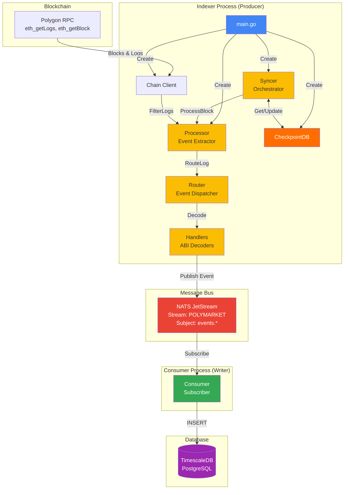
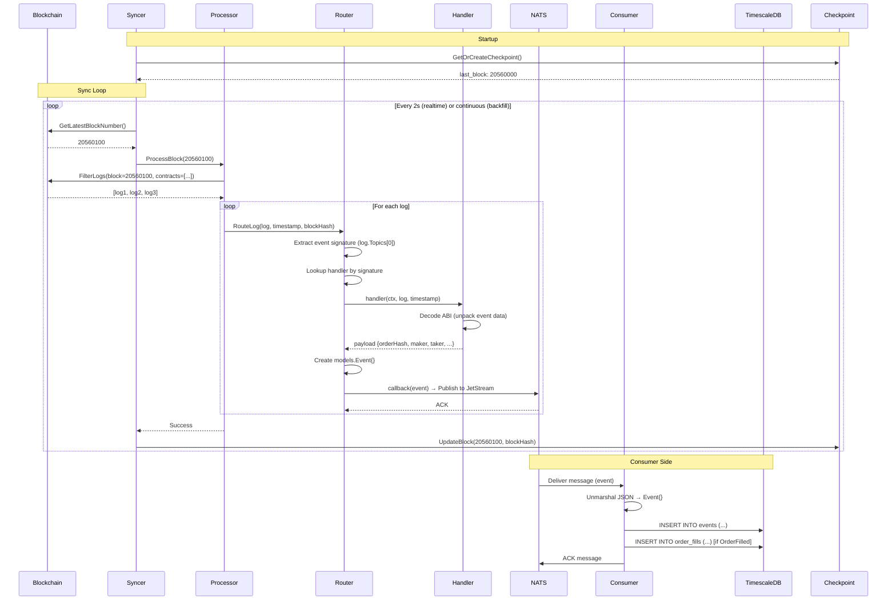
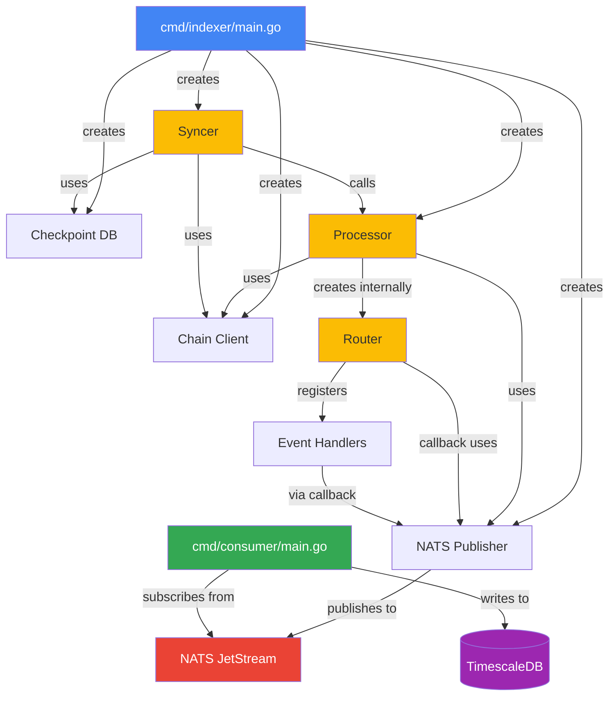

# Component Connections - Polymarket Indexer

## Overview

This document explains how the core components of the Polymarket indexer connect and interact with each other.

## High-Level Architecture (Mermaid)



## Sequence Diagram: Complete Event Flow



## Component Dependency Graph



## ASCII Architecture Diagram

```
┌─────────────────────────────────────────────────────────────────────────┐
│                    POLYMARKET INDEXER ARCHITECTURE                       │
└─────────────────────────────────────────────────────────────────────────┘

┌─────────────────────────────────────────────────────────────────────────┐
│                          PRODUCER SIDE (Indexer)                         │
└─────────────────────────────────────────────────────────────────────────┘

┌──────────────────┐
│  cmd/indexer     │  Main Entry Point
│    main.go       │  - Initializes all components
└────────┬─────────┘  - Sets up graceful shutdown
         │            - Starts HTTP server for /health and /metrics
         │
         │ 1. Creates & Configures
         ├─────────────────────────────────────────────┐
         │                                             │
         ▼                                             ▼
┌──────────────────┐                          ┌──────────────────┐
│  Chain Client    │                          │  NATS Publisher  │
│ (chain.Client)   │                          │ (nats.Publisher) │
├──────────────────┤                          ├──────────────────┤
│ - RPC Connection │                          │ - JetStream      │
│ - FilterLogs()   │                          │ - Publish()      │
│ - GetBlock()     │                          │ - Stream Setup   │
└──────────────────┘                          └──────────────────┘
         │                                             │
         │                                             │
         │ 2. Passes to Processor                     │
         ├─────────────────────────────────────────────┤
         │                                             │
         ▼                                             ▼
┌──────────────────────────────────────────────────────────────┐
│                    PROCESSOR                                  │
│              (processor.BlockEventsProcessor)                 │
├──────────────────────────────────────────────────────────────┤
│  Created by: main.go (processor.New)                         │
│  Receives:   chainClient, natsPublisher, config              │
│  Contains:   router                                           │
│                                                               │
│  Flow:                                                        │
│  1. ProcessBlock(blockNumber)                                │
│  2. FilterLogs() → Get events from chain                     │
│  3. For each log: processLog()                               │
│  4.   → router.Route(log)                                    │
│  5.     → handler decodes event                              │
│  6.     → callback publishes to NATS                         │
└───────────────────────┬──────────────────────────────────────┘
                        │
                        │ 3. Contains internally
                        ▼
            ┌───────────────────────┐
            │       ROUTER          │
            │   (router.Router)     │
            ├───────────────────────┤
            │ Created by: processor │
            │ Purpose: Route events │
            │          to handlers  │
            │                       │
            │ Maps:                 │
            │  Event Sig → Handler  │
            │  0x123... → OrderFill │
            │  0x456... → Transfer  │
            └───────────┬───────────┘
                        │
                        │ 4. Calls handlers
                        ▼
            ┌───────────────────────┐
            │      HANDLERS         │
            │  (handler package)    │
            ├───────────────────────┤
            │ - OrderFilled         │
            │ - TransferSingle      │
            │ - TokenRegistered     │
            │ etc.                  │
            │                       │
            │ Each handler:         │
            │ 1. Decodes ABI        │
            │ 2. Creates Event{}    │
            │ 3. Calls callback     │
            │    (publishes to NATS)│
            └───────────────────────┘
         │
         │ 5. Passed to Syncer
         ▼
┌──────────────────────────────────────────────────────────────┐
│                         SYNCER                                │
│                   (syncer.Syncer)                             │
├──────────────────────────────────────────────────────────────┤
│  Created by: main.go (syncer.New)                            │
│  Receives:   chainClient, processor, checkpoint, config      │
│                                                               │
│  Orchestrates:                                                │
│  - Start() → Load checkpoint                                 │
│  - runBackfill() or runRealtime()                            │
│  - Calls: processor.ProcessBlock(blockNum)                   │
│  - Saves checkpoints after processing                        │
│                                                               │
│  Modes:                                                       │
│  ┌─────────────────┐         ┌─────────────────┐            │
│  │  BACKFILL       │         │  REALTIME       │            │
│  │  - Batch: 1000  │  <───>  │  - Poll: 2s     │            │
│  │  - Workers: 5   │ Switch  │  - Sequential   │            │
│  └─────────────────┘         └─────────────────┘            │
└───────────────────────────────────────────────────────────────┘
         │
         │ 6. Syncer calls processor for each block
         │
         └──────> processor.ProcessBlock(blockNumber)
                  processor.ProcessBlockRange(from, to)


┌─────────────────────────────────────────────────────────────────────────┐
│                      MESSAGE BUS (NATS JetStream)                        │
└─────────────────────────────────────────────────────────────────────────┘

                    ┌──────────────────────┐
                    │   NATS JetStream     │
                    │                      │
                    │  Stream: POLYMARKET  │
                    │  Subject: events.*   │
                    │                      │
                    │  Durability: Yes     │
                    │  Retention: 7 days   │
                    └──────────┬───────────┘
                               │
                               │ Decouples Producer & Consumer
                               │
                               ▼

┌─────────────────────────────────────────────────────────────────────────┐
│                      CONSUMER SIDE (Database Writer)                     │
└─────────────────────────────────────────────────────────────────────────┘

┌──────────────────┐
│  cmd/consumer    │  Consumer Entry Point
│    main.go       │  - Subscribes to NATS
└────────┬─────────┘  - Writes to TimescaleDB
         │            - Runs independently from indexer
         │
         │ 1. Subscribes to NATS stream
         │
         ▼
┌──────────────────────────────────────────────────────────────┐
│                    NATS SUBSCRIBER                            │
│                 (nats.Subscribe)                              │
├──────────────────────────────────────────────────────────────┤
│  - Connects to JetStream                                     │
│  - Subscribes to "POLYMARKET.events.*"                       │
│  - Receives events as JSON                                   │
│  - For each message:                                         │
│    1. Unmarshal Event{}                                      │
│    2. Insert into TimescaleDB                                │
│    3. Ack message                                            │
└──────────────────────────────────────────────────────────────┘
         │
         │ 2. Writes to database
         ▼
┌──────────────────────────────────────────────────────────────┐
│                    TIMESCALEDB                                │
│                   (PostgreSQL)                                │
├──────────────────────────────────────────────────────────────┤
│  Tables:                                                      │
│  - events            (all events)                            │
│  - order_fills       (CTF Exchange)                          │
│  - token_transfers   (Conditional Tokens)                    │
│  - conditions        (market conditions)                     │
│  - token_registrations                                       │
│  - checkpoints       (sync progress)                         │
└──────────────────────────────────────────────────────────────┘
```

## Component Relationships

### 1. Indexer (main.go) → Syncer → Processor → Router

```go
// cmd/indexer/main.go

func main() {
    // 1. Create dependencies
    chainClient := chain.NewClient(rpcURL, wsURL, chainID)
    natsPublisher := nats.NewPublisher(natsURL)
    checkpointDB := db.NewCheckpointDB(path)
    
    // 2. Create Processor (which creates Router internally)
    processor := processor.New(
        logger,
        chainClient,      // ← Processor uses this to fetch logs
        natsPublisher,    // ← Processor uses this to publish events
        config,
    )
    
    // Inside processor.New():
    //   - Creates router with event callback
    //   - Registers handlers (OrderFilled, TransferSingle, etc.)
    //   - Handler callback publishes to NATS
    
    // 3. Create Syncer (which uses Processor)
    syncer := syncer.New(
        logger,
        chainClient,      // ← Syncer uses this to get latest block
        processor,        // ← Syncer calls processor.ProcessBlock()
        checkpointDB,     // ← Syncer uses this to save progress
        config,
    )
    
    // 4. Start syncing (runs until shutdown)
    syncer.Start(ctx)
    
    // Flow:
    // syncer.Start()
    //   → syncer.runBackfill() or syncer.runRealtime()
    //     → processor.ProcessBlock(blockNumber)
    //       → chainClient.FilterLogs()
    //       → router.Route(log)
    //         → handler.HandleOrderFilled(log)
    //           → callback(event)
    //             → natsPublisher.Publish(event)
}
```

### 2. Data Flow

```
Complete Event Processing Flow:
────────────────────────────────

Indexer → Syncer → Processor → Router.RouteLog() → Handler → NATS → Consumer → DB

Detailed Steps:
───────────────

1. Syncer determines which block to process
   ├─ Backfill mode: Process batch (e.g., 1000 blocks)
   └─ Realtime mode: Process new blocks (1 at a time)

2. Syncer calls: processor.ProcessBlock(blockNumber)

3. Processor fetches logs from blockchain:
   ├─ Creates FilterQuery{from, to, addresses}
   └─ Calls: chainClient.FilterLogs(query)

4. For each log, Processor calls: processLog()
   └─ Calls: router.RouteLog(ctx, log, timestamp, blockHash)

5. Router.RouteLog() method:
   ├─ Extracts event signature: log.Topics[0]
   ├─ Looks up handler by signature: handler := logHandlers[eventSig]
   └─ Calls: handler(ctx, log, timestamp)

6. Handler decodes event:
   ├─ Unpacks ABI using go-ethereum contract bindings
   ├─ Extracts event data (OrderFilled, TransferSingle, etc.)
   ├─ Returns payload
   └─ Router calls callback with models.Event{}

7. Callback publishes to NATS:
   ├─ callback = natsPublisher.Publish
   ├─ Marshal Event{} to JSON
   └─ Publish to JetStream subject: "POLYMARKET.events.{EventName}"

8. NATS JetStream stores event:
   ├─ Durably persists to disk
   └─ Retains for 7 days (configurable)

9. Consumer receives event:
   ├─ Subscribes to "POLYMARKET.events.*"
   ├─ Unmarshal JSON to Event{}
   ├─ Insert into TimescaleDB table
   └─ Ack message to NATS

10. Syncer saves checkpoint:
    └─ checkpointDB.UpdateBlock(blockNumber, blockHash)
```

### 3. Dependency Injection

```
Creation Order (in main.go):
───────────────────────────

1. chainClient ─────────┐
                        ├──> processor ───> syncer
2. natsPublisher ───────┤
                        │
3. checkpointDB ────────┘

Internal Creation (in processor.New):
─────────────────────────────────────

processor.New() {
    // Creates router internally
    eventCallback := func(event) { natsPublisher.Publish(event) }
    router := router.New(eventCallback)
    
    // Registers all handlers
    router.RegisterLogHandler(OrderFilledSig, handler.HandleOrderFilled)
    router.RegisterLogHandler(TransferSingleSig, handler.HandleTransferSingle)
    // ... etc
    
    return &Processor{
        chain:     chainClient,
        router:    router,      // ← Router is internal to processor
        publisher: natsPublisher,
    }
}
```

## Key Interactions

### Indexer → Syncer

| Method | Direction | Purpose |
|--------|-----------|---------|
| `syncer.New()` | Indexer → Syncer | Create syncer instance |
| `syncer.Start(ctx)` | Indexer → Syncer | Start synchronization loop |
| `syncer.GetStatus()` | Indexer → Syncer | Get current block and health |

### Syncer → Processor

| Method | Direction | Purpose |
|--------|-----------|---------|
| `processor.ProcessBlock(n)` | Syncer → Processor | Process single block |
| `processor.ProcessBlockRange(from, to)` | Syncer → Processor | Process batch of blocks |

### Processor → Router

| Method | Direction | Purpose |
|--------|-----------|---------|
| `router.New(callback)` | Processor → Router | Create router with event callback |
| `router.RegisterLogHandler(sig, name, handler)` | Processor → Router | Register event handlers |
| `router.RouteLog(ctx, log, timestamp, blockHash)` | Processor → Router | **KEY METHOD**: Route log to appropriate handler |

### Router → Handler

| Method | Direction | Purpose |
|--------|-----------|---------|
| `handler.HandleOrderFilled(log, callback)` | Router → Handler | Decode and handle OrderFilled event |
| `handler.HandleTransferSingle(log, callback)` | Router → Handler | Decode and handle TransferSingle event |
| (etc.) | Router → Handler | Decode and handle other events |

### Handler → NATS

| Method | Direction | Purpose |
|--------|-----------|---------|
| `callback(event)` → `publisher.Publish(event)` | Handler → NATS | Publish decoded event to message bus |

## Consumer (Separate Process)

The **consumer** is a completely independent process that:

1. **Connects to NATS JetStream**
   ```go
   js.Subscribe("POLYMARKET.events.*", handler)
   ```

2. **Receives events** published by the indexer

3. **Writes to TimescaleDB**
   ```go
   db.Exec("INSERT INTO events (...) VALUES (...)")
   ```

4. **Runs independently**
   - Can be scaled (multiple replicas)
   - Can crash and restart without affecting indexer
   - NATS provides durability and replay

### Why Separate?

- **Decoupling**: Indexer and consumer can restart independently
- **Scalability**: Can run multiple consumers for high throughput
- **Reliability**: NATS provides message durability
- **Flexibility**: Can add more consumers for different purposes (analytics, alerts, etc.)

## Summary Table

| Component | File | Created By | Uses | Purpose |
|-----------|------|------------|------|---------|
| **Indexer** | `cmd/indexer/main.go` | User (make run-indexer) | All components | Main entry point, creates all components |
| **Syncer** | `internal/syncer/syncer.go` | Indexer (syncer.New) | Processor, Chain, Checkpoint | Orchestrates block sync (backfill/realtime) |
| **Processor** | `internal/processor/processor.go` | Indexer (processor.New) | Router, Chain, NATS | Fetches logs, routes to handlers |
| **Router** | `internal/router/router.go` | Processor (router.New) | Handlers | Maps event signatures to handler functions |
| **Handlers** | `internal/handler/events.go` | Router (registered) | NATS (via callback) | Decode ABI events, publish to NATS |
| **NATS** | `internal/nats/publisher.go` | Indexer (nats.NewPublisher) | JetStream | Message bus for events |
| **Consumer** | `cmd/consumer/main.go` | User (make run-consumer) | NATS, Database | Writes events to TimescaleDB |

## Visual Summary: Complete Flow

```
┌─────────────────────────────────────────────────────────────┐
│ INDEXER PROCESS                                              │
│                                                              │
│  main.go                                                     │
│    │                                                         │
│    ├──> Creates Syncer                                      │
│    │      │                                                  │
│    │      ├──> Calls Processor.ProcessBlock(blockNum)      │
│    │      │      │                                          │
│    │      │      ├──> Calls processLog(log)                │
│    │      │      │      │                                   │
│    │      │      │      ├──> Calls Router.RouteLog()       │
│    │      │      │      │      │                            │
│    │      │      │      │      ├──> Looks up Handler       │
│    │      │      │      │      │      │                     │
│    │      │      │      │      │      ├──> Decode ABI      │
│    │      │      │      │      │      │                     │
│    │      │      │      │      │      └──> Return payload  │
│    │      │      │      │      │                            │
│    │      │      │      │      └──> Callback(event)        │
│    │      │      │      │             │                     │
│    │      │      │      │             └──> NATS Publish    │
│    │      │      │      │                                   │
│    │      │      │      └──────────────────┐                │
│    │      │      │                         │                │
│    │      │      └──> Uses Chain Client    │                │
│    │      │           (FilterLogs)         │                │
│    │      │                                │                │
│    │      └──> Saves Checkpoints           │                │
│    │                                       │                │
│    └──> Created:                           │                │
│         - Chain Client                     │                │
│         - NATS Publisher                   │                │
│         - Checkpoint DB                    │                │
│         - Processor (creates Router)       │                │
│         - Syncer                           │                │
└────────────────────────────────────────────┼────────────────┘
                                             │
                                             │ NATS JetStream
                                             │ (Message Bus)
                                             │ Stream: POLYMARKET
                                             │ Subject: events.*
                                             │
┌────────────────────────────────────────────┼────────────────┐
│ CONSUMER PROCESS                           │                 │
│                                            │                 │
│  main.go                                   │                 │
│    │                                       │                 │
│    ├──> Subscribes to NATS <──────────────┘                 │
│    │     "POLYMARKET.events.*"                               │
│    │                                                         │
│    └──> Writes to TimescaleDB                               │
│         - events table                                       │
│         - order_fills table                                  │
│         - token_transfers table                              │
│         etc.                                                 │
│                                                              │
└─────────────────────────────────────────────────────────────┘

COMPLETE FLOW:
──────────────
Indexer → Syncer → Processor → Router.RouteLog() → Handler → NATS → Consumer → DB
```

## References

- Indexer: [cmd/indexer/main.go](../cmd/indexer/main.go)
- Syncer: [internal/syncer/syncer.go](../internal/syncer/syncer.go) and [SYNCER_ARCHITECTURE.md](./SYNCER_ARCHITECTURE.md)
- Processor: [internal/processor/processor.go](../internal/processor/processor.go)
- Router: [internal/router/router.go](../internal/router/router.go)
- Handlers: [internal/handler/events.go](../internal/handler/events.go)
- Consumer: [cmd/consumer/main.go](../cmd/consumer/main.go)
