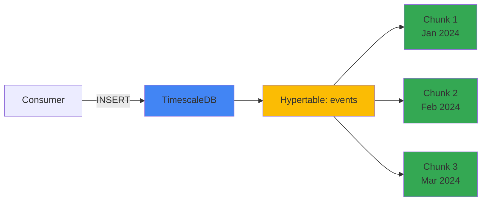
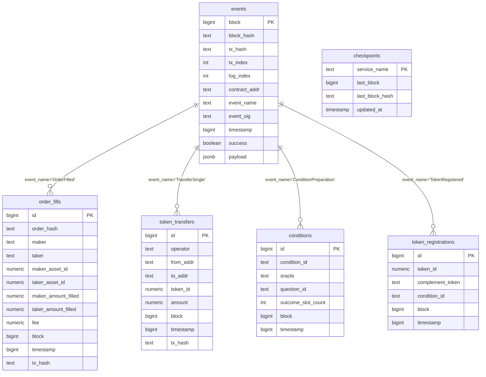
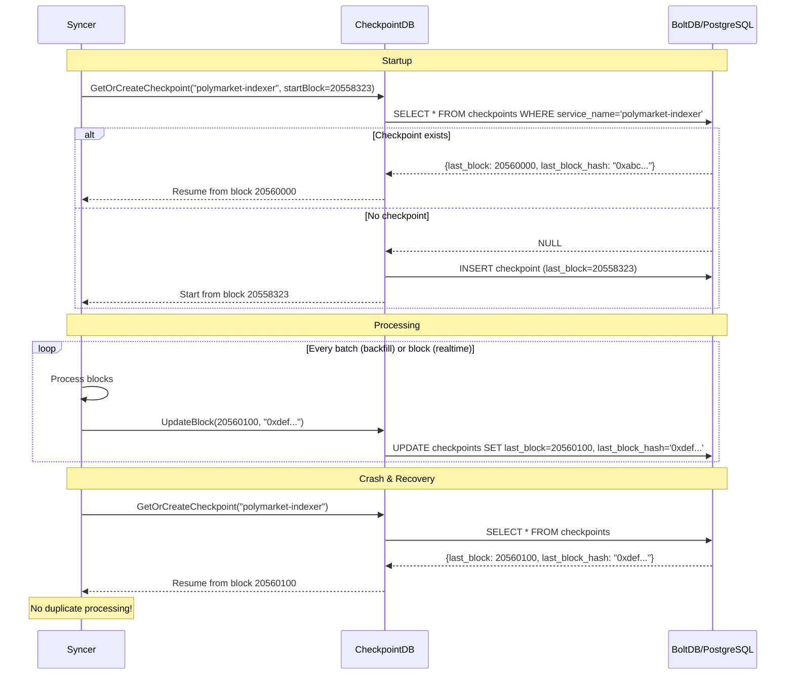
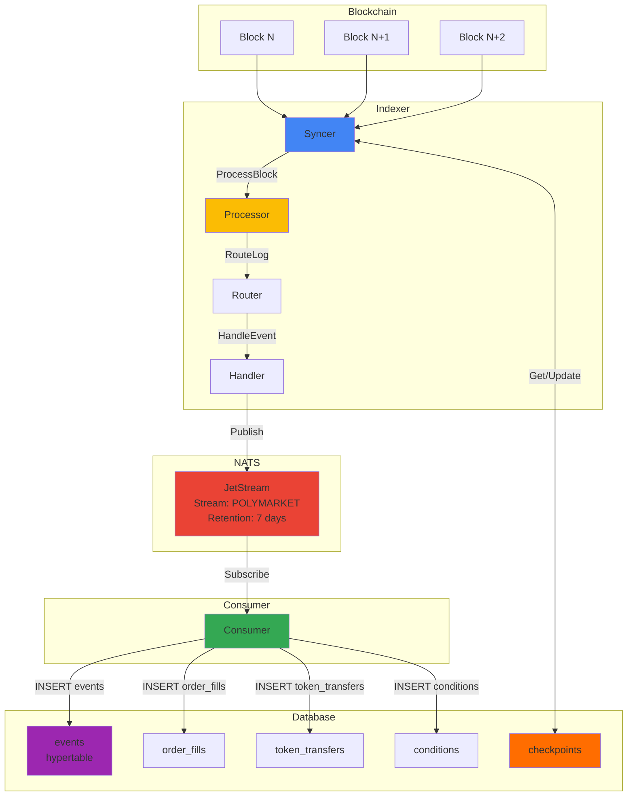

# Database Architecture

## Overview

The Polymarket indexer uses **TimescaleDB** (PostgreSQL extension) to store blockchain events, market data, and synchronization state.

## What is TimescaleDB?

**TimescaleDB** is a PostgreSQL extension optimized for time-series data. It provides:
- **Automatic partitioning** (hypertables) - splits data by time ranges
- **Fast inserts** - optimized for high-throughput writes
- **Efficient queries** - fast aggregations over time ranges
- **PostgreSQL compatibility** - uses standard SQL, supports JSON, indexes, etc.



## Why TimescaleDB?

### Comparison with Alternatives

| Feature | TimescaleDB | MongoDB | Cassandra | Plain PostgreSQL |
|---------|-------------|---------|-----------|------------------|
| **Time-series optimized** | ✅ Yes | ❌ No | ⚠️ Manual | ❌ No |
| **SQL Support** | ✅ Full | ❌ No | ⚠️ CQL | ✅ Full |
| **Automatic partitioning** | ✅ Yes | ❌ No | ✅ Yes | ⚠️ Manual |
| **Insert performance** | ✅ 10M+ rows/sec | ⚠️ Good | ✅ Excellent | ⚠️ Moderate |
| **Query performance** | ✅ Fast | ⚠️ Good | ⚠️ Good | ❌ Slow on large data |
| **ACID transactions** | ✅ Yes | ⚠️ Eventual | ❌ No | ✅ Yes |
| **JSON support** | ✅ JSONB | ✅ Native | ❌ Limited | ✅ JSONB |
| **Operational complexity** | ✅ Low | ⚠️ Medium | ❌ High | ✅ Low |
| **Cost** | ✅ Open source | ⚠️ License fees | ✅ Open source | ✅ Open source |

### Decision Factors

1. **Time-series nature**: Blockchain events are inherently time-ordered
2. **High write throughput**: Polygon processes ~2 blocks/second = ~100+ events/sec
3. **SQL familiarity**: Team knows PostgreSQL
4. **JSONB support**: Event payloads are flexible (different event types)
5. **Low ops overhead**: Single Docker container, familiar backup tools

## Database Schema

### Schema Diagram



### Core Tables

#### 1. **events** (Hypertable)

All blockchain events are stored here. This is the **source of truth**.

```sql
CREATE TABLE events (
    block BIGINT NOT NULL,           -- Block number
    block_hash TEXT NOT NULL,        -- Block hash (for reorg detection)
    tx_hash TEXT NOT NULL,           -- Transaction hash
    tx_index INTEGER NOT NULL,       -- Transaction index in block
    log_index INTEGER NOT NULL,      -- Log index in transaction
    contract_addr TEXT NOT NULL,     -- Contract address that emitted event
    event_name TEXT NOT NULL,        -- Human-readable event name
    event_sig TEXT NOT NULL,         -- Event signature hash (0x...)
    timestamp BIGINT NOT NULL,       -- Block timestamp (Unix epoch)
    success BOOLEAN NOT NULL,        -- Was this log from a successful tx?
    payload JSONB NOT NULL,          -- Event-specific data (flexible schema)
    
    PRIMARY KEY (block, tx_hash, log_index)
);

-- Convert to hypertable (TimescaleDB magic)
SELECT create_hypertable('events', 'timestamp', chunk_time_interval => 86400000000);

-- Indexes for common queries
CREATE INDEX idx_events_contract ON events(contract_addr);
CREATE INDEX idx_events_event_name ON events(event_name);
CREATE INDEX idx_events_tx_hash ON events(tx_hash);
CREATE INDEX idx_events_timestamp ON events(timestamp DESC);
```

**Why JSONB for payload?**
- Different events have different fields (OrderFilled vs TransferSingle)
- Flexible schema allows adding new event types without migrations
- PostgreSQL JSONB is fast and supports indexing

**Example event:**
```json
{
  "block": 20558323,
  "block_hash": "0xabc...",
  "tx_hash": "0x123...",
  "tx_index": 5,
  "log_index": 2,
  "contract_addr": "0x4bFb41d5B3570DeFd03C39a9A4D8dE6Bd8B8982E",
  "event_name": "OrderFilled",
  "event_sig": "0x8c5be...",
  "timestamp": 1703001234,
  "success": true,
  "payload": {
    "orderHash": "0xdef...",
    "maker": "0x456...",
    "taker": "0x789...",
    "makerAssetId": "123",
    "takerAssetId": "456",
    "makerAmountFilled": "1000000",
    "takerAmountFilled": "2000000",
    "fee": "5000"
  }
}
```

#### 2. **order_fills** (Denormalized View)

Flattened view of OrderFilled events for fast analytics.

```sql
CREATE TABLE order_fills (
    id BIGSERIAL PRIMARY KEY,
    order_hash TEXT NOT NULL,
    maker TEXT NOT NULL,
    taker TEXT NOT NULL,
    maker_asset_id NUMERIC NOT NULL,
    taker_asset_id NUMERIC NOT NULL,
    maker_amount_filled NUMERIC NOT NULL,
    taker_amount_filled NUMERIC NOT NULL,
    fee NUMERIC NOT NULL,
    block BIGINT NOT NULL,
    timestamp BIGINT NOT NULL,
    tx_hash TEXT NOT NULL
);

CREATE INDEX idx_order_fills_maker ON order_fills(maker);
CREATE INDEX idx_order_fills_taker ON order_fills(taker);
CREATE INDEX idx_order_fills_timestamp ON order_fills(timestamp DESC);
```

**Why denormalize?**
- Faster queries (no JSONB parsing)
- Easier to work with for analysts
- Can add computed columns (e.g., USD value)

#### 3. **token_transfers** (ERC1155 Transfers)

Tracks conditional token movements.

```sql
CREATE TABLE token_transfers (
    id BIGSERIAL PRIMARY KEY,
    operator TEXT NOT NULL,      -- Who initiated transfer
    from_addr TEXT NOT NULL,     -- Sender
    to_addr TEXT NOT NULL,       -- Recipient
    token_id NUMERIC NOT NULL,   -- Conditional token ID
    amount NUMERIC NOT NULL,     -- Amount transferred
    block BIGINT NOT NULL,
    timestamp BIGINT NOT NULL,
    tx_hash TEXT NOT NULL
);

CREATE INDEX idx_token_transfers_from ON token_transfers(from_addr);
CREATE INDEX idx_token_transfers_to ON token_transfers(to_addr);
CREATE INDEX idx_token_transfers_token_id ON token_transfers(token_id);
```

#### 4. **conditions** (Market Conditions)

Prediction market conditions (e.g., "Will BTC hit $100k by EOY?").

```sql
CREATE TABLE conditions (
    id BIGSERIAL PRIMARY KEY,
    condition_id TEXT NOT NULL UNIQUE,  -- Keccak256 hash
    oracle TEXT NOT NULL,                -- Oracle address
    question_id TEXT NOT NULL,           -- Question identifier
    outcome_slot_count INTEGER NOT NULL, -- Number of outcomes (2 for binary)
    block BIGINT NOT NULL,
    timestamp BIGINT NOT NULL
);

CREATE INDEX idx_conditions_oracle ON conditions(oracle);
```

#### 5. **token_registrations**

Maps token IDs to their conditions.

```sql
CREATE TABLE token_registrations (
    id BIGSERIAL PRIMARY KEY,
    token_id NUMERIC NOT NULL UNIQUE,
    complement_token TEXT NOT NULL,
    condition_id TEXT NOT NULL,
    block BIGINT NOT NULL,
    timestamp BIGINT NOT NULL,
    
    FOREIGN KEY (condition_id) REFERENCES conditions(condition_id)
);
```

#### 6. **checkpoints** (Sync State)

Critical for crash recovery and resumption.

```sql
CREATE TABLE checkpoints (
    service_name TEXT PRIMARY KEY,      -- "polymarket-indexer"
    last_block BIGINT NOT NULL,         -- Last successfully processed block
    last_block_hash TEXT NOT NULL,      -- Block hash (for reorg detection)
    updated_at TIMESTAMP DEFAULT NOW()
);
```

## Checkpoints: How They Work

### Purpose

Checkpoints enable the indexer to **resume from exactly where it left off** after:
- Crash or restart
- Deployment
- Network issues

Without checkpoints, the indexer would have to start from block 0 every time!

### Checkpoint Flow



### Storage Options

#### Option 1: BoltDB (Default)

```go
// Embedded key-value store (like SQLite)
checkpointDB, err := db.NewCheckpointDB("data/checkpoints.db")

// Stored in: data/checkpoints.db (local file)
// Pros: Simple, no external dependency
// Cons: Single node only, manual backups
```

#### Option 2: PostgreSQL (Recommended for Production)

```go
// Store in same TimescaleDB instance
checkpointDB, err := db.NewCheckpointDB("postgresql://...")

// Stored in: checkpoints table
// Pros: Transactional, backed up with main DB, multi-node support
// Cons: Requires database setup
```

### Checkpoint Data Structure

```go
type Checkpoint struct {
    ServiceName    string    // "polymarket-indexer"
    LastBlock      uint64    // 20560100
    LastBlockHash  string    // "0xdef..."
    UpdatedAt      time.Time // 2024-01-15T10:30:00Z
}
```

### Reorg Protection

Checkpoints include **block hash** to detect blockchain reorganizations:

```go
// On startup
checkpoint := GetCheckpoint("polymarket-indexer")
currentBlock := chain.GetBlockByNumber(checkpoint.LastBlock)

if currentBlock.Hash() != checkpoint.LastBlockHash {
    // REORG DETECTED!
    // Roll back 100 blocks to be safe
    checkpoint.LastBlock -= 100
    logger.Warn("Reorg detected, rolling back to block", checkpoint.LastBlock)
}
```

## Data Flow Diagram



## Query Examples

### Get Recent OrderFilled Events

```sql
-- From denormalized table (fast)
SELECT 
    order_hash,
    maker,
    taker,
    maker_amount_filled::numeric / 1e6 as maker_amount,
    taker_amount_filled::numeric / 1e6 as taker_amount,
    to_timestamp(timestamp) as filled_at
FROM order_fills
WHERE timestamp > EXTRACT(EPOCH FROM NOW() - INTERVAL '1 hour')
ORDER BY timestamp DESC
LIMIT 100;
```

### Get All Events for a Transaction

```sql
-- From main events table
SELECT 
    event_name,
    contract_addr,
    payload
FROM events
WHERE tx_hash = '0x123...'
ORDER BY log_index;
```

### Market Activity by Hour

```sql
-- TimescaleDB time_bucket aggregation
SELECT 
    time_bucket('1 hour', to_timestamp(timestamp)) as hour,
    COUNT(*) as fill_count,
    SUM(maker_amount_filled::numeric) as total_volume
FROM order_fills
WHERE timestamp > EXTRACT(EPOCH FROM NOW() - INTERVAL '7 days')
GROUP BY hour
ORDER BY hour DESC;
```

### Token Holder Balance

```sql
-- Track token movements
WITH transfers AS (
    SELECT 
        token_id,
        to_addr as address,
        amount
    FROM token_transfers
    WHERE token_id = 123
    
    UNION ALL
    
    SELECT 
        token_id,
        from_addr as address,
        -amount as amount
    FROM token_transfers
    WHERE token_id = 123
)
SELECT 
    address,
    SUM(amount) as balance
FROM transfers
GROUP BY address
HAVING SUM(amount) > 0
ORDER BY balance DESC;
```

### Check Sync Progress

```sql
-- How far behind is indexer?
SELECT 
    service_name,
    last_block,
    to_timestamp(updated_at) as last_updated,
    (SELECT MAX(block) FROM events) as indexed_block,
    AGE(NOW(), to_timestamp(updated_at)) as lag
FROM checkpoints;
```

## Monitoring Queries

### Database Size

```sql
-- Table sizes
SELECT
    schemaname,
    tablename,
    pg_size_pretty(pg_total_relation_size(schemaname||'.'||tablename)) AS size
FROM pg_tables
WHERE schemaname = 'public'
ORDER BY pg_total_relation_size(schemaname||'.'||tablename) DESC;
```

### Hypertable Stats

```sql
-- TimescaleDB chunk info
SELECT
    hypertable_name,
    num_chunks,
    pg_size_pretty(total_bytes) as total_size
FROM timescaledb_information.hypertables
WHERE hypertable_name = 'events';
```

### Insert Rate

```sql
-- Events per minute (last hour)
SELECT
    time_bucket('1 minute', to_timestamp(timestamp)) as minute,
    COUNT(*) as events_inserted
FROM events
WHERE timestamp > EXTRACT(EPOCH FROM NOW() - INTERVAL '1 hour')
GROUP BY minute
ORDER BY minute DESC
LIMIT 60;
```

## Backup & Recovery

### Backup

```bash
# Backup entire database
docker exec polymarket-timescaledb pg_dump -U polymarket polymarket > backup_$(date +%Y%m%d).sql

# Backup only schema
docker exec polymarket-timescaledb pg_dump -U polymarket --schema-only polymarket > schema.sql

# Backup only data
docker exec polymarket-timescaledb pg_dump -U polymarket --data-only polymarket > data.sql
```

### Restore

```bash
# Restore from backup
docker exec -i polymarket-timescaledb psql -U polymarket polymarket < backup_20240115.sql

# Restore to new database
docker exec -i polymarket-timescaledb psql -U polymarket -c "CREATE DATABASE polymarket_new;"
docker exec -i polymarket-timescaledb psql -U polymarket polymarket_new < backup_20240115.sql
```

### Point-in-Time Recovery

TimescaleDB supports PostgreSQL WAL (Write-Ahead Logging) for PITR:

```bash
# Enable WAL archiving in postgresql.conf
wal_level = replica
archive_mode = on
archive_command = 'cp %p /var/lib/postgresql/archive/%f'
```

## Performance Tuning

### TimescaleDB Settings

```sql
-- Increase chunk interval for high-volume tables
SELECT set_chunk_time_interval('events', INTERVAL '1 day');

-- Enable compression (save 90% disk space)
ALTER TABLE events SET (
    timescaledb.compress,
    timescaledb.compress_segmentby = 'contract_addr'
);

-- Add compression policy (compress chunks older than 7 days)
SELECT add_compression_policy('events', INTERVAL '7 days');
```

### PostgreSQL Settings

```sql
-- Increase shared memory (in postgresql.conf)
shared_buffers = 4GB
effective_cache_size = 12GB
maintenance_work_mem = 1GB
work_mem = 50MB

-- Increase connection pool
max_connections = 100

-- Tune for SSDs
random_page_cost = 1.1
effective_io_concurrency = 200
```

## Troubleshooting

### Indexer is slow

```sql
-- Check for missing indexes
SELECT schemaname, tablename, indexname
FROM pg_indexes
WHERE schemaname = 'public';

-- Add indexes for slow queries
CREATE INDEX idx_events_custom ON events(contract_addr, event_name, timestamp DESC);
```

### Database is full

```sql
-- Enable compression (see above)
-- Or drop old data
DELETE FROM events WHERE timestamp < EXTRACT(EPOCH FROM NOW() - INTERVAL '90 days');

-- Vacuum to reclaim space
VACUUM FULL events;
```

### Checkpoint stuck

```sql
-- Check checkpoint status
SELECT * FROM checkpoints;

-- Manually update if needed
UPDATE checkpoints 
SET last_block = 20560000, last_block_hash = '0xabc...'
WHERE service_name = 'polymarket-indexer';
```

## References

- [TimescaleDB Documentation](https://docs.timescale.com/)
- [PostgreSQL JSONB](https://www.postgresql.org/docs/current/datatype-json.html)
- [Hypertables Explained](https://docs.timescale.com/use-timescale/latest/hypertables/)
- [Database Schema](../migrations/001_initial_schema.up.sql)
- [Checkpoint Implementation](../internal/db/checkpoint.go)
