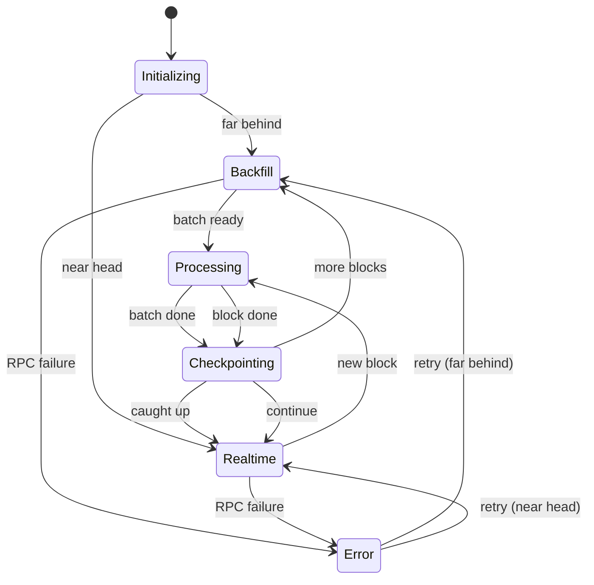

# 🎨 Design Patterns & Distributed Systems Resources

> **Ultimate learning resource for understanding design patterns, distributed systems, and scheduled jobs with real-world examples**

## 📚 Table of Contents

1. [Design Patterns in This Codebase](#design-patterns-in-this-codebase)
2. [Must-Read Git Repositories](#must-read-git-repositories)
3. [Essential Blogs & Articles](#essential-blogs--articles)
4. [Books & Papers](#books--papers)
5. [Frameworks & Tools](#frameworks--tools)
6. [Distributed Job Scheduling](#distributed-job-scheduling)
7. [Mental Models](#mental-models)

---

## 🏗️ Design Patterns in This Codebase

Before studying external resources, understand the patterns **already in your code**:

### 1. **Producer-Consumer Pattern** ⭐

**Where**: Indexer → NATS → Consumer

```go
// Producer (internal/nats/publisher.go)
func (p *Publisher) Publish(ctx context.Context, event models.Event) error {
    // Produces events to stream
}

// Consumer (cmd/consumer/main.go)
_, err := js.Subscribe("POLYMARKET.events.*", func(msg *nats.Msg) {
    // Consumes events from stream
})
```

**Learn More**:
- [Kafka Producer-Consumer](https://github.com/confluentinc/confluent-kafka-go/tree/master/examples)
- [RabbitMQ Tutorials](https://github.com/rabbitmq/rabbitmq-tutorials)

---

### 2. **Worker Pool Pattern** ⭐⭐⭐

**Where**: Syncer backfill mode ([internal/syncer/syncer.go](../internal/syncer/syncer.go#L320-L400))

```go
// Create worker pool
for i := 0; i < numWorkers; i++ {
    workerID := i
    go func() {
        for batch := range batchChan {
            processBatch(ctx, batch.from, batch.to)
        }
    }()
}

// Send work to pool
for from <= to {
    batchChan <- batch{from, from + batchSize}
    from += batchSize
}
```

**Real-World Examples**:
- **Temporal Workflow**: https://github.com/temporalio/samples-go
  - `worker-specific/` - Worker pool with task queues
  - `parallel-processing/` - Parallel execution patterns

- **Go Concurrency Examples**: https://github.com/golang/go/wiki/LearnConcurrency
  - Worker pools with channels
  - Fan-out/fan-in patterns

---

### 3. **Strategy Pattern** ⭐⭐

**Where**: Syncer mode switching (backfill vs realtime)

```go
// internal/syncer/syncer.go
func (s *Syncer) Start(ctx context.Context) error {
    if blocksBehind > s.cfg.RealtimeThreshold {
        return s.runBackfill(ctx)  // Strategy 1: Fast catch-up
    } else {
        return s.runRealtime(ctx)  // Strategy 2: Low-latency
    }
}
```

**Learn From**:
- **Kubernetes Controllers**: https://github.com/kubernetes/sample-controller
  - Different reconciliation strategies based on resource state
  
- **Prometheus Scrapers**: https://github.com/prometheus/prometheus/tree/main/scrape
  - Different scraping strategies per target

---

### 4. **Registry/Router Pattern** ⭐⭐⭐

**Where**: Event handler registration ([internal/router/event_log_handler_router.go](../internal/router/event_log_handler_router.go))

```go
// Register handlers
r.RegisterLogHandler(handler.OrderFilledSig, "OrderFilled", handler.HandleOrderFilled)
r.RegisterLogHandler(handler.TransferSingleSig, "TransferSingle", handler.HandleTransferSingle)

// Route at runtime
func (r *EventLogHandlerRouter) RouteLog(ctx, log, timestamp, hash) error {
    handler, exists := r.logHandlers[eventSig]
    if !exists {
        return nil  // No handler, skip
    }
    payload, err := handler(ctx, log, timestamp)  // Dynamic dispatch
}
```

**Real-World Examples**:
- **Gin Router**: https://github.com/gin-gonic/gin/blob/master/tree.go
  - HTTP route registration and dispatch
  
- **Chi Router**: https://github.com/go-chi/chi/blob/master/tree.go
  - Middleware chain + route matching
  
- **Kubernetes API Machinery**: https://github.com/kubernetes/apimachinery/tree/master/pkg/runtime
  - Resource type registration and routing

---

### 5. **Checkpoint/WAL Pattern** ⭐⭐⭐

**Where**: Checkpoint database ([internal/db/checkpoint.go](../internal/db/checkpoint.go))

```go
// Save progress
func (db *CheckpointDB) UpdateBlock(ctx, serviceName, block, hash) error {
    _, err := db.conn.Exec(ctx, 
        `UPDATE checkpoints SET last_block=$1, block_hash=$2 WHERE service_name=$3`,
        block, hash, serviceName)
}

// Resume from checkpoint
func (db *CheckpointDB) GetOrCreateCheckpoint(ctx, serviceName, startBlock) (*Checkpoint, error) {
    // Load last processed block
}
```

**Learn From**:
- **etcd WAL**: https://github.com/etcd-io/etcd/tree/main/server/storage/wal
  - Write-ahead logging for distributed consensus
  - Code: `server/storage/wal/wal.go`
  
- **Kafka Offset Management**: https://github.com/segmentio/kafka-go
  - Consumer offset checkpointing
  - Example: `examples/consumer-with-commit/main.go`
  
- **LevelDB**: https://github.com/google/leveldb
  - LSM tree with WAL
  - Code: `db/write_batch.cc`

---

### 6. **Circuit Breaker Pattern** (Missing - Should Add!)

**Where It Should Be**: RPC client ([internal/chain/on_chain_client.go](../internal/chain/on_chain_client.go))

```go
// Current: No circuit breaker
func (c *OnChainClient) FilterLogs(ctx, query) ([]types.Log, error) {
    return c.client.FilterLogs(ctx, query)  // Direct call, can fail repeatedly
}

// Should Be: With circuit breaker
func (c *OnChainClient) FilterLogs(ctx, query) ([]types.Log, error) {
    return c.breaker.Execute(func() ([]types.Log, error) {
        return c.client.FilterLogs(ctx, query)
    })
}
```

**Implement Using**:
- **Sony Gobreaker**: https://github.com/sony/gobreaker
  ```go
  import "github.com/sony/gobreaker"
  
  cb := gobreaker.NewCircuitBreaker(gobreaker.Settings{
      Name:        "RPC",
      MaxRequests: 3,
      Interval:    time.Minute,
      Timeout:     30 * time.Second,
      ReadyToTrip: func(counts gobreaker.Counts) bool {
          return counts.ConsecutiveFailures > 5
      },
  })
  ```

**Real-World Examples**:
- **Hystrix Go**: https://github.com/afex/hystrix-go
  - Netflix's circuit breaker pattern
  - `examples/basic.go`

---

## 🌟 Must-Read Git Repositories

### Category 1: Blockchain Indexers (Your Domain)

#### 1. **The Graph Protocol** ⭐⭐⭐⭐⭐
- **Repo**: https://github.com/graphprotocol/graph-node
- **Language**: Rust
- **Why Study**: Industry-standard blockchain indexer
- **Key Files**:
  - `chain/ethereum/src/network.rs` - RPC client with retries
  - `chain/ethereum/src/adapter.rs` - Block fetching strategies
  - `store/postgres/src/chain_store.rs` - Checkpoint management
  - `runtime/wasm/src/module.rs` - Event handler runtime
  
- **Patterns to Learn**:
  - Reorg handling (maintains chain head state)
  - Subgraph deployment model (multi-tenant indexing)
  - GraphQL query layer over indexed data
  - Prometheus metrics integration

#### 2. **Chainlink External Adapters**
- **Repo**: https://github.com/smartcontractkit/external-adapters-js
- **Language**: TypeScript
- **Why Study**: Event-driven oracle system
- **Key Files**:
  - `bootstrap/src/lib/cache-warmer/` - Scheduled cache refresh
  - `bootstrap/src/lib/rate-limit/` - Rate limiting for external APIs
  - `packages/core/bootstrap/src/lib/middleware/` - Middleware chain
  
- **Patterns**:
  - Rate limiting with Redis
  - Cache warming (proactive data fetching)
  - Health check patterns

#### 3. **Dune Analytics Open Source**
- **Repo**: https://github.com/duneanalytics/spellbook
- **Language**: SQL + dbt
- **Why Study**: Data modeling for blockchain analytics
- **Key Files**:
  - `models/` - dbt models for event transformation
  - `macros/` - Reusable SQL patterns
  
- **Patterns**:
  - Incremental materialization
  - Data quality testing
  - Event deduplication strategies

---

### Category 2: Distributed Job Schedulers

#### 4. **Temporal** ⭐⭐⭐⭐⭐
- **Repo**: https://github.com/temporalio/temporal
- **Language**: Go
- **Why Study**: Best-in-class distributed workflow engine
- **Key Files**:
  - `service/history/workflow/` - Workflow state machine
  - `service/matching/` - Task queue implementation
  - `common/persistence/` - Durable execution checkpoints
  
- **Samples**: https://github.com/temporalio/samples-go
  - `timer/` - Scheduled execution
  - `retry/` - Automatic retry policies
  - `parallel/` - Parallel task execution
  - `saga/` - Saga pattern (compensating transactions)
  
- **Patterns**:
  - Durable execution (workflows survive restarts)
  - Activity retries with exponential backoff
  - Versioning workflows in production

#### 5. **Asynq** ⭐⭐⭐⭐
- **Repo**: https://github.com/hibiken/asynq
- **Language**: Go
- **Why Study**: Redis-backed job queue (simpler than Temporal)
- **Key Files**:
  - `scheduler.go` - Cron job scheduling
  - `processor.go` - Worker pool implementation
  - `recoverer.go` - Failed job recovery
  
- **Examples**: https://github.com/hibiken/asynq/tree/master/example
  - `scheduled_tasks/` - Cron-like scheduling
  - `priority_queue/` - Priority task processing
  
- **Use When**: Need scheduled jobs without full workflow complexity

#### 6. **River** (New - 2024)
- **Repo**: https://github.com/riverqueue/river
- **Language**: Go
- **Why Study**: PostgreSQL-backed job queue
- **Key Files**:
  - `client.go` - Job enqueue patterns
  - `worker.go` - Worker lifecycle
  - `periodic_job.go` - Periodic job scheduling
  
- **Advantage**: No Redis dependency (uses Postgres LISTEN/NOTIFY)

---

### Category 3: Go Design Patterns

#### 7. **Uber Go Guide** ⭐⭐⭐⭐⭐
- **Repo**: https://github.com/uber-go/guide/blob/master/style.md
- **Why Study**: Go best practices from industry leader
- **Key Sections**:
  - Performance tips
  - Concurrency patterns
  - Error handling
  - Testing strategies
  
- **Companion Libraries**:
  - `uber-go/zap` - Structured logging (you already use)
  - `uber-go/fx` - Dependency injection framework

#### 8. **Go Patterns**
- **Repo**: https://github.com/tmrts/go-patterns
- **Why Study**: Go-specific pattern implementations
- **Key Patterns**:
  - `concurrency/` - Worker pool, semaphore, fan-out/fan-in
  - `structural/` - Decorator, adapter, proxy
  - `behavioral/` - Observer, strategy, chain of responsibility

#### 9. **Go Concurrency Patterns**
- **Repo**: https://github.com/lotusirous/go-concurrency-patterns
- **Why Study**: Deep dive into channel patterns
- **Examples**:
  - Pipeline pattern
  - Cancellation with context
  - Rate limiting
  - Bounded parallelism

---

### Category 4: Production Systems

#### 10. **Kubernetes Controllers** ⭐⭐⭐⭐⭐
- **Repo**: https://github.com/kubernetes/sample-controller
- **Language**: Go
- **Why Study**: Reference implementation for reconciliation loops
- **Key Files**:
  - `controller.go` - Reconciliation loop pattern
  - `main.go` - Leader election setup
  
- **Patterns**:
  - Level-triggered (vs edge-triggered) reconciliation
  - Work queues with rate limiting
  - Exponential backoff for failed items
  - Leader election for HA

#### 11. **Prometheus** ⭐⭐⭐⭐
- **Repo**: https://github.com/prometheus/prometheus
- **Language**: Go
- **Why Study**: Time-series database and scraper
- **Key Files**:
  - `scrape/scrape.go` - Polling loop with jitter
  - `storage/` - Time-series storage
  - `tsdb/` - Time-series database (LSM tree)
  
- **Patterns**:
  - Metrics exposition (pull model)
  - Service discovery patterns
  - Query engine design

#### 12. **NATS Server** ⭐⭐⭐⭐
- **Repo**: https://github.com/nats-io/nats-server
- **Language**: Go
- **Why Study**: High-performance messaging (you use this!)
- **Key Files**:
  - `server/jetstream.go` - Durable stream implementation
  - `server/consumer.go` - Consumer semantics
  - `server/raft.go` - Consensus for clustering
  
- **Patterns**:
  - Zero-copy message routing
  - Backpressure handling
  - Clustering with Raft

---

## 📖 Essential Blogs & Articles

### Distributed Systems

#### 1. **Martin Kleppmann** ⭐⭐⭐⭐⭐
- **Blog**: https://martin.kleppmann.com/archive.html
- **Must-Read**:
  - "Designing Data-Intensive Applications" (book excerpts)
  - "Please stop calling databases CP or AP" - CAP theorem
  - "Kafka, Samza and the Unix Philosophy"
  
#### 2. **High Scalability**
- **Site**: http://highscalability.com/
- **Must-Read**:
  - "Uber's Real-Time Data Infrastructure"
  - "How Discord Stores Billions of Messages"
  - "Scaling Slack - The Good, the Unexpected, and the Road Ahead"

#### 3. **AWS Architecture Blog**
- **Site**: https://aws.amazon.com/blogs/architecture/
- **Must-Read**:
  - "Event-Driven Architecture" series
  - "Implementing Saga Pattern"
  - "Retry Strategies for Distributed Systems"

#### 4. **Cloudflare Blog**
- **Site**: https://blog.cloudflare.com/
- **Must-Read**:
  - "How we built Cloudflare Workers"
  - "Using Argo Tunnel for distributed systems"
  - "A Byzantine failure in the real world"

---

### Go Specific

#### 5. **Go Blog** ⭐⭐⭐⭐⭐
- **Site**: https://go.dev/blog/
- **Must-Read**:
  - "Concurrency is not Parallelism" (Rob Pike)
  - "Go Concurrency Patterns: Pipelines and cancellation"
  - "Go Concurrency Patterns: Context"
  - "Advanced Go Concurrency Patterns"

#### 6. **Dave Cheney**
- **Blog**: https://dave.cheney.net/
- **Must-Read**:
  - "Practical Go: Real world advice for writing maintainable Go programs"
  - "Error handling in Go"
  - "SOLID Go Design"

#### 7. **Mitchell Hashimoto** (HashiCorp)
- **Blog**: https://mitchellh.com/writing
- **Must-Read**:
  - "Advanced Testing with Go"
  - "Structuring Applications in Go"

---

### Blockchain Indexing

#### 8. **The Graph Blog**
- **Site**: https://thegraph.com/blog/
- **Must-Read**:
  - "The Graph Network: A Decentralized Indexing Protocol"
  - "Subgraph Best Practices"
  - "Handling Chain Reorganizations"

#### 9. **Alchemy Engineering**
- **Site**: https://www.alchemy.com/blog
- **Must-Read**:
  - "How to Build a Blockchain Indexer"
  - "Ethereum RPC Best Practices"
  - "Optimizing Node Performance"

---

## 📚 Books & Papers

### Books

#### 1. **"Designing Data-Intensive Applications"** by Martin Kleppmann ⭐⭐⭐⭐⭐
- **What**: Bible of distributed systems
- **Key Chapters for You**:
  - Chapter 3: Storage and Retrieval (LSM trees, B-trees)
  - Chapter 5: Replication (leader-follower, consensus)
  - Chapter 11: Stream Processing (exactly-once semantics)
  
#### 2. **"Concurrency in Go"** by Katherine Cox-Buday ⭐⭐⭐⭐
- **What**: Deep dive into Go concurrency
- **Key Chapters**:
  - Chapter 3: Go's Concurrency Building Blocks
  - Chapter 4: Concurrency Patterns (worker pools, pipelines)
  - Chapter 5: Concurrency at Scale

#### 3. **"Database Internals"** by Alex Petrov
- **What**: How databases work under the hood
- **Relevant Chapters**:
  - Chapter 6: B-Tree Variants (PostgreSQL uses B+ trees)
  - Chapter 10: Distributed Transactions
  - Chapter 12: Consensus (Raft, Paxos)

#### 4. **"Site Reliability Engineering"** by Google SRE Team
- **What**: Operating production systems
- **Relevant Chapters**:
  - Chapter 22: Addressing Cascading Failures
  - Chapter 23: Managing Critical State
  - Chapter 24: Distributed Consensus for Reliability

---

### Papers

#### 1. **"Time, Clocks, and the Ordering of Events"** - Lamport (1978)
- **Why**: Foundation of distributed systems
- **PDF**: https://lamport.azurewebsites.net/pubs/time-clocks.pdf

#### 2. **"In Search of an Understandable Consensus Algorithm"** (Raft)
- **Why**: Raft consensus (used by etcd, NATS clustering)
- **PDF**: https://raft.github.io/raft.pdf

#### 3. **"Kafka: a Distributed Messaging System for Log Processing"**
- **Why**: Understand distributed streaming
- **PDF**: https://www.microsoft.com/en-us/research/wp-content/uploads/2017/09/Kafka.pdf

---

## 🛠️ Frameworks & Tools

### Job Scheduling Frameworks (Choose One)

#### Option 1: **Temporal** (Most Powerful) ⭐⭐⭐⭐⭐
```go
// Install
go get go.temporal.io/sdk

// Example: Scheduled workflow
func IndexerWorkflow(ctx workflow.Context) error {
    // Schedule periodic sync
    err := workflow.SetQueryHandler(ctx, "status", func() (string, error) {
        return "syncing", nil
    })
    
    // Activities with automatic retry
    ao := workflow.ActivityOptions{
        StartToCloseTimeout: time.Minute,
        RetryPolicy: &temporal.RetryPolicy{
            MaximumAttempts: 5,
            BackoffCoefficient: 2.0,
        },
    }
    ctx = workflow.WithActivityOptions(ctx, ao)
    
    var result string
    err = workflow.ExecuteActivity(ctx, SyncActivity).Get(ctx, &result)
    return err
}
```

**Pros**:
- Durable execution (survives crashes)
- Built-in versioning
- Saga pattern support
- Observability out-of-the-box

**Cons**:
- Complex setup (requires Temporal server)
- Steep learning curve

**When to Use**: Complex workflows with state management

---

#### Option 2: **Asynq** (Simpler) ⭐⭐⭐⭐
```go
// Install
go get github.com/hibiken/asynq

// Example: Scheduled task
func main() {
    scheduler := asynq.NewScheduler(
        asynq.RedisClientOpt{Addr: "localhost:6379"},
        &asynq.SchedulerOpts{},
    )
    
    // Register cron job
    task := asynq.NewTask("sync:blocks", nil)
    entryID, err := scheduler.Register(
        "*/5 * * * *",  // Every 5 minutes
        task,
        asynq.Queue("critical"),
    )
    
    scheduler.Run()
}

// Worker
func HandleSyncTask(ctx context.Context, t *asynq.Task) error {
    // Your sync logic
    return nil
}
```

**Pros**:
- Simple Redis-backed queue
- Cron support
- Priority queues
- Minimal setup

**Cons**:
- No complex workflow support
- No built-in state machine

**When to Use**: Scheduled jobs without complex dependencies

---

#### Option 3: **River** (PostgreSQL-Native) ⭐⭐⭐
```go
// Install
go get github.com/riverqueue/river

// Example: Periodic job with Postgres
workers := river.NewWorkers()
river.AddWorker(workers, &SyncWorker{})

riverClient, err := river.NewClient(riverpgxv5.New(dbPool), &river.Config{
    Queues: map[string]river.QueueConfig{
        river.QueueDefault: {MaxWorkers: 10},
    },
    Workers: workers,
})

// Schedule periodic job
_, err = riverClient.PeriodicJobs().Add(&river.PeriodicJobArgs{
    ConstructorFunc: func() (river.JobArgs, error) {
        return SyncJobArgs{}, nil
    },
    RunOnStart: true,
    ScheduleFunc: river.PeriodicInterval(5 * time.Minute),
})
```

**Pros**:
- No Redis dependency
- Uses your existing Postgres
- LISTEN/NOTIFY for low latency
- Transactional job creation

**Cons**:
- New project (less battle-tested)
- Fewer features than Temporal

**When to Use**: Want job queue + already using Postgres

---

### Circuit Breaker Libraries

#### **Sony Gobreaker** ⭐⭐⭐⭐
```go
import "github.com/sony/gobreaker"

cb := gobreaker.NewCircuitBreaker(gobreaker.Settings{
    Name:        "RPC",
    MaxRequests: 3,
    Interval:    60 * time.Second,
    Timeout:     30 * time.Second,
    ReadyToTrip: func(counts gobreaker.Counts) bool {
        failureRatio := float64(counts.TotalFailures) / float64(counts.Requests)
        return counts.Requests >= 3 && failureRatio >= 0.6
    },
})

// Use
result, err := cb.Execute(func() (interface{}, error) {
    return client.FilterLogs(ctx, query)
})
```

---

### Rate Limiting

#### **golang.org/x/time/rate** ⭐⭐⭐⭐⭐
```go
import "golang.org/x/time/rate"

// Token bucket rate limiter
limiter := rate.NewLimiter(rate.Limit(10), 1) // 10 req/sec, burst=1

func makeRequest(ctx context.Context) error {
    if err := limiter.Wait(ctx); err != nil {
        return err
    }
    // Make request
}
```

---

### Distributed Tracing

#### **OpenTelemetry** ⭐⭐⭐⭐⭐
```go
import (
    "go.opentelemetry.io/otel"
    "go.opentelemetry.io/otel/trace"
)

tracer := otel.Tracer("indexer")

func ProcessBlock(ctx context.Context, blockNum uint64) error {
    ctx, span := tracer.Start(ctx, "ProcessBlock")
    defer span.End()
    
    span.SetAttributes(
        attribute.Int64("block", int64(blockNum)),
    )
    
    // Your logic
    return nil
}
```

---

## ⚡ Distributed Job Scheduling Deep Dive

### Pattern 1: **Cron-Based (Simple)**

**Example**: Run sync check every 5 minutes

```go
// Option A: Use robfig/cron
import "github.com/robfig/cron/v3"

c := cron.New()
c.AddFunc("*/5 * * * *", func() {
    checkAndSync(context.Background())
})
c.Start()
```

**Pros**: Simple, local to one process
**Cons**: No distributed coordination, single point of failure

---

### Pattern 2: **Leader Election (HA)**

**Example**: Only one pod runs the job

```go
import (
    metav1 "k8s.io/apimachinery/pkg/apis/meta/v1"
    "k8s.io/client-go/tools/leaderelection"
)

// Kubernetes leader election
leaderelection.RunOrDie(ctx, leaderelection.LeaderElectionConfig{
    Lock: &resourcelock.LeaseLock{
        LeaseMeta: metav1.ObjectMeta{
            Name:      "indexer-leader",
            Namespace: "default",
        },
        Client: clientset.CoordinationV1(),
        LockConfig: resourcelock.ResourceLockConfig{
            Identity: podName,
        },
    },
    LeaseDuration: 15 * time.Second,
    RenewDeadline: 10 * time.Second,
    RetryPeriod:   2 * time.Second,
    Callbacks: leaderelection.LeaderCallbacks{
        OnStartedLeading: func(ctx context.Context) {
            // Only runs on leader
            runScheduledJobs(ctx)
        },
        OnStoppedLeading: func() {
            log.Info().Msg("Lost leadership")
        },
    },
})
```

**Pros**: High availability
**Cons**: Needs coordination service (etcd, Consul)

---

### Pattern 3: **Distributed Task Queue (Scalable)**

**Example**: Multiple workers process jobs from queue

```go
// Using Asynq
client := asynq.NewClient(asynq.RedisClientOpt{Addr: "localhost:6379"})

// Enqueue task
task := asynq.NewTask("sync:range", map[string]interface{}{
    "from": 1000,
    "to":   2000,
})
info, err := client.Enqueue(task, asynq.Queue("critical"))

// Worker (can run multiple instances)
srv := asynq.NewServer(
    asynq.RedisClientOpt{Addr: "localhost:6379"},
    asynq.Config{Concurrency: 10},
)

mux := asynq.NewServeMux()
mux.HandleFunc("sync:range", func(ctx context.Context, t *asynq.Task) error {
    var payload map[string]int
    json.Unmarshal(t.Payload(), &payload)
    return syncRange(ctx, payload["from"], payload["to"])
})

srv.Run(mux)
```

**Pros**: Horizontal scaling, retry logic
**Cons**: Needs Redis/queue infrastructure

---

### Pattern 4: **Workflow Engine (Most Robust)**

**Example**: Multi-step indexing workflow

```go
// Using Temporal
func IndexingWorkflow(ctx workflow.Context, input IndexingInput) error {
    // Step 1: Sync blocks
    var blocks []Block
    err := workflow.ExecuteActivity(ctx, SyncBlocksActivity, input.FromBlock, input.ToBlock).Get(ctx, &blocks)
    if err != nil {
        return err
    }
    
    // Step 2: Process events (parallel)
    var futures []workflow.Future
    for _, block := range blocks {
        future := workflow.ExecuteActivity(ctx, ProcessEventsActivity, block)
        futures = append(futures, future)
    }
    
    // Step 3: Wait for all
    for _, future := range futures {
        err := future.Get(ctx, nil)
        if err != nil {
            return err
        }
    }
    
    // Step 4: Update checkpoint
    return workflow.ExecuteActivity(ctx, UpdateCheckpointActivity, input.ToBlock).Get(ctx, nil)
}
```

**Pros**: Durable, versioned, complex workflows
**Cons**: Infrastructure overhead, learning curve

---

## 🧠 Mental Models

### Model 1: **State Machine Thinking**

Every component is a state machine:



**Questions to Ask**:
1. What are all possible states?
2. What triggers state transitions?
3. What invariants must hold in each state?
4. Can I get stuck in a state?

---

### Model 2: **Data Flow Pipelines**

Think in terms of data transformation stages:

```
Input → Transform → Enrich → Filter → Output
```

**Example in Your Code**:
```
RPC Logs → Parse ABI → Create Event → Route → Publish → Consume → Store
```

**Questions to Ask**:
1. What can fail at each stage?
2. Is each stage idempotent?
3. Can I reprocess data?
4. Where is backpressure applied?

---

### Model 3: **Failure Modes**

List every failure mode and mitigation:

| Failure | Impact | Detection | Mitigation |
|---------|--------|-----------|------------|
| RPC rate limit | Sync stops | Error logs | Circuit breaker + backoff |
| NATS down | Events lost | Health check | Durable queue (JetStream) |
| DB connection lost | Writes fail | Error metrics | Connection pool retry |
| Process crash | State lost | Watchdog | Checkpoint + resume |
| Chain reorg | Duplicate events | Block hash mismatch | Rollback checkpoint |

---

## 📝 Learning Path

### Week 1: Foundations
1. Read Uber Go Guide (2h)
2. Study worker pool pattern in your code (1h)
3. Read "Go Concurrency Patterns: Context" (1h)
4. Implement circuit breaker in RPC client (2h)

### Week 2: Patterns
1. Study The Graph's block fetching (3h)
2. Read Temporal samples - timer and retry (2h)
3. Refactor syncer with state machine pattern (3h)

### Week 3: Distributed Systems
1. Read DDIA Chapter 5 (Replication) (4h)
2. Study NATS JetStream internals (2h)
3. Add OpenTelemetry tracing to your indexer (2h)

### Week 4: Job Scheduling
1. Evaluate Asynq vs River vs Temporal (2h)
2. Implement scheduled checkpoint verification (3h)
3. Add leader election for HA (3h)

---

## 🎯 Actionable Next Steps for Your Codebase

### Immediate (This Week)

1. **Add Circuit Breaker to RPC Client**
   - Library: `github.com/sony/gobreaker`
   - File: [internal/chain/on_chain_client.go](../internal/chain/on_chain_client.go)
   - Impact: Prevent cascading failures

2. **Add Rate Limiter**
   - Library: `golang.org/x/time/rate`
   - File: [internal/chain/on_chain_client.go](../internal/chain/on_chain_client.go)
   - Impact: Respect RPC limits

3. **Add OpenTelemetry Tracing**
   - Library: `go.opentelemetry.io/otel`
   - Files: All internal/
   - Impact: Visibility into bottlenecks

### Short Term (Next 2 Weeks)

4. **Implement Scheduled Checkpoint Verification**
   - Library: `github.com/robfig/cron/v3` (simple) or `github.com/hibiken/asynq` (robust)
   - New file: `cmd/verifier/main.go`
   - Impact: Detect data corruption

5. **Add Prometheus Metrics**
   - Library: `github.com/prometheus/client_golang`
   - File: New `internal/metrics/metrics.go`
   - Impact: Production observability

6. **Implement Graceful Shutdown**
   - Pattern: Context cancellation
   - File: [cmd/indexer/main.go](../cmd/indexer/main.go)
   - Impact: Clean checkpoint saves

### Long Term (Next Month)

7. **Add Distributed Tracing**
   - Tool: Jaeger + OpenTelemetry
   - Impact: End-to-end request tracing

8. **Implement Leader Election**
   - Library: Kubernetes leases or Consul
   - Impact: High availability

9. **Add Workflow Engine**
   - Tool: Temporal or Asynq
   - Impact: Complex data pipelines

---

## 📌 Bookmark These

**Daily Reference**:
- Uber Go Guide: https://github.com/uber-go/guide
- Go Blog: https://go.dev/blog/
- Your [NAVIGATION.md](../NAVIGATION.md)

**Weekly Reading**:
- High Scalability: http://highscalability.com/
- Martin Kleppmann's Blog: https://martin.kleppmann.com/

**Monthly Deep Dive**:
- DDIA Book (one chapter/month)
- Study one OSS project in depth

---

**Last Updated**: January 1, 2026  
**Next Review**: February 1, 2026
