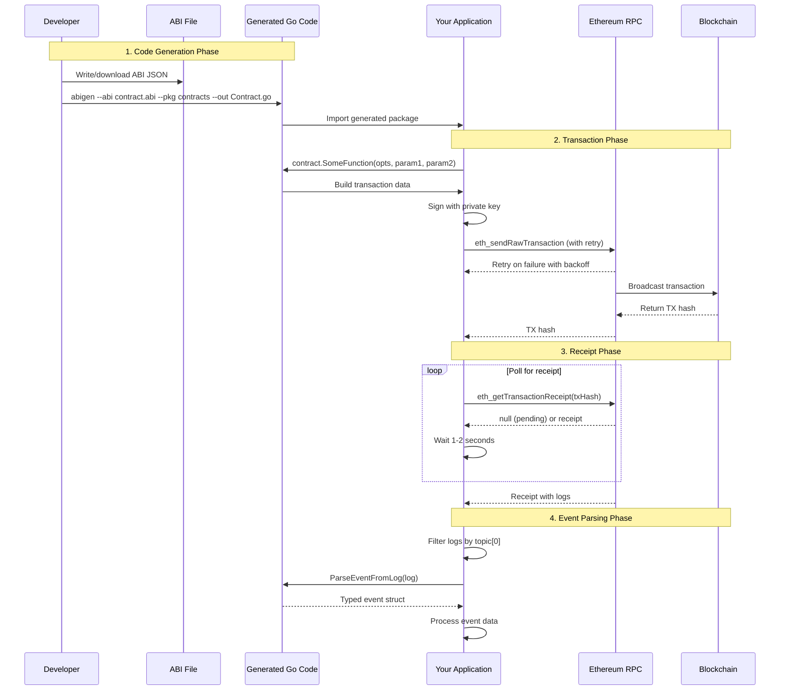
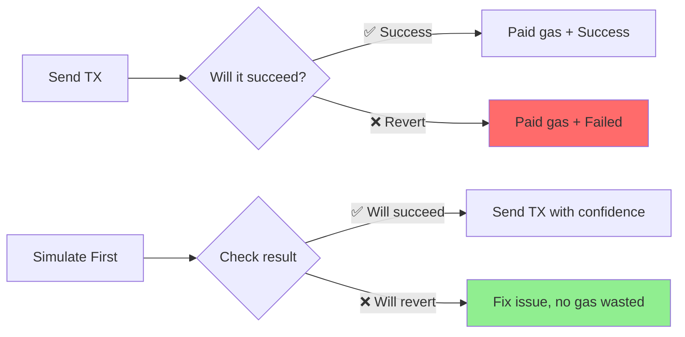
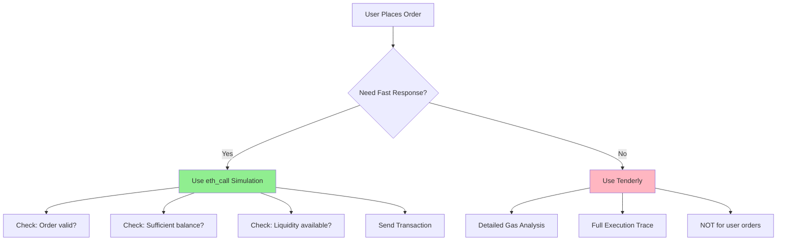
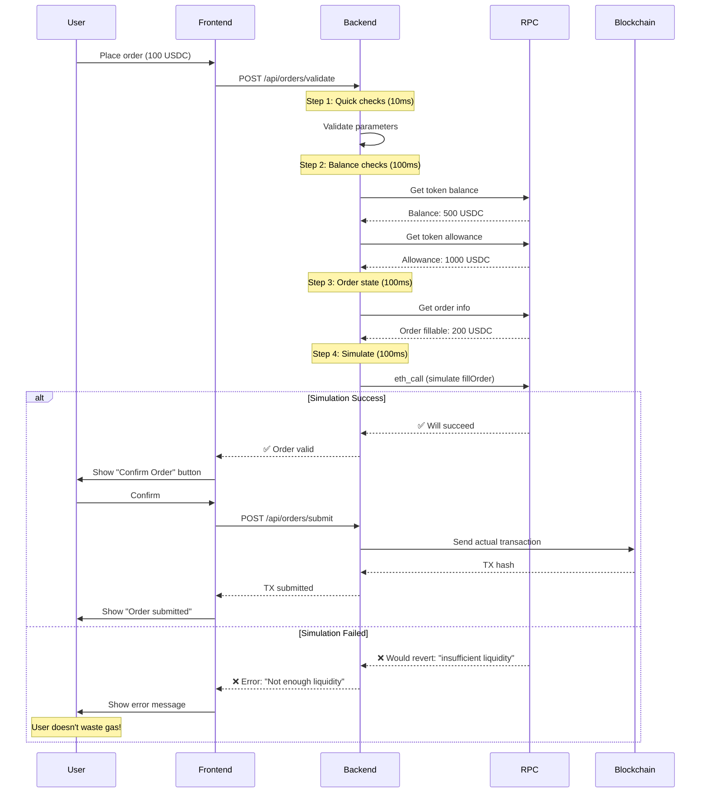
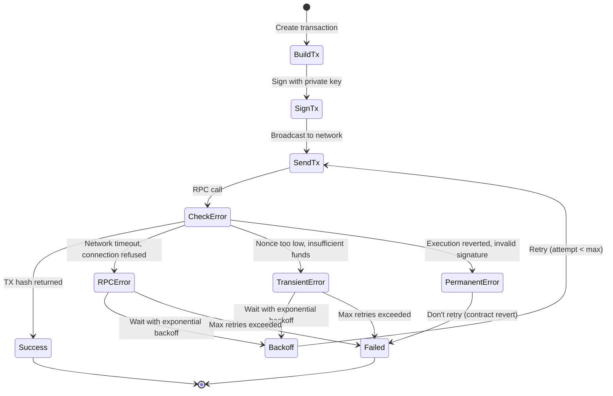
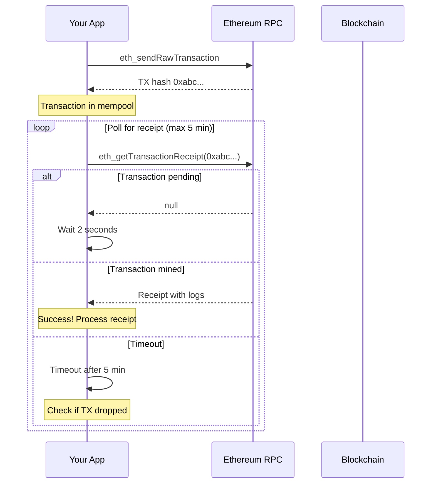
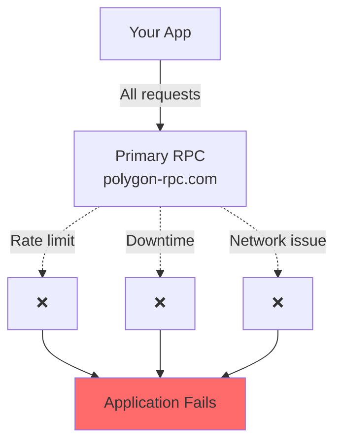
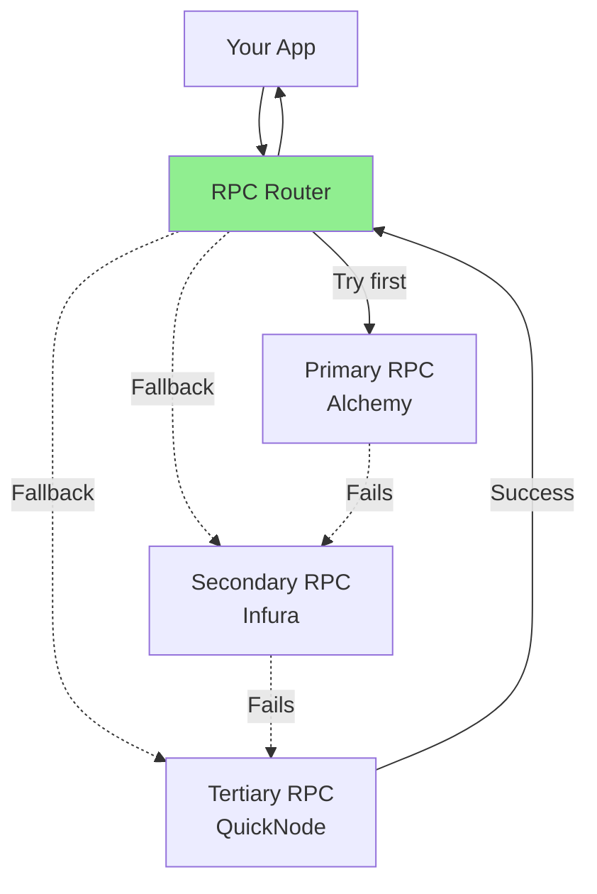
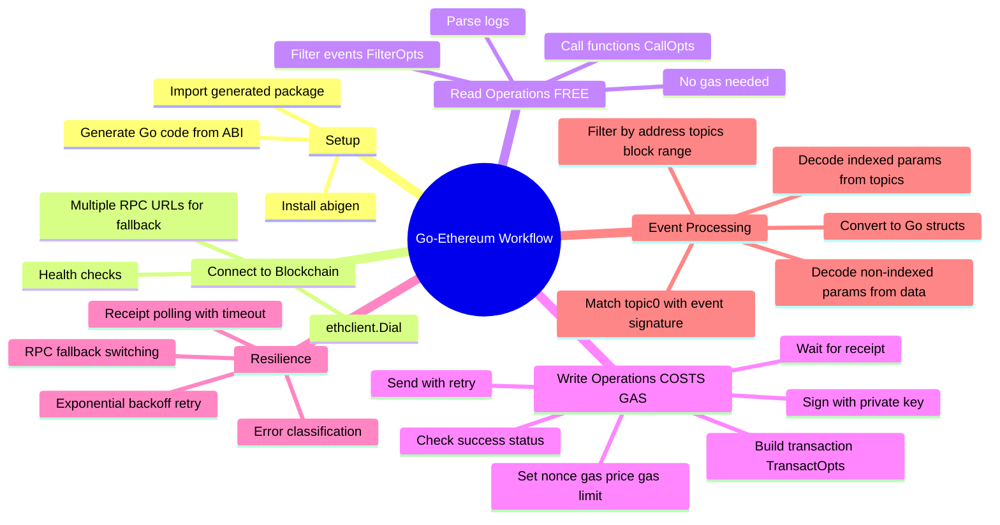

# Go-Ethereum Development Guide

A comprehensive guide for newbie Go developers working with Ethereum smart contracts, transactions, and event logs.

## Table of Contents
1. [Mental Model: The Big Picture](#mental-model-the-big-picture)
2. [Generating Go Code from ABI](#generating-go-code-from-abi)
3. [Transaction Simulation & Tracing](#transaction-simulation--tracing)
4. [Making Transactions with Retry Logic](#making-transactions-with-retry-logic)
5. [Getting Transaction Receipts](#getting-transaction-receipts)
6. [RPC Fallback Mechanism](#rpc-fallback-mechanism)
7. [Reading Event Logs](#reading-event-logs)
8. [Complete Example](#complete-example)

---

## Mental Model: The Big Picture

```mermaid
mindmap
  root((Go-Ethereum Development))
    Smart Contract Interaction
      ABI Files
        JSON definition of contract
        Functions, events, types
      abigen Tool
        Converts ABI → Go code
        Generates bindings
      Generated Code
        Type-safe functions
        Event structs
        Call/Transact methods
    
    Making Transactions
      Build Transaction
        From, To, Data, Gas
        Nonce, Gas Price
      Sign Transaction
        Private key
        Chain ID
      Send Transaction
        eth_sendRawTransaction
        Returns TX hash
      Wait for Receipt
        Confirms inclusion
        Gets logs
    
    Resilience Patterns
      Exponential Backoff
        Initial delay: 100ms
        Multiply by 2 each retry
        Max delay: 10s
        Max attempts: 5
      RPC Fallback
        Primary URL fails
        Switch to backup
        Round-robin or priority
      Receipt Polling
        Check every 1-2s
        Timeout after 5 min
        Handle reorgs
    
    Reading Events
      Filter Logs
        eth_getLogs
        By address, topics, block range
      Parse Logs
        Match topic[0] with event signature
        Decode indexed params (topics)
        Decode non-indexed params (data)
      Process Events
        Convert to Go structs
        Business logic
```

### The Flow: Contract → Transaction → Receipt → Events



---

## Generating Go Code from ABI

### What is ABI?

**Application Binary Interface (ABI)** is a JSON file that describes:
- Function signatures (name, inputs, outputs)
- Event signatures (name, indexed params)
- Data types

Think of it as the **contract's API documentation** in machine-readable format.

### Example ABI

```json
// CTFExchange.abi (simplified)
[
  {
    "type": "function",
    "name": "fillOrder",
    "inputs": [
      {"name": "order", "type": "tuple", "components": [...]},
      {"name": "fillAmount", "type": "uint256"}
    ],
    "outputs": [],
    "stateMutability": "nonpayable"
  },
  {
    "type": "event",
    "name": "OrderFilled",
    "inputs": [
      {"name": "orderHash", "type": "bytes32", "indexed": true},
      {"name": "maker", "type": "address", "indexed": true},
      {"name": "taker", "type": "address", "indexed": true},
      {"name": "makerAmountFilled", "type": "uint256", "indexed": false}
    ]
  }
]
```

### Installing abigen

```bash
# Install go-ethereum (includes abigen)
go install github.com/ethereum/go-ethereum/cmd/abigen@latest

# Verify installation
abigen --version
# abigen version 1.13.14-stable
```

### Generating Go Bindings

```bash
# Basic generation
abigen \
  --abi pkg/contracts/abi/CTFExchange.abi \
  --pkg contracts \
  --type CTFExchange \
  --out pkg/contracts/CTFExchange.go

# With embedded bytecode (for deployment)
abigen \
  --abi pkg/contracts/abi/CTFExchange.abi \
  --bin pkg/contracts/abi/CTFExchange.bin \
  --pkg contracts \
  --type CTFExchange \
  --out pkg/contracts/CTFExchange.go
```

**Parameters explained:**
- `--abi`: Path to ABI JSON file
- `--pkg`: Go package name for generated code
- `--type`: Name of the generated struct
- `--out`: Output file path
- `--bin`: (Optional) Bytecode for contract deployment

### Understanding Generated Code

**Generated file structure:**

```go
// pkg/contracts/CTFExchange.go (auto-generated)

package contracts

import (
    "github.com/ethereum/go-ethereum/accounts/abi"
    "github.com/ethereum/go-ethereum/accounts/abi/bind"
    "github.com/ethereum/go-ethereum/common"
    "github.com/ethereum/go-ethereum/core/types"
)

// CTFExchange is the main contract struct
type CTFExchange struct {
    CTFExchangeCaller     // Read-only functions
    CTFExchangeTransactor // State-changing functions
    CTFExchangeFilterer   // Event filtering
    contract *bind.BoundContract
}

// CTFExchangeCaller handles read operations (free, no gas)
type CTFExchangeCaller struct {
    contract *bind.BoundContract
}

// Functions like: GetOrder, IsValidOrder, etc.
func (c *CTFExchangeCaller) GetOrder(opts *bind.CallOpts, orderHash [32]byte) (Order, error) {
    // ...
}

// CTFExchangeTransactor handles write operations (costs gas)
type CTFExchangeTransactor struct {
    contract *bind.BoundContract
}

// Functions like: FillOrder, CancelOrder, etc.
func (c *CTFExchangeTransactor) FillOrder(opts *bind.TransactOpts, order Order, fillAmount *big.Int) (*types.Transaction, error) {
    // ...
}

// Event structs
type CTFExchangeOrderFilled struct {
    OrderHash          [32]byte
    Maker              common.Address
    Taker              common.Address
    MakerAmountFilled  *big.Int
    // ... more fields
}

// CTFExchangeFilterer handles event filtering
type CTFExchangeFilterer struct {
    contract *bind.BoundContract
}

func (f *CTFExchangeFilterer) FilterOrderFilled(opts *bind.FilterOpts, orderHash [][32]byte) (*CTFExchangeOrderFilledIterator, error) {
    // ...
}
```

### Using Generated Code

```go
package main

import (
    "github.com/ethereum/go-ethereum/common"
    "github.com/ethereum/go-ethereum/ethclient"
    "github.com/0xkanth/polymarket-indexer/pkg/contracts"
)

func main() {
    // Connect to Ethereum node
    client, _ := ethclient.Dial("https://polygon-rpc.com")
    
    // Contract address
    contractAddr := common.HexToAddress("0x4bFb41d5B3570DeFd03C39a9A4D8dE6Bd8B8982E")
    
    // Create contract instance
    exchange, err := contracts.NewCTFExchange(contractAddr, client)
    if err != nil {
        panic(err)
    }
    
    // Now you can call contract methods!
    // Read operations (free)
    order, err := exchange.GetOrder(nil, orderHash)
    
    // Write operations (costs gas) - covered next section
}
```

---

## Transaction Simulation & Tracing

### Why Simulate Before Sending?

**The Problem**: Sending a transaction costs gas, even if it fails.



**Benefits of Simulation**:
1. **Save gas** - Catch errors before paying
2. **Better UX** - Don't submit transactions that will fail
3. **Accurate gas estimates** - Simulation reveals actual gas needed
4. **Debug complex interactions** - See internal calls and state changes

### Method 1: Basic Simulation with `eth_call`

**`eth_call`** simulates a transaction without broadcasting it to the network. It's:
- ✅ Free (no gas cost)
- ✅ Available on all RPC providers
- ✅ Fast (instant result)
- ❌ Limited error details

#### Simulating Contract Calls

```go
package main

import (
    "context"
    "fmt"
    "math/big"
    
    "github.com/ethereum/go-ethereum/accounts/abi/bind"
    "github.com/ethereum/go-ethereum/common"
    "github.com/ethereum/go-ethereum/ethclient"
    
    "github.com/0xkanth/polymarket-indexer/pkg/contracts"
)

// SimulateBeforeSend simulates a transaction before actually sending it
func SimulateBeforeSend(ctx context.Context, client *ethclient.Client) error {
    // Load contract
    contractAddr := common.HexToAddress("0x4bFb41d5B3570DeFd03C39a9A4D8dE6Bd8B8982E")
    exchange, err := contracts.NewCTFExchange(contractAddr, client)
    if err != nil {
        return err
    }
    
    // Prepare parameters
    orderStruct := contracts.Order{
        // ... fill order details
    }
    fillAmount := big.NewInt(1000000)
    
    // Prepare sender address
    fromAddress := common.HexToAddress("0xYourAddress")
    
    // STEP 1: SIMULATE with CallOpts (read-only, no gas cost)
    callOpts := &bind.CallOpts{
        From:    fromAddress,          // Simulate as this address
        Pending: false,                // Use latest block, not pending
        Context: ctx,
    }
    
    // Try the simulation
    // Note: Most state-changing functions don't have a Call version
    // But you can use eth_call directly via client.CallContract
    
    // Build transaction data
    auth := &bind.TransactOpts{
        From:   fromAddress,
        NoSend: true,  // Don't send, just build the transaction
        Signer: func(addr common.Address, tx *types.Transaction) (*types.Transaction, error) {
            return tx, nil // Dummy signer for simulation
        },
    }
    
    tx, err := exchange.FillOrder(auth, orderStruct, fillAmount)
    if err != nil {
        return fmt.Errorf("failed to build transaction: %w", err)
    }
    
    // Simulate using eth_call
    msg := ethereum.CallMsg{
        From:     fromAddress,
        To:       &contractAddr,
        Gas:      0,  // No limit for simulation
        GasPrice: big.NewInt(1),
        Value:    big.NewInt(0),
        Data:     tx.Data(),
    }
    
    result, err := client.CallContract(ctx, msg, nil) // nil = latest block
    if err != nil {
        // Simulation failed! Transaction would revert
        fmt.Printf("❌ Simulation failed: %v\n", err)
        fmt.Printf("Don't send this transaction!\n")
        return fmt.Errorf("simulation failed: %w", err)
    }
    
    // Simulation succeeded!
    fmt.Printf("✅ Simulation successful!\n")
    fmt.Printf("Result: %x\n", result)
    fmt.Printf("Safe to send transaction.\n")
    
    // STEP 2: Now send the real transaction (covered in previous sections)
    // tx, err := SendTransactionWithRetry(...)
    
    return nil
}
```

#### Reading Contract State (Free)

```go
// Reading contract state is always free and uses eth_call automatically
func checkOrderStatus(ctx context.Context, client *ethclient.Client) error {
    contractAddr := common.HexToAddress("0x4bFb41d5B3570DeFd03C39a9A4D8dE6Bd8B8982E")
    exchange, _ := contracts.NewCTFExchange(contractAddr, client)
    
    orderHash := [32]byte{/* ... */}
    
    // This uses eth_call automatically (no gas cost)
    order, err := exchange.GetOrder(&bind.CallOpts{}, orderHash)
    if err != nil {
        return err
    }
    
    fmt.Printf("Order maker: %s\n", order.Maker.Hex())
    fmt.Printf("Order amount: %s\n", order.MakerAmount.String())
    
    return nil
}
```

### Method 2: Advanced Simulation with Tenderly

**Tenderly** provides advanced simulation with:
- ✅ Detailed execution traces
- ✅ Gas profiler (shows gas per function)
- ✅ State diffs (what changed)
- ✅ Internal calls visualization
- ✅ Custom block/state simulation
- ❌ Requires API key
- ❌ Costs money (has free tier)

#### When to Use Tenderly?

1. **Complex DeFi protocols** - Multiple contract interactions
2. **Debugging production issues** - Trace why a transaction failed
3. **Gas optimization** - See where gas is spent
4. **Fork testing** - Test against live chain state
5. **Security audits** - Analyze attack vectors

#### Tenderly Simulation Example

```go
package tenderly

import (
    "bytes"
    "context"
    "encoding/json"
    "fmt"
    "io"
    "net/http"
    "time"
)

// TenderlyClient wraps Tenderly API
type TenderlyClient struct {
    APIKey     string
    AccountID  string
    ProjectID  string
    HTTPClient *http.Client
}

// SimulateRequest defines simulation parameters
type SimulateRequest struct {
    NetworkID     string                 `json:"network_id"`      // "137" for Polygon
    From          string                 `json:"from"`
    To            string                 `json:"to"`
    Input         string                 `json:"input"`           // Hex-encoded calldata
    Gas           uint64                 `json:"gas"`
    GasPrice      string                 `json:"gas_price"`
    Value         string                 `json:"value"`
    BlockNumber   *int64                 `json:"block_number,omitempty"`
    StateOverrides map[string]interface{} `json:"state_objects,omitempty"`
    Save          bool                   `json:"save"`            // Save simulation for later viewing
}

// SimulateResponse contains simulation results
type SimulateResponse struct {
    Transaction struct {
        Hash       string `json:"hash"`
        Status     bool   `json:"status"`
        GasUsed    uint64 `json:"gas_used"`
        CallTrace  []Call `json:"call_trace"`
    } `json:"transaction"`
    Simulation struct {
        ID  string `json:"id"`
        URL string `json:"url"`  // Link to view in Tenderly dashboard
    } `json:"simulation"`
}

type Call struct {
    CallType string `json:"call_type"`
    From     string `json:"from"`
    To       string `json:"to"`
    Gas      uint64 `json:"gas"`
    GasUsed  uint64 `json:"gas_used"`
    Input    string `json:"input"`
    Output   string `json:"output"`
}

// NewTenderlyClient creates a Tenderly API client
func NewTenderlyClient(apiKey, accountID, projectID string) *TenderlyClient {
    return &TenderlyClient{
        APIKey:    apiKey,
        AccountID: accountID,
        ProjectID: projectID,
        HTTPClient: &http.Client{
            Timeout: 30 * time.Second,
        },
    }
}

// Simulate simulates a transaction on Tenderly
func (t *TenderlyClient) Simulate(ctx context.Context, req SimulateRequest) (*SimulateResponse, error) {
    url := fmt.Sprintf("https://api.tenderly.co/api/v1/account/%s/project/%s/simulate",
        t.AccountID, t.ProjectID)
    
    reqBody, err := json.Marshal(req)
    if err != nil {
        return nil, err
    }
    
    httpReq, err := http.NewRequestWithContext(ctx, "POST", url, bytes.NewReader(reqBody))
    if err != nil {
        return nil, err
    }
    
    httpReq.Header.Set("Content-Type", "application/json")
    httpReq.Header.Set("X-Access-Key", t.APIKey)
    
    resp, err := t.HTTPClient.Do(httpReq)
    if err != nil {
        return nil, err
    }
    defer resp.Body.Close()
    
    if resp.StatusCode != http.StatusOK {
        body, _ := io.ReadAll(resp.Body)
        return nil, fmt.Errorf("tenderly API error: %d - %s", resp.StatusCode, string(body))
    }
    
    var simResp SimulateResponse
    if err := json.NewDecoder(resp.Body).Decode(&simResp); err != nil {
        return nil, err
    }
    
    return &simResp, nil
}

// Example usage
func simulateWithTenderly() {
    client := NewTenderlyClient(
        "YOUR_TENDERLY_API_KEY",
        "your-account",
        "your-project",
    )
    
    // Simulate a transaction
    req := SimulateRequest{
        NetworkID: "137", // Polygon
        From:      "0xYourAddress",
        To:        "0x4bFb41d5B3570DeFd03C39a9A4D8dE6Bd8B8982E",
        Input:     "0xabc123...", // Transaction calldata
        Gas:       300000,
        GasPrice:  "100000000000", // 100 Gwei
        Value:     "0",
        Save:      true, // Save for viewing in dashboard
    }
    
    resp, err := client.Simulate(context.Background(), req)
    if err != nil {
        fmt.Printf("Simulation failed: %v\n", err)
        return
    }
    
    if resp.Transaction.Status {
        fmt.Printf("✅ Simulation successful!\n")
        fmt.Printf("Gas used: %d\n", resp.Transaction.GasUsed)
        fmt.Printf("View in Tenderly: %s\n", resp.Simulation.URL)
        
        // Analyze call trace
        fmt.Printf("\nCall trace (%d calls):\n", len(resp.Transaction.CallTrace))
        for i, call := range resp.Transaction.CallTrace {
            fmt.Printf("  %d. %s: %s -> %s (gas: %d)\n",
                i+1, call.CallType, call.From[:10]+"...", call.To[:10]+"...", call.GasUsed)
        }
    } else {
        fmt.Printf("❌ Simulation failed (would revert)\n")
        fmt.Printf("View details: %s\n", resp.Simulation.URL)
    }
}
```

### Method 3: Transaction Tracing with `debug_traceTransaction`

**After** a transaction is mined, you can trace it to understand what happened.

#### When to Use Tracing?

1. **Debug failed transactions** - See exactly where and why it reverted
2. **Gas optimization** - Identify expensive operations
3. **Security analysis** - Analyze complex attack transactions
4. **Verify contract behavior** - Ensure logic executed as expected

#### Important Notes

⚠️ **Not all RPC providers support tracing**:
- ✅ Self-hosted nodes with `--http.api=debug`
- ✅ Alchemy (on paid plans)
- ✅ QuickNode (on higher tiers)
- ❌ Most free RPC providers
- ❌ Infura

#### Transaction Tracing Example

```go
package main

import (
    "context"
    "encoding/json"
    "fmt"
    
    "github.com/ethereum/go-ethereum/common"
    "github.com/ethereum/go-ethereum/ethclient"
    "github.com/ethereum/go-ethereum/rpc"
)

// TraceConfig configures what to trace
type TraceConfig struct {
    EnableMemory     bool `json:"enableMemory"`
    DisableStack     bool `json:"disableStack"`
    DisableStorage   bool `json:"disableStorage"`
    EnableReturnData bool `json:"enableReturnData"`
    Timeout          string `json:"timeout"`
}

// TraceResult contains the execution trace
type TraceResult struct {
    Gas         uint64                   `json:"gas"`
    Failed      bool                     `json:"failed"`
    ReturnValue string                   `json:"returnValue"`
    StructLogs  []StructLog              `json:"structLogs"`
}

type StructLog struct {
    PC      uint64            `json:"pc"`
    Op      string            `json:"op"`
    Gas     uint64            `json:"gas"`
    GasCost uint64            `json:"gasCost"`
    Depth   int               `json:"depth"`
    Error   string            `json:"error,omitempty"`
    Stack   []string          `json:"stack,omitempty"`
    Memory  []string          `json:"memory,omitempty"`
    Storage map[string]string `json:"storage,omitempty"`
}

// TraceTransaction traces a transaction to see internal execution
func TraceTransaction(ctx context.Context, rpcURL string, txHash common.Hash) (*TraceResult, error) {
    // Connect to RPC with raw client (ethclient doesn't expose debug APIs)
    rpcClient, err := rpc.DialContext(ctx, rpcURL)
    if err != nil {
        return nil, fmt.Errorf("failed to connect to RPC: %w", err)
    }
    defer rpcClient.Close()
    
    // Configure tracing
    config := TraceConfig{
        EnableMemory:     false, // Memory traces are huge, usually not needed
        DisableStack:     false, // Stack is useful for debugging
        DisableStorage:   false, // Storage shows state changes
        EnableReturnData: true,  // See what functions returned
        Timeout:          "10s", // Tracing can be slow
    }
    
    var result TraceResult
    err = rpcClient.CallContext(ctx, &result, "debug_traceTransaction", txHash, config)
    if err != nil {
        return nil, fmt.Errorf("trace failed: %w", err)
    }
    
    return &result, nil
}

// AnalyzeTrace prints useful information from the trace
func AnalyzeTrace(trace *TraceResult) {
    fmt.Printf("Transaction Analysis:\n")
    fmt.Printf("  Gas used: %d\n", trace.Gas)
    fmt.Printf("  Failed: %v\n", trace.Failed)
    fmt.Printf("  Operations: %d\n", len(trace.StructLogs))
    
    if trace.Failed {
        fmt.Printf("  ❌ Transaction reverted\n")
        // Find where it failed
        for i, log := range trace.StructLogs {
            if log.Error != "" {
                fmt.Printf("  Failed at step %d: %s (opcode: %s)\n", i, log.Error, log.Op)
                break
            }
        }
    }
    
    // Gas profiling - find most expensive operations
    fmt.Printf("\nMost expensive operations:\n")
    type OpCost struct {
        Op   string
        Cost uint64
    }
    
    opCosts := make(map[string]uint64)
    for _, log := range trace.StructLogs {
        opCosts[log.Op] += log.GasCost
    }
    
    // Print top 5 most expensive
    count := 0
    for op, cost := range opCosts {
        if count >= 5 {
            break
        }
        if cost > 1000 { // Only show if significant
            fmt.Printf("  %s: %d gas\n", op, cost)
            count++
        }
    }
}

// Example usage
func traceExample() {
    ctx := context.Background()
    txHash := common.HexToHash("0xabc123...")
    
    // Need RPC provider that supports debug_* APIs
    rpcURL := "https://polygon-mainnet.g.alchemy.com/v2/YOUR-KEY"
    
    trace, err := TraceTransaction(ctx, rpcURL, txHash)
    if err != nil {
        fmt.Printf("Failed to trace: %v\n", err)
        fmt.Printf("Note: Not all RPC providers support tracing\n")
        return
    }
    
    AnalyzeTrace(trace)
}
```

### Method 4: State Inspection Before Sending

Instead of simulating the whole transaction, check prerequisites:

```go
package main

import (
    "context"
    "fmt"
    "math/big"
    
    "github.com/ethereum/go-ethereum/accounts/abi/bind"
    "github.com/ethereum/go-ethereum/common"
    "github.com/ethereum/go-ethereum/ethclient"
)

// PreflightChecks validates conditions before sending transaction
func PreflightChecks(ctx context.Context, client *ethclient.Client) error {
    fromAddress := common.HexToAddress("0xYourAddress")
    contractAddr := common.HexToAddress("0x4bFb41d5B3570DeFd03C39a9A4D8dE6Bd8B8982E")
    
    // 1. Check ETH balance for gas
    balance, err := client.BalanceAt(ctx, fromAddress, nil)
    if err != nil {
        return err
    }
    
    minBalance := big.NewInt(100000000000000000) // 0.1 ETH
    if balance.Cmp(minBalance) < 0 {
        return fmt.Errorf("insufficient ETH balance: have %s, need %s",
            balance.String(), minBalance.String())
    }
    fmt.Printf("✅ ETH balance: %s\n", balance.String())
    
    // 2. Check token allowance (if needed)
    // tokenContract, _ := contracts.NewERC20(tokenAddr, client)
    // allowance, _ := tokenContract.Allowance(&bind.CallOpts{}, fromAddress, contractAddr)
    // if allowance.Cmp(requiredAmount) < 0 {
    //     return fmt.Errorf("insufficient token allowance")
    // }
    
    // 3. Check nonce (detect if transactions are stuck)
    nonce, err := client.NonceAt(ctx, fromAddress, nil) // latest
    if err != nil {
        return err
    }
    
    pendingNonce, err := client.PendingNonceAt(ctx, fromAddress)
    if err != nil {
        return err
    }
    
    if pendingNonce > nonce+5 {
        fmt.Printf("⚠️  Warning: %d pending transactions detected\n", pendingNonce-nonce)
        fmt.Printf("   Consider waiting or using higher gas price\n")
    } else {
        fmt.Printf("✅ Nonce: %d (no stuck transactions)\n", nonce)
    }
    
    // 4. Check gas price (detect spikes)
    gasPrice, err := client.SuggestGasPrice(ctx)
    if err != nil {
        return err
    }
    
    maxGasPrice := big.NewInt(500000000000) // 500 Gwei max
    if gasPrice.Cmp(maxGasPrice) > 0 {
        return fmt.Errorf("gas price too high: %s (max: %s)",
            gasPrice.String(), maxGasPrice.String())
    }
    fmt.Printf("✅ Gas price: %s Gwei\n", new(big.Int).Div(gasPrice, big.NewInt(1e9)))
    
    // 5. Check contract state
    // order, err := exchange.GetOrder(&bind.CallOpts{}, orderHash)
    // if order.Filled {
    //     return fmt.Errorf("order already filled")
    // }
    
    fmt.Printf("\n✅ All preflight checks passed!\n")
    return nil
}
```

### Comparison: When to Use Each Method?

| Method | Cost | Speed | Detail | Use Case |
|--------|------|-------|--------|----------|
| **eth_call** | Free | Fast | Basic | Quick validation before sending |
| **Preflight Checks** | Free | Fast | None | Check balances, allowances, state |
| **Tenderly Simulate** | Paid | Medium | High | Complex DeFi, debugging, gas profiling |
| **debug_trace** | Free* | Slow | Highest | Post-mortem analysis of mined TXs |

*Requires special RPC node

### Best Practice: Combined Approach

```go
func SendTransactionSafely(ctx context.Context, client *ethclient.Client) error {
    // Step 1: Preflight checks (free, fast)
    if err := PreflightChecks(ctx, client); err != nil {
        return fmt.Errorf("preflight failed: %w", err)
    }
    
    // Step 2: Simulate with eth_call (free, fast)
    if err := SimulateBeforeSend(ctx, client); err != nil {
        return fmt.Errorf("simulation failed: %w", err)
    }
    
    // Step 3: Send transaction with retry (costs gas)
    tx, err := SendTransactionWithRetry(ctx, client, logger, txFunc, gasLimit, cfg)
    if err != nil {
        return fmt.Errorf("send failed: %w", err)
    }
    
    fmt.Printf("✅ Transaction sent: %s\n", tx.Hash().Hex())
    
    // Step 4: Wait for receipt
    receipt, err := WaitForReceipt(ctx, client, tx.Hash(), logger, receiptCfg)
    if err != nil {
        // Step 5 (optional): Trace the failed transaction to debug
        if strings.Contains(err.Error(), "failed") {
            trace, _ := TraceTransaction(ctx, rpcURL, tx.Hash())
            if trace != nil {
                AnalyzeTrace(trace)
            }
        }
        return err
    }
    
    fmt.Printf("✅ Transaction confirmed in block %d\n", receipt.BlockNumber.Uint64())
    return nil
}
```

### Key Takeaways

1. **Always simulate before sending** production transactions
2. **Use `eth_call`** for basic validation (free and fast)
3. **Use Tenderly** for complex DeFi debugging and gas optimization
4. **Use tracing** to debug failed transactions after they're mined
5. **Combine preflight checks + simulation** for maximum safety
6. **Save gas** by catching errors before broadcasting

---

## Special Case: Prediction Market User Orders

### Should You Use Simple Simulation or Tenderly?

**For user-facing prediction market orders (Polymarket, etc.):**



### Answer: Use Simple `eth_call` Simulation ✅

**Why `eth_call` is sufficient for user orders:**

1. **Speed** - Users expect instant feedback (<500ms)
   - `eth_call`: ~50-200ms
   - Tenderly: ~500-2000ms
   
2. **Cost** - You can't charge users for Tenderly API calls
   - `eth_call`: Free, unlimited
   - Tenderly: $99/month + per-simulation costs

3. **Simplicity** - Order validation is straightforward
   - ✅ Does order meet minimum size?
   - ✅ Does user have tokens?
   - ✅ Does user have allowance?
   - ✅ Is there matching liquidity?
   - ✅ Will transaction revert?

4. **Scale** - You need to handle many users
   - `eth_call`: Scales with your RPC provider
   - Tenderly: Rate limits apply

### Practical Implementation for Prediction Markets

```go
package orders

import (
    "context"
    "fmt"
    "math/big"
    
    "github.com/ethereum/go-ethereum"
    "github.com/ethereum/go-ethereum/accounts/abi/bind"
    "github.com/ethereum/go-ethereum/common"
    "github.com/ethereum/go-ethereum/ethclient"
    "github.com/rs/zerolog"
    
    "github.com/0xkanth/polymarket-indexer/pkg/contracts"
)

// OrderValidator validates prediction market orders before submission
type OrderValidator struct {
    client   *ethclient.Client
    exchange *contracts.CTFExchange
    token    *contracts.ERC20
    logger   zerolog.Logger
}

// ValidateAndSimulateOrder performs all checks before submitting user order
func (v *OrderValidator) ValidateAndSimulateOrder(
    ctx context.Context,
    user common.Address,
    order contracts.Order,
    fillAmount *big.Int,
) error {
    v.logger.Info().
        Str("user", user.Hex()).
        Str("order_hash", fmt.Sprintf("%x", order.Salt)).
        Str("amount", fillAmount.String()).
        Msg("validating order")
    
    // Step 1: Quick parameter validation (no RPC calls)
    if err := v.validateParameters(order, fillAmount); err != nil {
        v.logger.Warn().Err(err).Msg("parameter validation failed")
        return fmt.Errorf("invalid parameters: %w", err)
    }
    
    // Step 2: Check user balances and allowances (read-only, free)
    if err := v.checkUserBalances(ctx, user, order, fillAmount); err != nil {
        v.logger.Warn().Err(err).Msg("balance check failed")
        return fmt.Errorf("insufficient balance/allowance: %w", err)
    }
    
    // Step 3: Check order state (read-only, free)
    if err := v.checkOrderState(ctx, order); err != nil {
        v.logger.Warn().Err(err).Msg("order state check failed")
        return fmt.Errorf("order not fillable: %w", err)
    }
    
    // Step 4: Simulate the actual transaction (free, fast)
    if err := v.simulateOrderFill(ctx, user, order, fillAmount); err != nil {
        v.logger.Warn().Err(err).Msg("simulation failed")
        return fmt.Errorf("transaction would revert: %w", err)
    }
    
    v.logger.Info().Msg("✅ order validation passed")
    return nil
}

// validateParameters checks basic order parameters (no RPC calls)
func (v *OrderValidator) validateParameters(order contracts.Order, fillAmount *big.Int) error {
    // Check minimum order size (example: 1 USDC)
    minSize := big.NewInt(1000000) // 1 USDC (6 decimals)
    if fillAmount.Cmp(minSize) < 0 {
        return fmt.Errorf("order size %s below minimum %s", fillAmount, minSize)
    }
    
    // Check maximum order size (example: 100k USDC to prevent manipulation)
    maxSize := new(big.Int).Mul(big.NewInt(100000), big.NewInt(1000000))
    if fillAmount.Cmp(maxSize) > 0 {
        return fmt.Errorf("order size %s exceeds maximum %s", fillAmount, maxSize)
    }
    
    // Check order maker amount
    if order.MakerAmount.Cmp(big.NewInt(0)) <= 0 {
        return fmt.Errorf("invalid maker amount: %s", order.MakerAmount)
    }
    
    return nil
}

// checkUserBalances verifies user has sufficient tokens and allowances
func (v *OrderValidator) checkUserBalances(
    ctx context.Context,
    user common.Address,
    order contracts.Order,
    fillAmount *big.Int,
) error {
    // For prediction markets, user needs:
    // 1. Outcome tokens (to sell) OR
    // 2. USDC (to buy)
    
    // Check if user is taking the maker or taker side
    // This is simplified - actual logic depends on your order book
    
    // Check token balance
    balance, err := v.token.BalanceOf(&bind.CallOpts{Context: ctx}, user)
    if err != nil {
        return fmt.Errorf("failed to get balance: %w", err)
    }
    
    requiredBalance := fillAmount
    if balance.Cmp(requiredBalance) < 0 {
        return fmt.Errorf("insufficient balance: have %s, need %s",
            balance.String(), requiredBalance.String())
    }
    
    // Check token allowance to exchange contract
    allowance, err := v.token.Allowance(
        &bind.CallOpts{Context: ctx},
        user,
        v.exchange.Address(),
    )
    if err != nil {
        return fmt.Errorf("failed to get allowance: %w", err)
    }
    
    if allowance.Cmp(requiredBalance) < 0 {
        return fmt.Errorf("insufficient allowance: have %s, need %s. User needs to approve token",
            allowance.String(), requiredBalance.String())
    }
    
    return nil
}

// checkOrderState verifies the order is still valid and fillable
func (v *OrderValidator) checkOrderState(ctx context.Context, order contracts.Order) error {
    // Calculate order hash
    orderHash := calculateOrderHash(order) // Implement based on your protocol
    
    // Check if order exists and is fillable
    // This is protocol-specific - example for Polymarket-style
    orderInfo, err := v.exchange.GetOrder(&bind.CallOpts{Context: ctx}, orderHash)
    if err != nil {
        return fmt.Errorf("failed to get order info: %w", err)
    }
    
    // Check if order is cancelled
    if orderInfo.Status == 2 { // Cancelled status
        return fmt.Errorf("order is cancelled")
    }
    
    // Check if order is expired
    if orderInfo.Expiration.Cmp(big.NewInt(time.Now().Unix())) < 0 {
        return fmt.Errorf("order is expired")
    }
    
    // Check if order is fully filled
    if orderInfo.FilledAmount.Cmp(orderInfo.MakerAmount) >= 0 {
        return fmt.Errorf("order is fully filled")
    }
    
    // Check remaining fillable amount
    remaining := new(big.Int).Sub(orderInfo.MakerAmount, orderInfo.FilledAmount)
    if remaining.Cmp(big.NewInt(0)) <= 0 {
        return fmt.Errorf("no remaining liquidity")
    }
    
    return nil
}

// simulateOrderFill simulates the actual fillOrder transaction
func (v *OrderValidator) simulateOrderFill(
    ctx context.Context,
    user common.Address,
    order contracts.Order,
    fillAmount *big.Int,
) error {
    // Build transaction data
    auth := &bind.TransactOpts{
        From:   user,
        NoSend: true, // Don't actually send
        Signer: func(addr common.Address, tx *types.Transaction) (*types.Transaction, error) {
            return tx, nil // Dummy signer
        },
    }
    
    tx, err := v.exchange.FillOrder(auth, order, fillAmount)
    if err != nil {
        return fmt.Errorf("failed to build transaction: %w", err)
    }
    
    // Simulate using eth_call
    msg := ethereum.CallMsg{
        From:     user,
        To:       &v.exchange.Address(),
        Gas:      0, // No limit for simulation
        GasPrice: big.NewInt(1),
        Value:    big.NewInt(0),
        Data:     tx.Data(),
    }
    
    result, err := v.client.CallContract(ctx, msg, nil)
    if err != nil {
        // Parse the revert reason for better UX
        revertReason := parseRevertReason(err)
        return fmt.Errorf("simulation failed: %s", revertReason)
    }
    
    v.logger.Debug().
        Str("result", fmt.Sprintf("%x", result)).
        Msg("simulation successful")
    
    return nil
}

// parseRevertReason extracts user-friendly error from revert
func parseRevertReason(err error) string {
    errMsg := err.Error()
    
    // Common prediction market revert reasons
    revertMappings := map[string]string{
        "insufficient balance":        "You don't have enough tokens",
        "insufficient allowance":      "Please approve tokens first",
        "order expired":               "This order has expired",
        "order cancelled":             "This order was cancelled",
        "order filled":                "This order is already filled",
        "price changed":               "Price has changed, please refresh",
        "slippage exceeded":           "Price moved too much (slippage)",
        "market closed":               "This market is closed",
    }
    
    for pattern, friendly := range revertMappings {
        if strings.Contains(strings.ToLower(errMsg), pattern) {
            return friendly
        }
    }
    
    return errMsg
}

// Helper to calculate order hash (implement based on your protocol)
func calculateOrderHash(order contracts.Order) [32]byte {
    // This is protocol-specific
    // For Polymarket CTF Exchange, it uses EIP-712 structured data hashing
    // Implement according to your contract's getOrderHash() logic
    return [32]byte{}
}
```

### User Flow with Simulation



### When to Use Tenderly for Prediction Markets

**Tenderly is useful for:**
- ❌ **NOT** for individual user orders (too slow, too expensive)
- ✅ **YES** for admin operations (market creation, resolution)
- ✅ **YES** for debugging failed transactions in production
- ✅ **YES** for gas optimization of core contracts
- ✅ **YES** for security testing/audits

### Performance Comparison

**Validating 1 user order:**

| Approach | Time | Cost | User Experience |
|----------|------|------|-----------------|
| **eth_call simulation** | 200-400ms | $0 | ✅ Instant feedback |
| **Tenderly simulation** | 800-2000ms | $0.01 per call | ❌ Slow, feels laggy |
| **No simulation** | 50ms | Gas if fails | ❌ Users lose money |

**At scale (10,000 orders/day):**

| Approach | Daily Cost | User Impact |
|----------|------------|-------------|
| **eth_call** | $0 | ✅ All orders validated |
| **Tenderly** | $100/day = $36,500/year | ❌ Prohibitively expensive |
| **No validation** | $0 infra, $$$ user gas lost | ❌ Users angry |

### Production Implementation

```go
// API handler for order validation
func (h *OrderHandler) ValidateOrder(w http.ResponseWriter, r *http.Request) {
    var req ValidateOrderRequest
    if err := json.NewDecoder(r.Body).Decode(&req); err != nil {
        http.Error(w, "invalid request", http.StatusBadRequest)
        return
    }
    
    // Quick response timeout - users expect fast feedback
    ctx, cancel := context.WithTimeout(r.Context(), 2*time.Second)
    defer cancel()
    
    // Validate using eth_call simulation
    err := h.validator.ValidateAndSimulateOrder(
        ctx,
        req.UserAddress,
        req.Order,
        req.FillAmount,
    )
    
    if err != nil {
        // Return user-friendly error
        json.NewEncoder(w).Encode(map[string]interface{}{
            "valid": false,
            "error": err.Error(),
        })
        return
    }
    
    // Order is valid, can proceed to sign and submit
    json.NewEncoder(w).Encode(map[string]interface{}{
        "valid": true,
        "message": "Order can be submitted",
    })
}
```

### Recommendation for Prediction Markets

**For user-facing order submission:**
```
✅ Use eth_call simulation (fast, free, reliable)
✅ Add preflight checks (balances, allowances)
✅ Parse revert reasons for friendly error messages
❌ Don't use Tenderly for per-order validation
✅ Use Tenderly only for post-mortem debugging
```

**This approach:**
- Saves users from wasting gas on failed transactions
- Provides instant feedback (<500ms)
- Scales to thousands of orders per day
- Costs $0 in infrastructure
- Catches 99% of failures before they happen

---

## Making Transactions with Retry Logic

### The Transaction Lifecycle



### Basic Transaction (No Retry)

```go
package main

import (
    "context"
    "crypto/ecdsa"
    "fmt"
    "math/big"
    
    "github.com/ethereum/go-ethereum/accounts/abi/bind"
    "github.com/ethereum/go-ethereum/common"
    "github.com/ethereum/go-ethereum/crypto"
    "github.com/ethereum/go-ethereum/ethclient"
    
    "github.com/0xkanth/polymarket-indexer/pkg/contracts"
)

func sendTransaction() error {
    // 1. Connect to Ethereum node
    client, err := ethclient.Dial("https://polygon-rpc.com")
    if err != nil {
        return fmt.Errorf("failed to connect: %w", err)
    }
    defer client.Close()
    
    // 2. Load private key
    privateKey, err := crypto.HexToECDSA("your-private-key-hex")
    if err != nil {
        return fmt.Errorf("failed to load key: %w", err)
    }
    
    publicKey := privateKey.Public()
    publicKeyECDSA, _ := publicKey.(*ecdsa.PublicKey)
    fromAddress := crypto.PubkeyToAddress(*publicKeyECDSA)
    
    // 3. Get nonce (transaction count)
    nonce, err := client.PendingNonceAt(context.Background(), fromAddress)
    if err != nil {
        return fmt.Errorf("failed to get nonce: %w", err)
    }
    
    // 4. Get gas price
    gasPrice, err := client.SuggestGasPrice(context.Background())
    if err != nil {
        return fmt.Errorf("failed to get gas price: %w", err)
    }
    
    // 5. Get chain ID
    chainID, err := client.ChainID(context.Background())
    if err != nil {
        return fmt.Errorf("failed to get chain ID: %w", err)
    }
    
    // 6. Create transactor (signer)
    auth, err := bind.NewKeyedTransactorWithChainID(privateKey, chainID)
    if err != nil {
        return fmt.Errorf("failed to create transactor: %w", err)
    }
    
    // 7. Set transaction options
    auth.Nonce = big.NewInt(int64(nonce))
    auth.Value = big.NewInt(0)      // ETH to send (0 for most calls)
    auth.GasLimit = uint64(300000)  // Max gas to use
    auth.GasPrice = gasPrice
    
    // 8. Load contract
    contractAddr := common.HexToAddress("0x4bFb41d5B3570DeFd03C39a9A4D8dE6Bd8B8982E")
    exchange, err := contracts.NewCTFExchange(contractAddr, client)
    if err != nil {
        return fmt.Errorf("failed to load contract: %w", err)
    }
    
    // 9. Call contract method (this sends the transaction)
    tx, err := exchange.FillOrder(auth, orderStruct, fillAmount)
    if err != nil {
        return fmt.Errorf("failed to send transaction: %w", err)
    }
    
    fmt.Printf("Transaction sent: %s\n", tx.Hash().Hex())
    return nil
}
```

### Transaction with Exponential Backoff Retry

```go
package txutil

import (
    "context"
    "errors"
    "fmt"
    "math"
    "strings"
    "time"
    
    "github.com/ethereum/go-ethereum/accounts/abi/bind"
    "github.com/ethereum/go-ethereum/core/types"
    "github.com/rs/zerolog"
)

// RetryConfig configures retry behavior
type RetryConfig struct {
    MaxAttempts  int           // Maximum number of retry attempts
    InitialDelay time.Duration // Initial delay before first retry
    MaxDelay     time.Duration // Maximum delay between retries
    Multiplier   float64       // Delay multiplier for each retry
}

// DefaultRetryConfig provides sensible defaults
func DefaultRetryConfig() RetryConfig {
    return RetryConfig{
        MaxAttempts:  5,
        InitialDelay: 100 * time.Millisecond,
        MaxDelay:     10 * time.Second,
        Multiplier:   2.0,
    }
}

// IsRPCError checks if error is RPC-related (network, connection issues)
func IsRPCError(err error) bool {
    if err == nil {
        return false
    }
    
    errMsg := strings.ToLower(err.Error())
    
    // RPC/Network errors (RETRYABLE)
    rpcPatterns := []string{
        "connection refused",
        "timeout",
        "temporarily unavailable",
        "network is unreachable",
        "broken pipe",
        "EOF",
        "i/o timeout",
        "no such host",
        "connection reset",
        "TLS handshake",
    }
    
    for _, pattern := range rpcPatterns {
        if strings.Contains(errMsg, pattern) {
            return true
        }
    }
    
    return false
}

// IsRateLimitError checks if error is due to rate limiting
func IsRateLimitError(err error) bool {
    if err == nil {
        return false
    }
    
    errMsg := strings.ToLower(err.Error())
    
    // Rate limit patterns (RETRYABLE but need longer backoff)
    rateLimitPatterns := []string{
        "rate limit",
        "too many requests",
        "429",
        "daily request count exceeded",
        "capacity exceeded",
        "request limit reached",
    }
    
    for _, pattern := range rateLimitPatterns {
        if strings.Contains(errMsg, pattern) {
            return true
        }
    }
    
    return false
}

// IsTransactionRevert checks if transaction reverted (contract logic rejected)
func IsTransactionRevert(err error) bool {
    if err == nil {
        return false
    }
    
    errMsg := strings.ToLower(err.Error())
    
    // Transaction revert patterns (PERMANENT - don't retry)
    revertPatterns := []string{
        "execution reverted",
        "revert",
        "invalid opcode",
        "invalid jump",
        "stack underflow",
        "stack overflow",
    }
    
    for _, pattern := range revertPatterns {
        if strings.Contains(errMsg, pattern) {
            return true
        }
    }
    
    return false
}

// IsAlreadyKnown checks if transaction is already in mempool
func IsAlreadyKnown(err error) bool {
    if err == nil {
        return false
    }
    
    errMsg := strings.ToLower(err.Error())
    
    // Transaction already in mempool (not an error, wait for it)
    knownPatterns := []string{
        "already known",
        "known transaction",
    }
    
    for _, pattern := range knownPatterns {
        if strings.Contains(errMsg, pattern) {
            return true
        }
    }
    
    return false
}

// IsGasPriceTooLow checks if transaction needs higher gas price
func IsGasPriceTooLow(err error) bool {
    if err == nil {
        return false
    }
    
    errMsg := strings.ToLower(err.Error())
    
    // Gas price too low (RETRYABLE with price increase)
    gasPricePatterns := []string{
        "replacement transaction underpriced",
        "transaction underpriced",
        "gas price too low",
        "max fee per gas less than block",
    }
    
    for _, pattern := range gasPricePatterns {
        if strings.Contains(errMsg, pattern) {
            return true
        }
    }
    
    return false
}

// IsRetryableError determines if an error should trigger a retry
func IsRetryableError(err error) bool {
    if err == nil {
        return false
    }
    
    errMsg := strings.ToLower(err.Error())
    
    // 1. RPC issues - RETRYABLE
    if IsRPCError(err) {
        return true
    }
    
    // 2. Rate limits - RETRYABLE (but need longer backoff)
    if IsRateLimitError(err) {
        return true
    }
    
    // 3. Transaction reverts - NOT RETRYABLE (handled separately)
    if IsTransactionRevert(err) {
        return false
    }
    
    // 4. Execution out of gas - NOT RETRYABLE (permanent failure)
    if IsOutOfGasExecution(err) {
        return false
    }
    
    // 5. Gas estimation failures - RETRYABLE (with higher limit)
    if IsOutOfGasEstimation(err) {
        return true
    }
    
    // 6. Already in mempool - NOT RETRYABLE (wait for existing TX)
    if IsAlreadyKnown(err) {
        return false // Special case: handled separately
    }
    
    // 7. Gas price too low - RETRYABLE (with price increase)
    if IsGasPriceTooLow(err) {
        return true
    }
    
    // 8. Transient transaction errors - RETRYABLE
    transientPatterns := []string{
        "nonce too low",              // Nonce already used, check TX status then retry
    }
    
    for _, pattern := range transientPatterns {
        if strings.Contains(errMsg, pattern) {
            return true
        }
    }
    
    return false
}

// IsPermanentError determines if an error should NOT be retried
func IsPermanentError(err error) bool {
    if err == nil {
        return false
    }
    
    errMsg := strings.ToLower(err.Error())
    
    // Transaction reverts (contract rejected the transaction)
    if IsTransactionRevert(err) {
        return true
    }
    
    // Execution out of gas (transaction ran out during execution)
    if IsOutOfGasExecution(err) {
        return true
    }
    
    // Other permanent errors
    permanentPatterns := []string{
        "insufficient funds",          // Not enough ETH/tokens - won't resolve by retrying
        "exceeds block gas limit",     // Transaction too large for any block
        "invalid signature",
        "invalid sender",
        "nonce too high",              // Nonce from future, don't retry
        "invalid transaction",
    }
    
    for _, pattern := range permanentPatterns {
        if strings.Contains(errMsg, pattern) {
            return true
        }
    }
    
    return false
}

// CalculateBackoff calculates delay for the given attempt
func CalculateBackoff(cfg RetryConfig, attempt int) time.Duration {
    if attempt <= 0 {
        return 0
    }
    
    // Exponential: delay = initialDelay * (multiplier ^ (attempt - 1))
    delay := float64(cfg.InitialDelay) * math.Pow(cfg.Multiplier, float64(attempt-1))
    
    // Cap at max delay
    if delay > float64(cfg.MaxDelay) {
        return cfg.MaxDelay
    }
    
    return time.Duration(delay)
}

// CalculateRateLimitBackoff returns longer delay for rate limit errors
func CalculateRateLimitBackoff(attempt int) time.Duration {
    // Rate limits need much longer backoff
    baseDelay := 30 * time.Second
    delay := float64(baseDelay) * math.Pow(2.0, float64(attempt-1))
    maxDelay := 5 * time.Minute
    
    if delay > float64(maxDelay) {
        return maxDelay
    }
    
    return time.Duration(delay)
}

// BumpGasPrice increases gas price by a percentage
func BumpGasPrice(currentPrice *big.Int, bumpPercent int) *big.Int {
    if bumpPercent < 10 {
        bumpPercent = 10 // Minimum 10% increase
    }
    
    // newPrice = currentPrice * (100 + bumpPercent) / 100
    bump := new(big.Int).Mul(currentPrice, big.NewInt(int64(bumpPercent)))
    bump.Div(bump, big.NewInt(100))
    
    newPrice := new(big.Int).Add(currentPrice, bump)
    return newPrice
}

// EstimateGasWithBuffer estimates gas and adds a safety buffer
func EstimateGasWithBuffer(
    ctx context.Context,
    client *ethclient.Client,
    msg ethereum.CallMsg,
    bufferPercent int,
) (uint64, error) {
    if bufferPercent < 0 {
        bufferPercent = 20 // Default 20% buffer
    }
    
    // Estimate gas
    estimatedGas, err := client.EstimateGas(ctx, msg)
    if err != nil {
        return 0, fmt.Errorf("gas estimation failed: %w", err)
    }
    
    // Add buffer: gasLimit = estimatedGas * (100 + buffer) / 100
    buffer := estimatedGas * uint64(bufferPercent) / 100
    gasLimit := estimatedGas + buffer
    
    return gasLimit, nil
}

// BumpGasLimit increases gas limit by a percentage
func BumpGasLimit(currentLimit uint64, bumpPercent int) uint64 {
    if bumpPercent < 10 {
        bumpPercent = 10 // Minimum 10% increase
    }
    
    // newLimit = currentLimit * (100 + bumpPercent) / 100
    bump := currentLimit * uint64(bumpPercent) / 100
    newLimit := currentLimit + bump
    
    return newLimit
}

// GetChainMaxGasLimit returns the maximum gas limit for a chain
func GetChainMaxGasLimit(chainID *big.Int) uint64 {
    switch chainID.Int64() {
    case 1: // Ethereum Mainnet
        return 30_000_000
    case 137: // Polygon
        return 30_000_000
    case 42161: // Arbitrum
        return 1_125_899_906_842_624 // Much higher on L2
    case 10: // Optimism
        return 30_000_000
    default:
        return 30_000_000 // Safe default
    }
}

// GetDefaultGasLimit returns reasonable default gas limits for common operations
func GetDefaultGasLimit(operation string) uint64 {
    defaults := map[string]uint64{
        "erc20_transfer":     65_000,
        "erc20_approve":      50_000,
        "erc721_transfer":    85_000,
        "erc1155_transfer":   100_000,
        "dex_swap":           300_000,
        "dex_add_liquidity":  400_000,
        "nft_mint":           150_000,
        "contract_deploy":    2_000_000,
        "complex_defi":       500_000,
    }
    
    if limit, ok := defaults[operation]; ok {
        return limit
    }
    
    return 200_000 // Safe default for unknown operations
}

// IsOutOfGasEstimation checks if gas estimation failed (not execution)
func IsOutOfGasEstimation(err error) bool {
    if err == nil {
        return false
    }
    
    errMsg := strings.ToLower(err.Error())
    
    // Gas estimation failures (can retry with higher limit)
    estimationPatterns := []string{
        "gas required exceeds allowance",
        "exceeds block gas limit",
        "intrinsic gas too low",
    }
    
    for _, pattern := range estimationPatterns {
        if strings.Contains(errMsg, pattern) {
            return true
        }
    }
    
    return false
}

// IsOutOfGasExecution checks if transaction ran out of gas during execution
func IsOutOfGasExecution(err error) bool {
    if err == nil {
        return false
    }
    
    errMsg := strings.ToLower(err.Error())
    
    // Execution out of gas (transaction reverted)
    return strings.Contains(errMsg, "out of gas")
}

// CheckTransactionStatus checks if a transaction with given nonce already exists
func CheckTransactionStatus(
    ctx context.Context,
    client *ethclient.Client,
    from common.Address,
    nonce uint64,
) (txHash common.Hash, found bool, err error) {
    // Try to find transaction by account and nonce
    // Note: This is a best-effort check. Not all RPC providers support this.
    
    // Get pending transactions
    pendingNonce, err := client.PendingNonceAt(ctx, from)
    if err != nil {
        return common.Hash{}, false, err
    }
    
    // If pending nonce > our nonce, transaction might already be mined
    if pendingNonce > nonce {
        // Transaction likely mined or dropped
        return common.Hash{}, true, nil
    }
    
    return common.Hash{}, false, nil
}

// SendTransactionWithRetry sends a transaction with exponential backoff retry
// and intelligent error handling including gas price bumping, gas limit adjustment,
// and nonce checking
func SendTransactionWithRetry(
    ctx context.Context,
    client *ethclient.Client,
    logger zerolog.Logger,
    txFunc func(gasPrice *big.Int, gasLimit uint64) (*types.Transaction, error),
    initialGasLimit uint64,
    cfg RetryConfig,
) (*types.Transaction, error) {
    var lastErr error
    var lastTx *types.Transaction
    var currentGasPrice *big.Int
    var currentGasLimit uint64
    
    // Get initial gas price
    initialGasPrice, err := client.SuggestGasPrice(ctx)
    if err != nil {
        return nil, fmt.Errorf("failed to get gas price: %w", err)
    }
    currentGasPrice = initialGasPrice
    currentGasLimit = initialGasLimit
    
    // Get chain ID for max gas limit check
    chainID, err := client.ChainID(ctx)
    if err != nil {
        return nil, fmt.Errorf("failed to get chain ID: %w", err)
    }
    
    // Maximum gas price to prevent runaway costs (e.g., 500 Gwei for Polygon)
    maxGasPrice := new(big.Int).Mul(big.NewInt(500), big.NewInt(1e9))
    
    // Maximum gas limit for chain
    maxGasLimit := GetChainMaxGasLimit(chainID)
    
    for attempt := 1; attempt <= cfg.MaxAttempts; attempt++ {
        logger.Debug().
            Int("attempt", attempt).
            Int("max_attempts", cfg.MaxAttempts).
            Str("gas_price", currentGasPrice.String()).
            Uint64("gas_limit", currentGasLimit).
            Msg("attempting to send transaction")
        
        // Try to send transaction with current gas price and limit
        tx, err := txFunc(currentGasPrice, currentGasLimit)
        
        // Success!
        if err == nil {
            logger.Info().
                Str("tx_hash", tx.Hash().Hex()).
                Int("attempt", attempt).
                Str("gas_price", currentGasPrice.String()).
                Uint64("gas_limit", currentGasLimit).
                Msg("transaction sent successfully")
            return tx, nil
        }
        
        lastErr = err
        lastTx = tx
        
        // 1. Check if transaction already in mempool (not an error!)
        if IsAlreadyKnown(err) {
            logger.Info().
                Err(err).
                Int("attempt", attempt).
                Msg("transaction already in mempool, waiting for existing transaction")
            // TODO: In production, you'd want to track the original TX hash and wait for it
            // For now, return this as success since TX is submitted
            return lastTx, nil
        }
        
        // 2. Check if transaction reverted (contract logic rejected it)
        if IsTransactionRevert(err) {
            logger.Error().
                Err(err).
                Int("attempt", attempt).
                Msg("transaction reverted, not retrying")
            return nil, fmt.Errorf("transaction reverted: %w", err)
        }
        
        // 3. Check if execution ran out of gas (not estimation)
        if IsOutOfGasExecution(err) {
            logger.Error().
                Err(err).
                Int("attempt", attempt).
                Uint64("gas_limit", currentGasLimit).
                Msg("transaction ran out of gas during execution, not retrying")
            return nil, fmt.Errorf("out of gas: %w", err)
        }
        
        // 4. Check if gas estimation failed - bump gas limit!
        if IsOutOfGasEstimation(err) {
            newGasLimit := BumpGasLimit(currentGasLimit, 30) // 30% increase
            
            if newGasLimit > maxGasLimit {
                logger.Error().
                    Err(err).
                    Uint64("current_limit", currentGasLimit).
                    Uint64("max_limit", maxGasLimit).
                    Msg("gas limit exceeds chain maximum, not retrying")
                return nil, fmt.Errorf("gas limit exceeds maximum: %w", err)
            }
            
            logger.Warn().
                Err(err).
                Int("attempt", attempt).
                Uint64("old_limit", currentGasLimit).
                Uint64("new_limit", newGasLimit).
                Msg("gas estimation failed, increasing gas limit by 30%")
            
            currentGasLimit = newGasLimit
            continue // Retry immediately with higher gas limit
        }
        
        // 5. Check if error is permanent (insufficient funds, etc.)
        if IsPermanentError(err) {
            logger.Error().
                Err(err).
                Int("attempt", attempt).
                Msg("permanent error, not retrying")
            return nil, fmt.Errorf("permanent error: %w", err)
        }
        
        // 6. Check if gas price is too low - bump it!
        if IsGasPriceTooLow(err) {
            newGasPrice := BumpGasPrice(currentGasPrice, 20) // 20% increase
            
            if newGasPrice.Cmp(maxGasPrice) > 0 {
                logger.Error().
                    Err(err).
                    Str("current_price", currentGasPrice.String()).
                    Str("max_price", maxGasPrice.String()).
                    Msg("gas price exceeds maximum, not retrying")
                return nil, fmt.Errorf("gas price exceeds maximum: %w", err)
            }
            
            logger.Warn().
                Err(err).
                Int("attempt", attempt).
                Str("old_price", currentGasPrice.String()).
                Str("new_price", newGasPrice.String()).
                Msg("gas price too low, increasing by 20%")
            
            currentGasPrice = newGasPrice
            continue // Retry immediately with higher gas price
        }
        
        // 7. Check if nonce too low - might be mined already
        if strings.Contains(strings.ToLower(err.Error()), "nonce too low") {
            logger.Warn().
                Err(err).
                Int("attempt", attempt).
                Msg("nonce too low - checking if transaction already mined")
            
            // In production, check if TX with this nonce already succeeded
            // If yes, return success. If no, get fresh nonce and retry.
            // For now, we'll let the caller handle fresh nonce in txFunc
        }
        
        // 8. Check if error is retryable
        if !IsRetryableError(err) {
            logger.Warn().
                Err(err).
                Int("attempt", attempt).
                Msg("non-retryable error")
            return nil, fmt.Errorf("non-retryable error: %w", err)
        }
        
        // Last attempt, don't wait
        if attempt == cfg.MaxAttempts {
            logger.Error().
                Err(err).
                Int("attempt", attempt).
                Msg("max attempts reached")
            break
        }
        
        // Calculate backoff delay
        var delay time.Duration
        if IsRateLimitError(err) {
            delay = CalculateRateLimitBackoff(attempt)
            logger.Warn().
                Err(err).
                Int("attempt", attempt).
                Dur("retry_in", delay).
                Msg("rate limit error, using longer backoff")
        } else if IsRPCError(err) {
            delay = CalculateBackoff(cfg, attempt)
            logger.Warn().
                Err(err).
                Int("attempt", attempt).
                Dur("retry_in", delay).
                Msg("RPC error, will retry")
        } else {
            delay = CalculateBackoff(cfg, attempt)
            logger.Warn().
                Err(err).
                Int("attempt", attempt).
                Dur("retry_in", delay).
                Msg("transient transaction error, will retry")
        }
        
        // Wait before retry
        select {
        case <-ctx.Done():
            return nil, ctx.Err()
        case <-time.After(delay):
            // Continue to next attempt
        }
    }
    
    return nil, fmt.Errorf("failed after %d attempts: %w", cfg.MaxAttempts, lastErr)
}
```

### Using the Retry Function

```go
package main

import (
    "context"
    "math/big"
    
    "github.com/ethereum/go-ethereum/accounts/abi/bind"
    "github.com/ethereum/go-ethereum/common"
    "github.com/ethereum/go-ethereum/ethclient"
    "github.com/rs/zerolog"
    
    "github.com/0xkanth/polymarket-indexer/pkg/contracts"
    "github.com/0xkanth/polymarket-indexer/pkg/txutil"
)

func fillOrderWithRetry(ctx context.Context, logger zerolog.Logger) error {
    client, _ := ethclient.Dial("https://polygon-rpc.com")
    defer client.Close()
    
    privateKey, _ := crypto.HexToECDSA("your-private-key")
    chainID, _ := client.ChainID(ctx)
    
    contractAddr := common.HexToAddress("0x4bFb41d5B3570DeFd03C39a9A4D8dE6Bd8B8982E")
    exchange, _ := contracts.NewCTFExchange(contractAddr, client)
    
    // Get sender address
    publicKey := privateKey.Public()
    publicKeyECDSA, _ := publicKey.(*ecdsa.PublicKey)
    fromAddress := crypto.PubkeyToAddress(*publicKeyECDSA)
    
    // Prepare parameters
    orderStruct := contracts.Order{
        // ... fill order details
    }
    fillAmount := big.NewInt(1000000)
    
    // Step 1: Estimate gas with buffer
    // Build call message for estimation
    auth, _ := bind.NewKeyedTransactorWithChainID(privateKey, chainID)
    auth.NoSend = true // Don't actually send, just build the transaction
    
    tx, err := exchange.FillOrder(auth, orderStruct, fillAmount)
    if err != nil {
        return fmt.Errorf("failed to build transaction: %w", err)
    }
    
    // Estimate gas with 20% buffer
    callMsg := ethereum.CallMsg{
        From:     fromAddress,
        To:       &contractAddr,
        Gas:      0,
        GasPrice: big.NewInt(1), // Dummy price for estimation
        Value:    big.NewInt(0),
        Data:     tx.Data(),
    }
    
    gasLimit, err := txutil.EstimateGasWithBuffer(ctx, client, callMsg, 20)
    if err != nil {
        // Estimation failed, use reasonable default for DEX operations
        gasLimit = txutil.GetDefaultGasLimit("dex_swap")
        logger.Warn().
            Err(err).
            Uint64("fallback_limit", gasLimit).
            Msg("gas estimation failed, using default")
    }
    
    logger.Info().
        Uint64("gas_limit", gasLimit).
        Msg("estimated gas limit with buffer")
    
    // Step 2: Create transaction function that accepts gas price and limit
    txFunc := func(gasPrice *big.Int, gasLimit uint64) (*types.Transaction, error) {
        // Get fresh nonce for each attempt
        auth, err := bind.NewKeyedTransactorWithChainID(privateKey, chainID)
        if err != nil {
            return nil, err
        }
        
        nonce, err := client.PendingNonceAt(ctx, auth.From)
        if err != nil {
            return nil, err
        }
        
        // Set transaction options with provided gas price and limit
        auth.Nonce = big.NewInt(int64(nonce))
        auth.GasPrice = gasPrice
        auth.GasLimit = gasLimit
        auth.Value = big.NewInt(0)
        
        // Try to send transaction
        return exchange.FillOrder(auth, orderStruct, fillAmount)
    }
    
    // Step 3: Send with retry (includes gas price bumping, gas limit bumping, etc.)
    tx, err = txutil.SendTransactionWithRetry(
        ctx,
        client,
        logger,
        txFunc,
        gasLimit, // Initial gas limit
        txutil.DefaultRetryConfig(),
    )
    
    if err != nil {
        return fmt.Errorf("failed to fill order: %w", err)
    }
    
    logger.Info().
        Str("tx_hash", tx.Hash().Hex()).
        Uint64("gas_limit", tx.Gas()).
        Msg("order filled")
    return nil
}
```

---

## Getting Transaction Receipts

### Why Receipts Matter

After sending a transaction, you get a **transaction hash**. But this only means "transaction submitted", not "transaction executed".

**Receipt contains:**
- Transaction status (success/failed)
- Gas used
- Block number (confirmation)
- Event logs (what happened)
- Contract address (if deploying)

### Receipt Polling Flow



### Basic Receipt Fetching

```go
package main

import (
    "context"
    "fmt"
    "time"
    
    "github.com/ethereum/go-ethereum/common"
    "github.com/ethereum/go-ethereum/core/types"
    "github.com/ethereum/go-ethereum/ethclient"
)

func waitForReceipt(client *ethclient.Client, txHash common.Hash) (*types.Receipt, error) {
    ctx := context.Background()
    
    // Poll every 2 seconds for up to 5 minutes
    timeout := time.After(5 * time.Minute)
    ticker := time.NewTicker(2 * time.Second)
    defer ticker.Stop()
    
    for {
        select {
        case <-timeout:
            return nil, fmt.Errorf("timeout waiting for transaction receipt")
            
        case <-ticker.C:
            receipt, err := client.TransactionReceipt(ctx, txHash)
            if err != nil {
                // Still pending or error
                continue
            }
            
            // Got receipt!
            if receipt.Status == types.ReceiptStatusSuccessful {
                fmt.Printf("Transaction successful! Block: %d, Gas used: %d\n",
                    receipt.BlockNumber.Uint64(), receipt.GasUsed)
                return receipt, nil
            } else {
                return nil, fmt.Errorf("transaction failed: status=%d", receipt.Status)
            }
        }
    }
}
```

### Receipt Fetching with Retry and Timeout

```go
package txutil

import (
    "context"
    "errors"
    "fmt"
    "time"
    
    "github.com/ethereum/go-ethereum/common"
    "github.com/ethereum/go-ethereum/core/types"
    "github.com/ethereum/go-ethereum/ethclient"
    "github.com/rs/zerolog"
)

// ReceiptConfig configures receipt polling
type ReceiptConfig struct {
    PollInterval time.Duration // How often to poll
    Timeout      time.Duration // Max time to wait
    Confirmations uint64       // Wait for N confirmations
}

// DefaultReceiptConfig provides sensible defaults
func DefaultReceiptConfig() ReceiptConfig {
    return ReceiptConfig{
        PollInterval:  2 * time.Second,
        Timeout:       5 * time.Minute,
        Confirmations: 1, // Wait for 1 confirmation by default
    }
}

// WaitForReceipt polls for transaction receipt with retry
func WaitForReceipt(
    ctx context.Context,
    client *ethclient.Client,
    txHash common.Hash,
    logger zerolog.Logger,
    cfg ReceiptConfig,
) (*types.Receipt, error) {
    logger.Info().
        Str("tx_hash", txHash.Hex()).
        Dur("timeout", cfg.Timeout).
        Dur("poll_interval", cfg.PollInterval).
        Msg("waiting for transaction receipt")
    
    // Create timeout context
    ctx, cancel := context.WithTimeout(ctx, cfg.Timeout)
    defer cancel()
    
    ticker := time.NewTicker(cfg.PollInterval)
    defer ticker.Stop()
    
    attempt := 0
    for {
        select {
        case <-ctx.Done():
            return nil, fmt.Errorf("timeout waiting for receipt: %w", ctx.Err())
            
        case <-ticker.C:
            attempt++
            
            // Try to get receipt
            receipt, err := client.TransactionReceipt(ctx, txHash)
            
            if err != nil {
                // Transaction still pending
                logger.Debug().
                    Str("tx_hash", txHash.Hex()).
                    Int("attempt", attempt).
                    Err(err).
                    Msg("receipt not yet available")
                continue
            }
            
            // Got receipt!
            logger.Info().
                Str("tx_hash", txHash.Hex()).
                Uint64("block", receipt.BlockNumber.Uint64()).
                Uint64("gas_used", receipt.GasUsed).
                Int("logs", len(receipt.Logs)).
                Msg("receipt received")
            
            // Check status
            if receipt.Status != types.ReceiptStatusSuccessful {
                return nil, fmt.Errorf("transaction failed: status=%d, gas_used=%d",
                    receipt.Status, receipt.GasUsed)
            }
            
            // If confirmations required, check current block
            if cfg.Confirmations > 1 {
                currentBlock, err := client.BlockNumber(ctx)
                if err != nil {
                    logger.Warn().Err(err).Msg("failed to get current block")
                    continue
                }
                
                confirmations := currentBlock - receipt.BlockNumber.Uint64()
                if confirmations < cfg.Confirmations {
                    logger.Debug().
                        Uint64("current", confirmations).
                        Uint64("required", cfg.Confirmations).
                        Msg("waiting for more confirmations")
                    continue
                }
                
                logger.Info().
                    Uint64("confirmations", confirmations).
                    Msg("transaction confirmed")
            }
            
            return receipt, nil
        }
    }
}

// WaitForReceiptWithRetry adds RPC retry logic on top of polling
func WaitForReceiptWithRetry(
    ctx context.Context,
    client *ethclient.Client,
    txHash common.Hash,
    logger zerolog.Logger,
    cfg ReceiptConfig,
) (*types.Receipt, error) {
    retryFunc := func() (*types.Receipt, error) {
        return WaitForReceipt(ctx, client, txHash, logger, cfg)
    }
    
    // Note: We wrap in generic retry, but receipt polling already has its own retry
    // This adds an extra layer for RPC connection failures
    var receipt *types.Receipt
    var err error
    
    retryConfig := DefaultRetryConfig()
    retryConfig.MaxAttempts = 3 // Fewer retries since polling handles most cases
    
    for attempt := 1; attempt <= retryConfig.MaxAttempts; attempt++ {
        receipt, err = retryFunc()
        
        if err == nil {
            return receipt, nil
        }
        
        // If timeout, don't retry
        if errors.Is(err, context.DeadlineExceeded) {
            return nil, err
        }
        
        // If transaction failed, don't retry
        if strings.Contains(err.Error(), "transaction failed") {
            return nil, err
        }
        
        // RPC error, retry
        if attempt < retryConfig.MaxAttempts {
            delay := CalculateBackoff(retryConfig, attempt)
            logger.Warn().
                Err(err).
                Int("attempt", attempt).
                Dur("retry_in", delay).
                Msg("failed to get receipt, retrying")
            
            select {
            case <-ctx.Done():
                return nil, ctx.Err()
            case <-time.After(delay):
            }
        }
    }
    
    return nil, fmt.Errorf("failed to get receipt after retries: %w", err)
}
```

---

## RPC Fallback Mechanism

### The Problem: Single Point of Failure



### The Solution: Multi-RPC Client with Fallback



### Multi-RPC Client Implementation

```go
package rpc

import (
    "context"
    "errors"
    "fmt"
    "sync"
    "time"
    
    "github.com/ethereum/go-ethereum/ethclient"
    "github.com/rs/zerolog"
)

// RPCEndpoint represents a single RPC endpoint
type RPCEndpoint struct {
    URL      string
    Priority int           // Lower = higher priority
    Client   *ethclient.Client
    Healthy  bool
    mu       sync.RWMutex
}

// MultiRPCClient manages multiple RPC endpoints with fallback
type MultiRPCClient struct {
    endpoints []*RPCEndpoint
    logger    zerolog.Logger
    mu        sync.RWMutex
}

// NewMultiRPCClient creates a new multi-RPC client
func NewMultiRPCClient(urls []string, logger zerolog.Logger) (*MultiRPCClient, error) {
    if len(urls) == 0 {
        return nil, errors.New("at least one RPC URL required")
    }
    
    endpoints := make([]*RPCEndpoint, 0, len(urls))
    
    for i, url := range urls {
        client, err := ethclient.Dial(url)
        if err != nil {
            logger.Warn().
                Err(err).
                Str("url", url).
                Msg("failed to connect to RPC endpoint")
            continue
        }
        
        endpoint := &RPCEndpoint{
            URL:      url,
            Priority: i, // First URL has priority 0 (highest)
            Client:   client,
            Healthy:  true,
        }
        
        endpoints = append(endpoints, endpoint)
        
        logger.Info().
            Str("url", url).
            Int("priority", i).
            Msg("added RPC endpoint")
    }
    
    if len(endpoints) == 0 {
        return nil, errors.New("no healthy RPC endpoints available")
    }
    
    return &MultiRPCClient{
        endpoints: endpoints,
        logger:    logger,
    }, nil
}

// GetHealthyClient returns the highest priority healthy client
func (m *MultiRPCClient) GetHealthyClient() (*ethclient.Client, error) {
    m.mu.RLock()
    defer m.mu.RUnlock()
    
    for _, endpoint := range m.endpoints {
        endpoint.mu.RLock()
        healthy := endpoint.Healthy
        endpoint.mu.RUnlock()
        
        if healthy {
            return endpoint.Client, nil
        }
    }
    
    return nil, errors.New("no healthy RPC endpoints available")
}

// MarkUnhealthy marks an endpoint as unhealthy
func (m *MultiRPCClient) MarkUnhealthy(client *ethclient.Client) {
    m.mu.Lock()
    defer m.mu.Unlock()
    
    for _, endpoint := range m.endpoints {
        if endpoint.Client == client {
            endpoint.mu.Lock()
            endpoint.Healthy = false
            endpoint.mu.Unlock()
            
            m.logger.Warn().
                Str("url", endpoint.URL).
                Msg("marked RPC endpoint as unhealthy")
            
            // Start recovery goroutine
            go m.attemptRecovery(endpoint)
            break
        }
    }
}

// attemptRecovery tries to recover an unhealthy endpoint
func (m *MultiRPCClient) attemptRecovery(endpoint *RPCEndpoint) {
    ticker := time.NewTicker(30 * time.Second)
    defer ticker.Stop()
    
    for range ticker.C {
        // Health check
        ctx, cancel := context.WithTimeout(context.Background(), 5*time.Second)
        _, err := endpoint.Client.BlockNumber(ctx)
        cancel()
        
        if err == nil {
            endpoint.mu.Lock()
            endpoint.Healthy = true
            endpoint.mu.Unlock()
            
            m.logger.Info().
                Str("url", endpoint.URL).
                Msg("RPC endpoint recovered")
            return
        }
        
        m.logger.Debug().
            Err(err).
            Str("url", endpoint.URL).
            Msg("RPC endpoint still unhealthy")
    }
}

// WithFallback executes a function with automatic fallback
func (m *MultiRPCClient) WithFallback(fn func(*ethclient.Client) error) error {
    m.mu.RLock()
    endpoints := make([]*RPCEndpoint, len(m.endpoints))
    copy(endpoints, m.endpoints)
    m.mu.RUnlock()
    
    var lastErr error
    
    for _, endpoint := range endpoints {
        endpoint.mu.RLock()
        healthy := endpoint.Healthy
        endpoint.mu.RUnlock()
        
        if !healthy {
            continue
        }
        
        m.logger.Debug().
            Str("url", endpoint.URL).
            Int("priority", endpoint.Priority).
            Msg("trying RPC endpoint")
        
        err := fn(endpoint.Client)
        
        if err == nil {
            // Success!
            return nil
        }
        
        lastErr = err
        
        // Check if error is RPC-related (should try next endpoint)
        if IsRPCError(err) {
            m.logger.Warn().
                Err(err).
                Str("url", endpoint.URL).
                Msg("RPC error, trying next endpoint")
            
            m.MarkUnhealthy(endpoint.Client)
            continue
        }
        
        // Non-RPC error (business logic error), don't fallback
        m.logger.Debug().
            Err(err).
            Msg("non-RPC error, not trying fallback")
        return err
    }
    
    return fmt.Errorf("all RPC endpoints failed: %w", lastErr)
}

// IsRPCError checks if error is RPC-related
func IsRPCError(err error) bool {
    if err == nil {
        return false
    }
    
    errMsg := strings.ToLower(err.Error())
    
    rpcErrors := []string{
        "connection refused",
        "timeout",
        "network",
        "503",
        "502",
        "rate limit",
        "too many requests",
    }
    
    for _, pattern := range rpcErrors {
        if strings.Contains(errMsg, pattern) {
            return true
        }
    }
    
    return false
}

// Close closes all RPC connections
func (m *MultiRPCClient) Close() {
    m.mu.Lock()
    defer m.mu.Unlock()
    
    for _, endpoint := range m.endpoints {
        if endpoint.Client != nil {
            endpoint.Client.Close()
        }
    }
}
```

### Using Multi-RPC Client

```go
package main

import (
    "context"
    "fmt"
    
    "github.com/ethereum/go-ethereum/common"
    "github.com/rs/zerolog"
    
    "github.com/0xkanth/polymarket-indexer/pkg/rpc"
)

func main() {
    logger := zerolog.New(os.Stdout)
    
    // Create multi-RPC client with fallbacks
    rpcURLs := []string{
        "https://polygon-mainnet.g.alchemy.com/v2/YOUR-API-KEY",  // Priority 0
        "https://polygon-mainnet.infura.io/v3/YOUR-API-KEY",      // Priority 1
        "https://rpc.ankr.com/polygon",                            // Priority 2
    }
    
    multiClient, err := rpc.NewMultiRPCClient(rpcURLs, logger)
    if err != nil {
        panic(err)
    }
    defer multiClient.Close()
    
    // Example: Get block number with automatic fallback
    var blockNum uint64
    err = multiClient.WithFallback(func(client *ethclient.Client) error {
        num, err := client.BlockNumber(context.Background())
        if err != nil {
            return err
        }
        blockNum = num
        return nil
    })
    
    if err != nil {
        fmt.Printf("Failed: %v\n", err)
        return
    }
    
    fmt.Printf("Block number: %d\n", blockNum)
    
    // Example: Send transaction with fallback
    err = multiClient.WithFallback(func(client *ethclient.Client) error {
        tx, err := sendTransaction(client)
        if err != nil {
            return err
        }
        fmt.Printf("TX sent: %s\n", tx.Hash().Hex())
        return nil
    })
}
```

---

## Reading Event Logs

### Event Log Structure

```mermaid
graph TB
    subgraph "Event Log"
        Address[Contract Address<br/>0x4bFb...]
        Topics[Topics array<br/>topic[0] = event signature<br/>topic[1-3] = indexed params]
        Data[Data field<br/>Non-indexed params<br/>ABI-encoded]
        BlockNum[Block Number]
        TxHash[Transaction Hash]
        LogIndex[Log Index]
    end
    
    subgraph "Parsing"
        Topics --> Signature[Match event signature<br/>0xd0a08e8c... = OrderFilled]
        Topics --> IndexedParams[Extract indexed params<br/>orderHash, maker, taker]
        Data --> NonIndexedParams[Decode data<br/>amounts, fees]
    end
    
    Signature --> EventType[Identify event type]
    IndexedParams --> EventStruct[Build event struct]
    NonIndexedParams --> EventStruct
```

### Understanding Topics

**Ethereum event logs have up to 4 topics:**

- **topic[0]**: Event signature hash (always present)
- **topic[1-3]**: Indexed parameters (up to 3)

**Example:**
```solidity
event OrderFilled(
    bytes32 indexed orderHash,    // topic[1]
    address indexed maker,         // topic[2]
    address indexed taker,         // topic[3]
    uint256 makerAmountFilled      // in data field (not indexed)
);

// When this event is emitted:
// topics[0] = keccak256("OrderFilled(bytes32,address,address,uint256)")
//           = 0xd0a08e8c493f9c94f29311604c9de0fa40fe441d0d4d6e8b87b3e1a4cbadba5c
// topics[1] = orderHash (32 bytes)
// topics[2] = maker address (20 bytes, left-padded to 32)
// topics[3] = taker address (20 bytes, left-padded to 32)
// data      = abi.encode(makerAmountFilled)
```

### Filtering Logs

```go
package main

import (
    "context"
    "fmt"
    "math/big"
    
    "github.com/ethereum/go-ethereum"
    "github.com/ethereum/go-ethereum/common"
    "github.com/ethereum/go-ethereum/core/types"
    "github.com/ethereum/go-ethereum/ethclient"
)

func filterLogs(client *ethclient.Client) error {
    ctx := context.Background()
    
    // Contract address to filter
    contractAddr := common.HexToAddress("0x4bFb41d5B3570DeFd03C39a9A4D8dE6Bd8B8982E")
    
    // Event signature for OrderFilled
    // keccak256("OrderFilled(bytes32,address,address,uint256,uint256,uint256,uint256,uint256)")
    orderFilledSig := common.HexToHash("0xd0a08e8c493f9c94f29311604c9de0fa40fe441d0d4d6e8b87b3e1a4cbadba5c")
    
    // Optional: Filter by specific indexed param (e.g., specific maker)
    specificMaker := common.HexToAddress("0x742d35Cc6634C0532925a3b844Bc9e7595f0bEb")
    
    // Create filter query
    query := ethereum.FilterQuery{
        FromBlock: big.NewInt(20558323),        // Start block
        ToBlock:   big.NewInt(20558423),        // End block (100 blocks)
        Addresses: []common.Address{
            contractAddr,                       // Filter by contract
        },
        Topics: [][]common.Hash{
            {orderFilledSig},                   // topic[0]: event signature
            {},                                  // topic[1]: any orderHash
            {specificMaker.Hash()},             // topic[2]: specific maker only
            {},                                  // topic[3]: any taker
        },
    }
    
    // Fetch logs
    logs, err := client.FilterLogs(ctx, query)
    if err != nil {
        return fmt.Errorf("failed to filter logs: %w", err)
    }
    
    fmt.Printf("Found %d logs\n", len(logs))
    
    // Process logs
    for _, vLog := range logs {
        fmt.Printf("Block: %d, TX: %s, Log Index: %d\n",
            vLog.BlockNumber,
            vLog.TxHash.Hex(),
            vLog.Index)
        
        // Parse log (see next section)
        parseOrderFilledLog(vLog)
    }
    
    return nil
}
```

### Parsing Logs Manually

```go
package main

import (
    "fmt"
    "math/big"
    
    "github.com/ethereum/go-ethereum/accounts/abi"
    "github.com/ethereum/go-ethereum/common"
    "github.com/ethereum/go-ethereum/core/types"
)

// OrderFilledEvent represents the parsed event
type OrderFilledEvent struct {
    OrderHash         common.Hash
    Maker             common.Address
    Taker             common.Address
    MakerAssetID      *big.Int
    TakerAssetID      *big.Int
    MakerAmountFilled *big.Int
    TakerAmountFilled *big.Int
    Fee               *big.Int
}

func parseOrderFilledLog(vLog types.Log) (*OrderFilledEvent, error) {
    // Verify we have correct number of topics
    if len(vLog.Topics) != 4 {
        return nil, fmt.Errorf("invalid number of topics: expected 4, got %d", len(vLog.Topics))
    }
    
    // topics[0] is event signature (already verified by filter)
    // topics[1] is orderHash
    // topics[2] is maker
    // topics[3] is taker
    
    event := &OrderFilledEvent{
        OrderHash: vLog.Topics[1],
        Maker:     common.BytesToAddress(vLog.Topics[2].Bytes()),
        Taker:     common.BytesToAddress(vLog.Topics[3].Bytes()),
    }
    
    // Parse data field (non-indexed parameters)
    // Data contains 5 uint256 values (32 bytes each)
    if len(vLog.Data) < 160 { // 5 * 32 = 160 bytes
        return nil, fmt.Errorf("invalid data length: %d", len(vLog.Data))
    }
    
    event.MakerAssetID = new(big.Int).SetBytes(vLog.Data[0:32])
    event.TakerAssetID = new(big.Int).SetBytes(vLog.Data[32:64])
    event.MakerAmountFilled = new(big.Int).SetBytes(vLog.Data[64:96])
    event.TakerAmountFilled = new(big.Int).SetBytes(vLog.Data[96:128])
    event.Fee = new(big.Int).SetBytes(vLog.Data[128:160])
    
    return event, nil
}
```

### Parsing Logs with Generated Code

**This is the easier way! The generated code does the parsing for you.**

```go
package main

import (
    "fmt"
    
    "github.com/ethereum/go-ethereum/accounts/abi/bind"
    "github.com/ethereum/go-ethereum/common"
    "github.com/ethereum/go-ethereum/core/types"
    "github.com/ethereum/go-ethereum/ethclient"
    
    "github.com/0xkanth/polymarket-indexer/pkg/contracts"
)

func parseLogsWithGeneratedCode(client *ethclient.Client) error {
    // Create contract instance
    contractAddr := common.HexToAddress("0x4bFb41d5B3570DeFd03C39a9A4D8dE6Bd8B8982E")
    exchange, err := contracts.NewCTFExchange(contractAddr, client)
    if err != nil {
        return err
    }
    
    // Filter for OrderFilled events
    iterator, err := exchange.FilterOrderFilled(
        &bind.FilterOpts{
            Start: 20558323,
            End:   &endBlock,
        },
        nil, // orderHash filter (nil = any)
        nil, // maker filter (nil = any)
        nil, // taker filter (nil = any)
    )
    if err != nil {
        return err
    }
    defer iterator.Close()
    
    // Iterate through events
    for iterator.Next() {
        event := iterator.Event
        
        // Event is already parsed into a struct!
        fmt.Printf("Order Filled:\n")
        fmt.Printf("  Order Hash: %s\n", common.Bytes2Hex(event.OrderHash[:]))
        fmt.Printf("  Maker: %s\n", event.Maker.Hex())
        fmt.Printf("  Taker: %s\n", event.Taker.Hex())
        fmt.Printf("  Maker Amount: %s\n", event.MakerAmountFilled.String())
        fmt.Printf("  Taker Amount: %s\n", event.TakerAmountFilled.String())
        fmt.Printf("  Fee: %s\n", event.Fee.String())
    }
    
    if err := iterator.Error(); err != nil {
        return err
    }
    
    return nil
}
```

### Matching Topic Hash

```go
package main

import (
    "github.com/ethereum/go-ethereum/common"
    "github.com/ethereum/go-ethereum/core/types"
    "github.com/ethereum/go-ethereum/crypto"
)

// Event signatures (topic[0] hashes)
var (
    // OrderFilled(bytes32 indexed orderHash, address indexed maker, address indexed taker, ...)
    OrderFilledSig = crypto.Keccak256Hash([]byte("OrderFilled(bytes32,address,address,uint256,uint256,uint256,uint256,uint256)"))
    
    // TransferSingle(address indexed operator, address indexed from, address indexed to, uint256 id, uint256 value)
    TransferSingleSig = crypto.Keccak256Hash([]byte("TransferSingle(address,address,address,uint256,uint256)"))
    
    // ConditionPreparation(bytes32 indexed conditionId, address indexed oracle, bytes32 indexed questionId, uint256 outcomeSlotCount)
    ConditionPreparationSig = crypto.Keccak256Hash([]byte("ConditionPreparation(bytes32,address,bytes32,uint256)"))
)

func processLog(vLog types.Log) {
    if len(vLog.Topics) == 0 {
        return
    }
    
    // Match event signature (topic[0])
    switch vLog.Topics[0] {
    case OrderFilledSig:
        event, err := parseOrderFilledLog(vLog)
        if err != nil {
            fmt.Printf("Failed to parse OrderFilled: %v\n", err)
            return
        }
        handleOrderFilled(event)
        
    case TransferSingleSig:
        event, err := parseTransferSingleLog(vLog)
        if err != nil {
            fmt.Printf("Failed to parse TransferSingle: %v\n", err)
            return
        }
        handleTransferSingle(event)
        
    case ConditionPreparationSig:
        event, err := parseConditionPreparationLog(vLog)
        if err != nil {
            fmt.Printf("Failed to parse ConditionPreparation: %v\n", err)
            return
        }
        handleConditionPreparation(event)
        
    default:
        fmt.Printf("Unknown event: %s\n", vLog.Topics[0].Hex())
    }
}
```

---

## Complete Example

Putting it all together:

```go
package main

import (
    "context"
    "fmt"
    "math/big"
    "os"
    
    "github.com/ethereum/go-ethereum/accounts/abi/bind"
    "github.com/ethereum/go-ethereum/common"
    "github.com/ethereum/go-ethereum/crypto"
    "github.com/ethereum/go-ethereum/ethclient"
    "github.com/rs/zerolog"
    
    "github.com/0xkanth/polymarket-indexer/pkg/contracts"
    "github.com/0xkanth/polymarket-indexer/pkg/rpc"
    "github.com/0xkanth/polymarket-indexer/pkg/txutil"
)

func main() {
    // Initialize logger
    logger := zerolog.New(os.Stdout).With().Timestamp().Logger()
    ctx := context.Background()
    
    // 1. Setup multi-RPC client with fallback
    rpcURLs := []string{
        "https://polygon-mainnet.g.alchemy.com/v2/YOUR-KEY",
        "https://polygon-mainnet.infura.io/v3/YOUR-KEY",
        "https://rpc.ankr.com/polygon",
    }
    
    multiClient, err := rpc.NewMultiRPCClient(rpcURLs, logger)
    if err != nil {
        logger.Fatal().Err(err).Msg("failed to create multi-RPC client")
    }
    defer multiClient.Close()
    
    // 2. Get a healthy client
    client, err := multiClient.GetHealthyClient()
    if err != nil {
        logger.Fatal().Err(err).Msg("no healthy RPC endpoints")
    }
    
    // 3. Load contract
    contractAddr := common.HexToAddress("0x4bFb41d5B3570DeFd03C39a9A4D8dE6Bd8B8982E")
    exchange, err := contracts.NewCTFExchange(contractAddr, client)
    if err != nil {
        logger.Fatal().Err(err).Msg("failed to load contract")
    }
    
    // 4. Prepare transaction
    privateKey, _ := crypto.HexToECDSA("your-private-key")
    chainID, _ := client.ChainID(ctx)
    
    auth, err := bind.NewKeyedTransactorWithChainID(privateKey, chainID)
    if err != nil {
        logger.Fatal().Err(err).Msg("failed to create transactor")
    }
    
    // 5. Send transaction with retry
    var txHash common.Hash
    err = multiClient.WithFallback(func(client *ethclient.Client) error {
        txFunc := func() (*types.Transaction, error) {
            // Get fresh nonce
            nonce, err := client.PendingNonceAt(ctx, auth.From)
            if err != nil {
                return nil, err
            }
            auth.Nonce = big.NewInt(int64(nonce))
            
            // Get gas price
            gasPrice, err := client.SuggestGasPrice(ctx)
            if err != nil {
                return nil, err
            }
            auth.GasPrice = gasPrice
            auth.GasLimit = 300000
            
            // Call contract method
            return exchange.FillOrder(auth, orderData, fillAmount)
        }
        
        // Send with retry
        tx, err := txutil.SendTransactionWithRetry(
            ctx,
            logger,
            txFunc,
            txutil.DefaultRetryConfig(),
        )
        
        if err != nil {
            return err
        }
        
        txHash = tx.Hash()
        return nil
    })
    
    if err != nil {
        logger.Fatal().Err(err).Msg("failed to send transaction")
    }
    
    logger.Info().Str("tx_hash", txHash.Hex()).Msg("transaction sent")
    
    // 6. Wait for receipt with retry
    var receipt *types.Receipt
    err = multiClient.WithFallback(func(client *ethclient.Client) error {
        r, err := txutil.WaitForReceipt(
            ctx,
            client,
            txHash,
            logger,
            txutil.DefaultReceiptConfig(),
        )
        receipt = r
        return err
    })
    
    if err != nil {
        logger.Fatal().Err(err).Msg("failed to get receipt")
    }
    
    logger.Info().
        Uint64("block", receipt.BlockNumber.Uint64()).
        Uint64("gas_used", receipt.GasUsed).
        Int("logs", len(receipt.Logs)).
        Msg("transaction confirmed")
    
    // 7. Parse event logs
    for _, vLog := range receipt.Logs {
        if len(vLog.Topics) == 0 {
            continue
        }
        
        // Match OrderFilled event
        if vLog.Topics[0] == OrderFilledSig {
            event, err := parseOrderFilledLog(vLog)
            if err != nil {
                logger.Error().Err(err).Msg("failed to parse log")
                continue
            }
            
            logger.Info().
                Str("order_hash", event.OrderHash.Hex()).
                Str("maker", event.Maker.Hex()).
                Str("taker", event.Taker.Hex()).
                Str("amount", event.MakerAmountFilled.String()).
                Msg("order filled event")
        }
    }
}
```

---

## Summary: Mental Model for Beginners



### Key Takeaways

1. **ABI → Go Code**: Use `abigen` to convert JSON ABI into type-safe Go code
2. **Transactions need 3 steps**: Build → Sign → Send
3. **Always retry**: Network failures are common, use exponential backoff
4. **Use multiple RPCs**: Never rely on a single endpoint
5. **Receipts confirm execution**: TX hash ≠ success, wait for receipt
6. **Events = topic[0] + topics[1-3] + data**: Match signature, decode params
7. **Generated code is your friend**: Let abigen handle the complexity

This guide covers the essential patterns for production Ethereum development in Go. Use these utilities, adapt to your needs, and always handle errors gracefully!
