# Master Learning Path - Polymarket Indexer

> **Goal**: Enable a naive developer with little blockchain/indexer knowledge to understand, debug, and maintain this codebase in the shortest time possible.

## 📚 Learning Roadmap

This guide provides a **logical order** for reading documentation to build understanding from fundamentals to advanced topics.

```mermaid
graph TD
    START[👋 Start Here] --> README
    README[1️⃣ README.md<br/>Quick Start & Setup] --> ARCH
    ARCH[2️⃣ ARCHITECTURE.md<br/>System Overview] --> COMP
    COMP[3️⃣ COMPONENT_CONNECTIONS.md<br/>How Components Talk] --> DB
    DB[4️⃣ DATABASE.md<br/>Data Storage & Checkpoints] --> SYNC
    SYNC[5️⃣ SYNCER_ARCHITECTURE.md<br/>Block Synchronization] --> NATS
    NATS[6️⃣ NATS_EXPLAINED.md<br/>Message Bus] --> RUN
    RUN[7️⃣ RUNNING.md<br/>Operations & Monitoring] --> TEST
    TEST[8️⃣ TESTING.md<br/>Writing Tests] --> DEBUG
    DEBUG[9️⃣ Debugging Guide<br/>On-Call Troubleshooting] --> EXPERT
    EXPERT[🎓 Expert Level<br/>Advanced Topics]
    
    style START fill:#4285f4,color:#fff
    style README fill:#34a853,color:#fff
    style ARCH fill:#fbbc04
    style COMP fill:#fbbc04
    style DB fill:#ea4335,color:#fff
    style SYNC fill:#ea4335,color:#fff
    style NATS fill:#ea4335,color:#fff
    style RUN fill:#9c27b0,color:#fff
    style TEST fill:#9c27b0,color:#fff
    style DEBUG fill:#ff6d00,color:#fff
    style EXPERT fill:#00bcd4
```



## 🎯 Quick Reference Card

**Print this out and keep it on your desk!**

```
┌─────────────────────────────────────────────────────────────────────┐
│                    POLYMARKET INDEXER CHEATSHEET                     │
└─────────────────────────────────────────────────────────────────────┘

🏗️  ARCHITECTURE
   Indexer → Syncer → Processor → Router → Handler → NATS → Consumer → DB
   
🔄 DATA FLOW
   1. Syncer fetches blocks from Polygon RPC
   2. Processor extracts events (OrderFilled, TransferSingle, etc.)
   3. Router routes events to handlers by signature
   4. Handler decodes ABI and publishes to NATS
   5. Consumer subscribes from NATS and writes to TimescaleDB
   
💾 DATABASE (TimescaleDB = PostgreSQL + time-series optimization)
   - events (hypertable) - All events (source of truth)
   - order_fills - OrderFilled events (denormalized for speed)
   - token_transfers - ERC1155 transfers
   - conditions - Market conditions
   - checkpoints - Sync progress (CRITICAL for recovery)
   
🔧 KEY COMMANDS
   make infra-up       Start NATS + TimescaleDB
   make migrate-up     Apply database migrations
   make build          Compile indexer + consumer
   make run-indexer    Start indexer (producer)
   make run-consumer   Start consumer (database writer)
   
📊 MONITORING
   http://localhost:8080/health         Indexer health
   http://localhost:8080/metrics        Prometheus metrics
   http://localhost:8222                NATS monitoring
   docker exec ... psql -U polymarket   Database access
   
🐛 DEBUGGING
   Check logs:          docker logs polymarket-indexer
   Check NATS:          http://localhost:8222
   Check DB:            SELECT * FROM checkpoints;
   Check sync lag:      Prometheus: chain_height - syncer_height
   
🚨 ON-CALL QUICK FIXES
   Indexer stuck?       Check RPC rate limits, restart indexer
   Consumer stuck?      Check NATS connection, restart consumer
   Database full?       Enable compression, drop old data
   Reorg detected?      Normal - syncer auto-handles (rollback 100 blocks)
   
📁 KEY FILES
   cmd/indexer/main.go           Entry point (creates all components)
   internal/syncer/syncer.go     Block sync orchestrator
   internal/processor/           Event extraction
   internal/router/              Event routing
   internal/handler/             ABI decoding
   internal/nats/                NATS publisher
   cmd/consumer/main.go          Consumer entry point
   migrations/001_*.sql          Database schema
   
🔐 CONFIGURATION
   config.toml          Runtime config (poll interval, workers, etc.)
   config/chains.json   Chain data (RPC URLs, contracts, start block)
   
🧪 TESTING
   make test            Run unit tests
   make fork-test       Run fork tests (requires Anvil)
   go test ./...        Run all tests
   
📖 DOCS (Read in this order!)
   1. README.md                  Quick start
   2. ARCHITECTURE.md            System design
   3. COMPONENT_CONNECTIONS.md   Component interactions
   4. DATABASE.md                Database & checkpoints
   5. SYNCER_ARCHITECTURE.md     Sync strategies
   6. NATS_EXPLAINED.md          Message bus
   7. RUNNING.md                 Operations
   8. TESTING.md                 Testing guide
   9. This file!                 Master guide
└─────────────────────────────────────────────────────────────────────┘
```

## 📖 Documentation Index

### Level 1: Beginner (Start Here)

#### 1. [README.md](../README.md)
**Read Time**: 10 minutes  
**What You'll Learn**:
- What is Polymarket indexer?
- Quick start (setup in 8 steps)
- How to run locally
- Basic configuration

**Key Concepts**:
- Blockchain indexer (watches blockchain, stores events in database)
- Producer-consumer pattern (indexer produces, consumer consumes)
- Docker Compose for infrastructure

**When to Read**: First thing, before touching any code.

---

#### 2. [docs/ARCHITECTURE.md](ARCHITECTURE.md)
**Read Time**: 15 minutes  
**What You'll Learn**:
- High-level system design
- Why each component exists
- Data flow overview

**Key Concepts**:
- Indexer (producer) vs Consumer (writer)
- NATS JetStream (message bus)
- TimescaleDB (time-series database)

**When to Read**: After setup, before diving into code.

**Mermaid Diagram**: System architecture

---

#### 3. [docs/COMPONENT_CONNECTIONS.md](COMPONENT_CONNECTIONS.md)
**Read Time**: 20 minutes  
**What You'll Learn**:
- How components connect to each other
- Data flow from blockchain to database
- Who creates what, who calls whom

**Key Concepts**:
- Syncer orchestrates Processor
- Processor uses Router
- Router calls Handlers
- Handlers publish to NATS
- Consumer writes to database

**When to Read**: When you understand the high-level architecture and want to know how components interact.

**Mermaid Diagrams**: 
- Component dependency graph
- Data flow sequence
- Complete architecture

---

### Level 2: Intermediate (Core Concepts)

#### 4. [docs/DATABASE.md](DATABASE.md)
**Read Time**: 25 minutes  
**What You'll Learn**:
- Database schema (events, order_fills, token_transfers, etc.)
- Why TimescaleDB was chosen (vs MongoDB, Cassandra, PostgreSQL)
- How checkpoints work (crash recovery)
- Query examples

**Key Concepts**:
- TimescaleDB = PostgreSQL + time-series optimization
- Hypertables (automatic partitioning by time)
- Checkpoints = sync progress (last_block, last_block_hash)
- JSONB for flexible event payloads

**When to Read**: When you want to understand data storage and recovery.

**Mermaid Diagrams**:
- Database ER diagram
- Checkpoint flow sequence
- Data flow diagram

---

#### 5. [docs/SYNCER_ARCHITECTURE.md](SYNCER_ARCHITECTURE.md)
**Read Time**: 20 minutes  
**What You'll Learn**:
- How syncer coordinates blockchain synchronization
- Backfill mode (fast catch-up with worker pools)
- Realtime mode (low-latency polling)
- Automatic mode switching

**Key Concepts**:
- Dual-mode strategy (backfill vs realtime)
- Worker pools for parallel processing
- Confirmations (wait N blocks to avoid reorgs)
- Health monitoring

**When to Read**: When you want to understand how blocks are fetched and processed.

**ASCII Diagrams**:
- Syncer lifecycle flow
- Mode switching logic
- Worker pool distribution

---

#### 6. [docs/NATS_EXPLAINED.md](NATS_EXPLAINED.md)
**Read Time**: 15 minutes  
**What You'll Learn**:
- What is NATS JetStream?
- Why use a message bus?
- How producer-consumer decoupling works
- Message retention and replay

**Key Concepts**:
- JetStream = NATS + persistence
- Stream = named message storage
- Subject = message topic
- Consumer group = subscriber

**When to Read**: When you want to understand the messaging layer.

---

### Level 3: Advanced (Operations & Debugging)

#### 7. [docs/RUNNING.md](RUNNING.md)
**Read Time**: 15 minutes  
**What You'll Learn**:
- How to run in production
- Monitoring with Prometheus
- Health checks
- Scaling strategies

**Key Concepts**:
- Prometheus metrics (blocks_processed, events_processed, etc.)
- Health endpoints (/health, /metrics)
- Horizontal scaling (multiple consumers)

**When to Read**: Before deploying to production.

---

#### 8. [docs/TESTING.md](TESTING.md)
**Read Time**: 20 minutes  
**What You'll Learn**:
- Unit testing strategies
- Fork testing with Anvil
- Mocking patterns
- Test coverage

**Key Concepts**:
- go test framework
- Anvil (local Ethereum fork)
- Mock contracts for testing
- Table-driven tests

**When to Read**: When you need to write tests or fix failing tests.

---

#### 9. On-Call Debugging Guide
**Read Time**: 30 minutes  
**What You'll Learn**:
- Common issues and fixes
- How to read logs
- How to check sync status
- How to manually fix checkpoints

**Key Concepts**:
- Log interpretation
- Metric analysis
- Database queries for debugging
- Emergency procedures

**When to Read**: When things break in production (or before your first on-call shift).

---

### Level 4: Expert (Deep Dives)

#### 10. [docs/DEPENDENCIES.md](DEPENDENCIES.md)
**What**: External library documentation
**When**: When you need to modify core functionality

#### 11. [docs/GO_ETHEREUM_GUIDE.md](GO_ETHEREUM_GUIDE.md)
**What**: go-ethereum library usage
**When**: When working with blockchain interactions

#### 12. [docs/TRANSACTION_HELPERS.md](TRANSACTION_HELPERS.md)
**What**: Transaction parsing utilities
**When**: When adding new event handlers

#### 13. [docs/FORK_TESTING_GUIDE.md](FORK_TESTING_GUIDE.md)
**What**: Advanced fork testing with Anvil
**When**: When testing against mainnet state

#### 14. [docs/DAEMON_MODE.md](DAEMON_MODE.md)
**What**: Running as system service
**When**: When deploying to production servers

---

## 🎓 Learning Paths by Role

### Path A: Backend Developer (New to Blockchain)


**Focus**: Understand system design, database, and operations.  
**Skip**: Blockchain-specific details initially.

---

### Path B: Blockchain Developer (New to Indexers)


**Focus**: Understand indexing patterns, sync strategies, and event processing.  
**Skip**: Database internals initially (you know PostgreSQL).

---

### Path C: DevOps/SRE (Operations Focus)


**Focus**: Deployment, monitoring, debugging.  
**Skip**: Code internals (handlers, routers).

---

### Path D: On-Call Engineer (Emergency Prep)

```
1. README.md (Setup)
2. ARCHITECTURE.md (High-level understanding)
3. RUNNING.md (Monitoring)
4. Debugging Guide (Troubleshooting)
5. DATABASE.md (Checkpoint recovery)
```

**Focus**: Quick fixes, log interpretation, metric analysis.  
**Time**: 2 hours to be on-call ready.

---

## 🧠 Mental Models

### Model 1: The Pipeline

```
Blockchain → Syncer → Processor → Router → Handler → NATS → Consumer → Database
                ↑                                                          ↓
                └────────────────── Checkpoint ─────────────────────────────┘
```

**Key Insight**: It's a data pipeline. Each stage transforms data and passes it forward.

---

### Model 2: The State Machine


**Key Insight**: Syncer is a state machine that switches between backfill and realtime modes.

---

### Model 3: The Dependency Tree

```
main.go
 ├── chainClient (RPC connection)
 ├── natsPublisher (message bus)
 ├── checkpointDB (state persistence)
 ├── processor (creates router internally)
 │   └── router (creates handlers map)
 │       └── handlers (decode events)
 └── syncer (orchestrates everything)
     ├── chainClient (fetch blocks)
     ├── processor (extract events)
     └── checkpointDB (save progress)
```

**Key Insight**: main.go creates dependencies and injects them. Each component has clear responsibilities.

---

## 🐛 Debugging Mindmap

```mermaid
mindmap
  root((Issue))
    Indexer Not Running
      Check Docker
        docker ps
        docker logs polymarket-indexer
      Check RPC
        curl RPC_URL
        Check rate limits
      Check Config
        config.toml
        chains.json
    Consumer Not Writing
      Check NATS
        http://localhost:8222
        NATS stream exists?
      Check Database
        psql connection
        Tables exist?
      Check Logs
        docker logs polymarket-consumer
    Sync is Slow
      Check Metrics
        blocks_behind
        processing_duration
      Check RPC Latency
        curl -w "%{time_total}"
      Check Database
        Disk space
        Index performance
    Data is Missing
      Check Checkpoint
        SELECT * FROM checkpoints
      Check Events
        SELECT COUNT(*) FROM events
      Check NATS
        Lost messages?
      Reorg?
        Check block_hash
```

---

## 📝 Code Reading Order

If you want to **read the code** to understand implementation:

1. **Start**: `cmd/indexer/main.go` (80 lines) - See how everything is wired together
2. **Next**: `internal/syncer/syncer.go` (300 lines) - Understand the orchestrator
3. **Then**: `internal/processor/processor.go` (200 lines) - See event extraction
4. **After**: `internal/router/router.go` (100 lines) - Understand routing logic
5. **Finally**: `internal/handler/events.go` (500 lines) - See ABI decoding

**Total Reading Time**: 2-3 hours for ~1200 lines of core logic.

---

## 🧪 Hands-On Learning Path

### Day 1: Setup & Run (2 hours)

1. Read [README.md](../README.md)
2. Run through Quick Start
   ```bash
   make infra-up
   make migrate-up
   make build
   make run-indexer
   make run-consumer
   ```
3. Open monitoring dashboards
   - http://localhost:8080/metrics
   - http://localhost:8222
4. Query database
   ```bash
   docker exec -it polymarket-timescaledb psql -U polymarket
   SELECT * FROM checkpoints;
   SELECT COUNT(*) FROM events;
   ```

**Goal**: Get a working system running locally.

---

### Day 2: Understanding (3 hours)

1. Read [ARCHITECTURE.md](ARCHITECTURE.md)
2. Read [COMPONENT_CONNECTIONS.md](COMPONENT_CONNECTIONS.md)
3. Read [DATABASE.md](DATABASE.md)
4. Draw the architecture on paper
5. Trace an event from blockchain to database

**Goal**: Build mental model of system design.

---

### Day 3: Deep Dive (4 hours)

1. Read [SYNCER_ARCHITECTURE.md](SYNCER_ARCHITECTURE.md)
2. Read code: `internal/syncer/syncer.go`
3. Add log statements to syncer
4. Watch logs as syncer switches modes
5. Manually update checkpoint, observe behavior

**Goal**: Understand sync orchestration.

---

### Day 4: Event Processing (3 hours)

1. Read `internal/processor/processor.go`
2. Read `internal/router/router.go`
3. Read `internal/handler/events.go`
4. Add a new event handler (practice)
5. Test new handler

**Goal**: Understand event extraction and routing.

---

### Day 5: Testing & Debugging (4 hours)

1. Read [TESTING.md](TESTING.md)
2. Read [RUNNING.md](RUNNING.md)
3. Write a unit test
4. Run fork tests
5. Simulate failure scenarios
6. Practice debugging with logs

**Goal**: Be able to test and debug issues.

---

## 🚨 On-Call Runbook

### Emergency Contacts

```yaml
Team Lead: @lead
Database Expert: @db-admin
Blockchain Expert: @blockchain-dev
DevOps: @sre
```

### Severity Levels

| Level | Description | Response Time | Example |
|-------|-------------|---------------|---------|
| **P0** | Production down | Immediate | Indexer crashed, no events flowing |
| **P1** | Degraded service | 30 minutes | Sync lag > 10,000 blocks |
| **P2** | Minor issue | 4 hours | Some events missing (< 1%) |
| **P3** | Non-urgent | Next business day | Documentation update |

---

### Issue: Indexer is Down

**Symptoms**:
- No new events in database
- `/health` endpoint returns 500
- Prometheus: `up{job="indexer"} == 0`

**Diagnostic Steps**:
```bash
# 1. Check if container is running
docker ps | grep indexer

# 2. Check logs
docker logs polymarket-indexer --tail 100

# 3. Check RPC connection
curl -X POST https://polygon-rpc.com \
  -H "Content-Type: application/json" \
  -d '{"jsonrpc":"2.0","method":"eth_blockNumber","params":[],"id":1}'
```

**Common Causes**:
1. **RPC rate limit exceeded**
   - **Fix**: Add delay between requests, use different RPC provider
   - **Config**: `indexer.poll_interval = "5s"` (increase from 2s)

2. **Out of memory**
   - **Symptom**: `docker logs` shows OOM kill
   - **Fix**: Increase Docker memory limit or reduce `indexer.workers`

3. **Bad checkpoint**
   - **Symptom**: Logs show "failed to get block" at specific block
   - **Fix**: Manually rollback checkpoint
   ```sql
   UPDATE checkpoints 
   SET last_block = last_block - 1000 
   WHERE service_name = 'polymarket-indexer';
   ```

**Recovery**:
```bash
# Restart indexer
docker restart polymarket-indexer

# Monitor logs
docker logs -f polymarket-indexer

# Verify sync resumed
watch 'docker exec polymarket-timescaledb psql -U polymarket -c "SELECT * FROM checkpoints"'
```

---

### Issue: Consumer is Slow

**Symptoms**:
- NATS has backlog (messages accumulating)
- Database lag increasing
- Prometheus: `nats_stream_msgs` growing

**Diagnostic Steps**:
```bash
# 1. Check NATS stream
curl http://localhost:8222/streaming/channelsz?subs=1

# 2. Check consumer logs
docker logs polymarket-consumer --tail 100

# 3. Check database performance
docker exec polymarket-timescaledb psql -U polymarket -c "\
  SELECT schemaname, tablename, pg_size_pretty(pg_total_relation_size(schemaname||'.'||tablename)) \
  FROM pg_tables WHERE schemaname='public' ORDER BY pg_total_relation_size(schemaname||'.'||tablename) DESC;"
```

**Common Causes**:
1. **Database full**
   - **Fix**: Enable compression, drop old data
   ```sql
   ALTER TABLE events SET (timescaledb.compress);
   SELECT add_compression_policy('events', INTERVAL '7 days');
   ```

2. **Single consumer bottleneck**
   - **Fix**: Scale consumers horizontally
   ```bash
   docker-compose up -d --scale consumer=3
   ```

3. **Slow queries (missing indexes)**
   - **Fix**: Add indexes
   ```sql
   CREATE INDEX idx_events_timestamp ON events(timestamp DESC);
   CREATE INDEX idx_events_contract ON events(contract_addr);
   ```

---

### Issue: Sync Lag Growing

**Symptoms**:
- Prometheus: `blocks_behind` increasing
- Checkpoint not updating
- Events delayed

**Diagnostic Steps**:
```bash
# Check current lag
docker exec polymarket-timescaledb psql -U polymarket -c "\
  SELECT last_block, \
         (SELECT MAX(block) FROM events) as indexed_block, \
         updated_at \
  FROM checkpoints;"

# Check Prometheus metrics
curl http://localhost:8080/metrics | grep blocks_behind
```

**Common Causes**:
1. **RPC too slow**
   - **Fix**: Switch to faster RPC provider (Alchemy, QuickNode)
   - **Config**: Update `chains.json` with new RPC URL

2. **Too many workers (overloading RPC)**
   - **Fix**: Reduce workers
   - **Config**: `indexer.workers = 3` (from 5)

3. **Large batch size (memory pressure)**
   - **Fix**: Reduce batch size
   - **Config**: `indexer.batch_size = 500` (from 1000)

---

### Issue: Duplicate Events

**Symptoms**:
- Same event appears twice in database
- Primary key violations in logs

**Diagnostic Steps**:
```sql
-- Find duplicates
SELECT tx_hash, log_index, COUNT(*) 
FROM events 
GROUP BY tx_hash, log_index 
HAVING COUNT(*) > 1;
```

**Common Causes**:
1. **Reorg not handled**
   - **Fix**: Check block_hash matches
   ```sql
   SELECT block, block_hash FROM events WHERE tx_hash = '0x...';
   ```

2. **Consumer replayed messages**
   - **Fix**: Check NATS consumer ack
   - **Monitor**: NATS dashboard for unacked messages

**Recovery**:
```sql
-- Delete duplicates (keep first occurrence)
DELETE FROM events 
WHERE ctid NOT IN (
  SELECT MIN(ctid) 
  FROM events 
  GROUP BY tx_hash, log_index
);
```

---

## 🎯 Success Criteria

After completing this learning path, you should be able to:

### ✅ Level 1: Beginner
- [ ] Explain what a blockchain indexer does (in 30 seconds)
- [ ] Run the indexer locally
- [ ] Query the database for events
- [ ] Read logs to find errors

### ✅ Level 2: Intermediate  
- [ ] Draw the architecture diagram from memory
- [ ] Explain data flow from blockchain to database
- [ ] Add a new event handler
- [ ] Write a unit test

### ✅ Level 3: Advanced
- [ ] Explain syncer mode switching (backfill vs realtime)
- [ ] Debug sync lag issues
- [ ] Manually fix checkpoint
- [ ] Optimize database queries

### ✅ Level 4: Expert
- [ ] Design new features (e.g., multi-chain support)
- [ ] Handle production incidents independently
- [ ] Mentor new team members
- [ ] Contribute to architecture decisions

---

## 📚 Additional Resources

### Blockchain Basics
- [Ethereum 101](https://ethereum.org/en/developers/docs/)
- [ERC-1155 Standard](https://eips.ethereum.org/EIPS/eip-1155)
- [Polygon Documentation](https://docs.polygon.technology/)

### Go Programming
- [Effective Go](https://go.dev/doc/effective_go)
- [Go by Example](https://gobyexample.com/)
- [Go Concurrency Patterns](https://go.dev/blog/pipelines)

### Databases
- [TimescaleDB Docs](https://docs.timescale.com/)
- [PostgreSQL Tutorial](https://www.postgresqltutorial.com/)
- [JSONB Best Practices](https://www.postgresql.org/docs/current/datatype-json.html)

### NATS
- [NATS JetStream Guide](https://docs.nats.io/nats-concepts/jetstream)
- [NATS Patterns](https://docs.nats.io/nats-concepts/subjects)

### Monitoring
- [Prometheus Best Practices](https://prometheus.io/docs/practices/)
- [Grafana Dashboards](https://grafana.com/docs/grafana/latest/)

---

## 🤝 Getting Help

### Ask Questions
- **Slack**: #polymarket-indexer
- **GitHub Issues**: For bugs and feature requests
- **Code Reviews**: For learning best practices

### Pair Programming
- Schedule sessions with experienced team members
- Walk through code together
- Debug real issues as a team

### Office Hours
- **When**: Fridays 2-3 PM
- **Who**: Technical lead available for questions
- **Format**: Open Q&A, code reviews, architecture discussions

---

## 🔄 Keep Learning

### Weekly Challenges
1. **Week 1**: Add a new event handler (PositionSplit)
2. **Week 2**: Optimize a slow query
3. **Week 3**: Write integration test for syncer
4. **Week 4**: Deploy to staging environment
5. **Week 5**: Handle a simulated P0 incident

### Monthly Reviews
- Review this document and update based on learnings
- Share knowledge with team (brown bag lunches)
- Contribute improvements to documentation

---

## 📍 Document Map

```
polymarket-indexer/
│
├── README.md                         ← Start here
├── LEARNING_PATH.md                  ← Original guide
├── THIS FILE                         ← Master learning path
│
├── docs/
│   ├── ARCHITECTURE.md               ← System design
│   ├── COMPONENT_CONNECTIONS.md      ← Component interactions
│   ├── DATABASE.md                   ← Database & checkpoints (NEW)
│   ├── SYNCER_ARCHITECTURE.md        ← Sync strategies
│   ├── NATS_EXPLAINED.md             ← Message bus
│   ├── RUNNING.md                    ← Operations
│   ├── TESTING.md                    ← Testing guide
│   ├── DEPENDENCIES.md               ← Library docs
│   ├── GO_ETHEREUM_GUIDE.md          ← Blockchain interaction
│   ├── TRANSACTION_HELPERS.md        ← Utilities
│   ├── FORK_TESTING_GUIDE.md         ← Advanced testing
│   └── DAEMON_MODE.md                ← Production deployment
│
├── cmd/
│   ├── indexer/main.go               ← Indexer entry point
│   └── consumer/main.go              ← Consumer entry point
│
├── internal/
│   ├── syncer/syncer.go              ← Block synchronization
│   ├── processor/processor.go        ← Event extraction
│   ├── router/router.go              ← Event routing
│   ├── handler/events.go             ← ABI decoding
│   ├── nats/publisher.go             ← NATS client
│   ├── chain/client.go               ← RPC client
│   └── db/checkpoint.go              ← Checkpoint management
│
├── config.toml                       ← Runtime configuration
├── config/chains.json                ← Chain configuration
├── migrations/001_initial_schema.up.sql  ← Database schema
└── docker-compose.yml                ← Infrastructure
```

---

## 🎓 Certification Path

Complete these milestones to become a **Certified Polymarket Indexer Expert**:

### 🥉 Bronze Level (1 week)
- [ ] Complete setup and run indexer locally
- [ ] Read all Level 1 & 2 docs
- [ ] Query database successfully
- [ ] Understand high-level architecture

### 🥈 Silver Level (2 weeks)  
- [ ] Complete Day 1-5 hands-on exercises
- [ ] Write a new event handler
- [ ] Fix a real bug
- [ ] Run fork tests successfully

### 🥇 Gold Level (1 month)
- [ ] Handle a production incident
- [ ] Optimize a query or process
- [ ] Mentor a new team member
- [ ] Contribute to documentation

### 💎 Diamond Level (3 months)
- [ ] Design and implement a new feature
- [ ] Present architecture to team
- [ ] Lead on-call rotation
- [ ] Become go-to expert

---

**Remember**: Everyone starts as a beginner. Take your time, ask questions, and learn by doing. You've got this! 🚀

**Last Updated**: January 1, 2026  
**Maintained By**: Polymarket Indexer Team  
**Questions?**: Slack #polymarket-indexer
