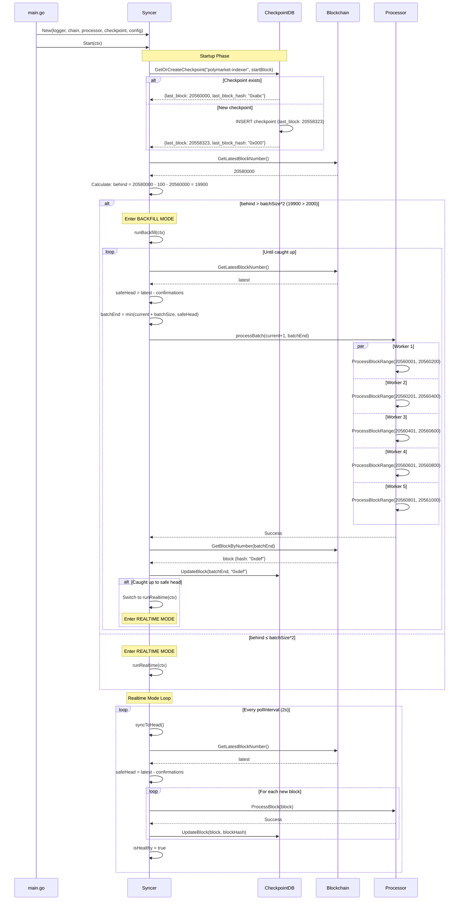

# Syncer Architecture

## Overview

The **Syncer** is the orchestration layer that coordinates blockchain synchronization for the Polymarket indexer. It bridges raw blockchain data from the RPC client to the processor that extracts meaningful events.

## Syncer State Machine

```mermaid
stateDiagram-v2
    [*] --> Startup
    Startup --> LoadCheckpoint
    
    LoadCheckpoint --> DetermineStrategy: checkpoint loaded
    
    DetermineStrategy --> Backfill: behind > batchSize*2
    DetermineStrategy --> Realtime: behind ≤ batchSize*2
    
    state Backfill {
        [*] --> FetchLatest
        FetchLatest --> CalculateSafeHead
        CalculateSafeHead --> CheckCaughtUp
        
        CheckCaughtUp --> ProcessBatch: not caught up
        CheckCaughtUp --> Realtime: caught up
        
        ProcessBatch --> SaveCheckpoint: success
        ProcessBatch --> RetryBatch: error
        
        RetryBatch --> ProcessBatch: after 5s delay
        
        SaveCheckpoint --> UpdateMetrics
        UpdateMetrics --> FetchLatest
    }
    
    state Realtime {
        [*] --> WaitPoll
        WaitPoll --> SyncToHead: every pollInterval (2s)
        
        SyncToHead --> FetchLatestRT: start sync
        FetchLatestRT --> CalculateSafeHeadRT
        CalculateSafeHeadRT --> CheckLag
        
        CheckLag --> AlreadyAtHead: behind = 0
        CheckLag --> ProcessSingle: 0 < behind ≤ batchSize*2
        CheckLag --> Backfill: behind > batchSize*2
        
        ProcessSingle --> SaveCheckpointRT: success
        ProcessSingle --> ErrorRetry: error
        
        SaveCheckpointRT --> WaitPoll
        AlreadyAtHead --> WaitPoll
        ErrorRetry --> WaitPoll: mark unhealthy
    }
    
    Backfill --> Realtime: mode switch
    Realtime --> Backfill: fell behind
    
    Startup --> [*]: context canceled
    Backfill --> [*]: context canceled
    Realtime --> [*]: context canceled
```

## Sequence Diagram: Syncer Lifecycle



## Purpose

Blockchain indexing requires handling two distinct scenarios:

1. **Historical Backfill**: When starting fresh or after downtime, the indexer needs to catch up quickly through thousands of historical blocks
2. **Realtime Tracking**: When near the chain head, the indexer needs low-latency updates as new blocks arrive

The syncer intelligently switches between these modes and handles:
- Checkpoint persistence (resume from crash)
- Block confirmation safety (avoid reorgs)
- Worker pool coordination (parallel processing)
- Health monitoring and metrics

## Architecture Diagram

```
┌─────────────────────────────────────────────────────────────────────────────┐
│                          SYNCER LIFECYCLE FLOW                               │
└─────────────────────────────────────────────────────────────────────────────┘

                                ┌──────────────┐
                                │   main.go    │
                                │  (indexer)   │
                                └──────┬───────┘
                                       │
                            1. syncer.Start(ctx)
                                       │
                                       ▼
                         ┌─────────────────────────┐
                         │  Load Checkpoint        │
                         │  ┌───────────────────┐  │
                         │  │ CheckpointDB      │  │
                         │  │ - last_block      │  │
                         │  │ - last_block_hash │  │
                         │  └───────────────────┘  │
                         │  Default: startBlock    │
                         │  from chains.json       │
                         └───────────┬─────────────┘
                                     │
                         2. Determine Strategy
                         (Calculate: behind = latest - confirmations - current)
                                     │
                  ┌──────────────────┴─────────────────┐
                  │                                     │
         behind > batchSize*2                   behind ≤ batchSize*2
         (e.g., 2000+ blocks)                   (e.g., 0-2000 blocks)
                  │                                     │
                  ▼                                     ▼
      ┌───────────────────────┐           ┌───────────────────────┐
      │   BACKFILL MODE       │           │   REALTIME MODE       │
      │  (Fast Catch-Up)      │           │  (Live Tracking)      │
      │                       │           │                       │
      │  Config:              │           │  Config:              │
      │  - batchSize: 1000    │           │  - pollInterval: 2s   │
      │  - workers: 5         │           │  - sequential: 1 blk  │
      └───────────────────────┘           └───────────────────────┘
                  │                                     │
      ┌───────────┴───────────┐            ┌───────────┴───────────┐
      │  Worker Pool          │            │  Polling Loop         │
      │  (Parallel)           │            │  (Sequential)         │
      └───────────┬───────────┘            └───────────┬───────────┘
                  │                                     │
                  ▼                                     ▼
   ┌──────────────────────────────┐      ┌──────────────────────────┐
   │  Split Batch into Chunks     │      │  Poll Every 2s           │
   │                              │      │                          │
   │  Batch: blocks 1-1000        │      │  Fetch latest block      │
   │  Workers: 5                  │      │  Process 1 block at time │
   │                              │      │                          │
   │  Worker 1: blocks 1-200      │      │  Block N → Processor     │
   │  Worker 2: blocks 201-400    │      │  Block N+1 → Processor   │
   │  Worker 3: blocks 401-600    │      │  Block N+2 → Processor   │
   │  Worker 4: blocks 601-800    │      │                          │
   │  Worker 5: blocks 801-1000   │      │  Save checkpoint after   │
   │                              │      │  each block              │
   │  Wait for all workers (sync) │      │                          │
   └──────────────┬───────────────┘      └──────────────┬───────────┘
                  │                                     │
                  ▼                                     ▼
   ┌──────────────────────────────┐      ┌──────────────────────────┐
   │  Save Checkpoint             │      │  Check if Fell Behind    │
   │                              │      │                          │
   │  - Update last_block         │      │  if behind > 2*batchSize │
   │  - Update last_block_hash    │      │  → Switch to BACKFILL    │
   │  - Update Prometheus metrics │      │                          │
   │    * syncer_height           │      │  else                    │
   │    * blocks_behind           │      │  → Continue REALTIME     │
   └──────────────┬───────────────┘      └──────────────┬───────────┘
                  │                                     │
                  │          ┌──────────────────────────┘
                  │          │
                  ▼          ▼
       ┌─────────────────────────────┐
       │  Auto Mode Switching        │
       │                             │
       │  Backfill → Realtime:       │
       │  - When: current ≥ safeHead │
       │  - Reason: Caught up        │
       │                             │
       │  Realtime → Backfill:       │
       │  - When: behind > 2*batch   │
       │  - Reason: Fell behind      │
       └─────────────────────────────┘
```

## Component Interactions

```
┌─────────────────────────────────────────────────────────────────────┐
│                        SYNCER DEPENDENCIES                           │
└─────────────────────────────────────────────────────────────────────┘

         ┌──────────────────────┐
         │       Syncer         │
         │  (Orchestrator)      │
         └──────────┬───────────┘
                    │
       ┌────────────┼────────────┐
       │            │            │
       ▼            ▼            ▼
  ┌────────┐  ┌─────────┐  ┌──────────┐
  │ Chain  │  │Processor│  │Checkpoint│
  │ Client │  │         │  │   DB     │
  └────┬───┘  └────┬────┘  └────┬─────┘
       │           │            │
       │           │            │
       ▼           ▼            ▼
  ┌────────┐  ┌─────────┐  ┌──────────┐
  │  RPC   │  │  NATS   │  │BoltDB/SQL│
  │Provider│  │JetStream│  │          │
  └────────┘  └─────────┘  └──────────┘
```

### Who Interacts with Syncer

| Component | Interaction | Direction | Purpose |
|-----------|-------------|-----------|---------|
| `cmd/indexer/main.go` | Creates syncer via `syncer.New()` and calls `syncer.Start()` | Caller → Syncer | Initialize and start sync |
| `internal/processor` | Syncer calls `processor.ProcessBlock()` or `processor.ProcessBlockRange()` | Syncer → Processor | Extract events from blocks |
| `internal/db/checkpoint` | Syncer calls `checkpoint.GetOrCreateCheckpoint()` and `checkpoint.UpdateBlock()` | Syncer → CheckpointDB | Save/load progress |
| `internal/chain/client` | Syncer calls `chain.GetLatestBlockNumber()` and `chain.GetBlockByNumber()` | Syncer → Chain | Fetch blockchain data |
| Prometheus | Syncer updates metrics (syncer_height, chain_height, blocks_behind, syncer_errors) | Syncer → Prometheus | Monitoring |
| HTTP `/health` | Health endpoint calls `syncer.Healthy()` | External → Syncer | Readiness probe |

## Sync Modes Comparison

| Aspect | Backfill Mode | Realtime Mode |
|--------|---------------|---------------|
| **When Used** | When behind > 2*batchSize blocks | When behind ≤ 2*batchSize blocks |
| **Processing** | Parallel (5 workers by default) | Sequential (1 block at a time) |
| **Batch Size** | 1000 blocks per batch | 1 block per iteration |
| **Polling** | Continuous (no delay) | Every 2s (pollInterval) |
| **Checkpoint** | After each batch completes | After each block |
| **Throughput** | High (5000 blocks/batch with 5 workers) | Low (1 block/2s = 30 blocks/min) |
| **Latency** | Variable (depends on batch size) | Low (~2s per block) |
| **Use Case** | Historical catch-up | Live event tracking |

## Trigger Flow

### Who Triggers Sync?

1. **Initial Trigger**: `main.go` calls `syncer.Start(ctx)`
2. **Self-Management**: Syncer runs continuously until context canceled
   - In **Backfill**: Loops continuously processing batches
   - In **Realtime**: Ticker fires every `pollInterval` (2s)

### How Often Does It Sync?

- **Backfill Mode**: As fast as possible (limited by RPC rate limits and worker count)
  - 5 workers × 1000 blocks/batch = potential 5000 blocks per cycle
  - Cycle time depends on RPC latency and event processing time
- **Realtime Mode**: Every `pollInterval` (default: 2 seconds)
  - Configured in `config.toml`: `syncer.poll_interval = "2s"`
  - Processes 1-N new blocks per cycle (where N = blocks confirmed since last poll)

## Configuration

### From `config.toml`

```toml
[syncer]
poll_interval = "2s"       # Polling frequency in realtime mode
batch_size = 1000          # Blocks per batch in backfill mode
confirmations = 100        # Wait N blocks before processing (reorg safety)
workers = 5                # Parallel workers for backfill
```

### From `chains.json`

```json
{
  "polygon": {
    "startBlock": 20558323,  // Block to start syncing from
    "confirmations": 100     // Can override config.toml
  }
}
```

### Configuration Priority

1. `chains.json` - Chain-specific data (startBlock, contract addresses)
2. `config.toml` - Runtime behavior (workers, batch size, poll interval)
3. Defaults in code - Fallback values

## Safety Mechanisms

### 1. Confirmations

```go
safeHead := latest - confirmations  // Only process blocks with N confirmations
```

- **Purpose**: Avoid processing blocks that might get reorganized
- **Default**: 100 confirmations (~3 minutes on Polygon)
- **Trade-off**: Higher confirmations = safer but slower

### 2. Checkpoint Persistence

```
┌─────────────────────────┐
│   Checkpoint Record     │
├─────────────────────────┤
│ service_name: "indexer" │
│ last_block: 20559000    │
│ last_block_hash: "0x..." │
│ updated_at: timestamp   │
└─────────────────────────┘
```

- **Saved After**: Every batch (backfill) or block (realtime)
- **Resume Point**: On restart, syncer loads checkpoint and resumes from `last_block`
- **Crash Recovery**: No duplicate processing or missed events

### 3. Health Monitoring

```go
s.isHealthy = true   // On successful sync
s.isHealthy = false  // On RPC or processing failure
```

- **Exposed Via**: `syncer.Healthy()` → `/health` endpoint
- **Used By**: Kubernetes readiness probes
- **Effect**: Unhealthy pods removed from service load balancer

### 4. Error Retry

```go
if err != nil {
    syncerErrors.WithLabelValues("get_latest_block").Inc()
    s.logger.Error().Err(err).Msg("failed to get latest block")
    time.Sleep(5 * time.Second)  // Exponential backoff could be added
    continue  // Retry same operation
}
```

- **Strategy**: Sleep and retry on transient errors
- **Metrics**: Errors tracked by type (get_latest_block, process_batch, etc.)
- **No Data Loss**: Syncer retries until success or context canceled

### 5. Context Cancellation

```go
select {
case <-ctx.Done():
    return ctx.Err()  // Graceful shutdown
case <-ticker.C:
    // Process blocks
}
```

- **Trigger**: SIGINT (Ctrl+C) or SIGTERM (Kubernetes pod deletion)
- **Effect**: Syncer stops processing and exits cleanly
- **Resume**: On restart, loads checkpoint and continues

## Metrics Exposed

### Prometheus Metrics

| Metric | Type | Description | Example |
|--------|------|-------------|---------|
| `polymarket_syncer_block_height` | Gauge | Current block syncer has processed | 20559500 |
| `polymarket_chain_block_height` | Gauge | Latest block from blockchain RPC | 20559600 |
| `polymarket_blocks_behind` | Gauge | How far behind chain head | 100 |
| `polymarket_syncer_errors_total` | Counter | Errors by type (get_latest_block, process_batch, etc.) | 5 |

### Monitoring Queries

```promql
# Syncer lag
polymarket_chain_block_height - polymarket_syncer_block_height

# Sync rate (blocks/sec)
rate(polymarket_syncer_block_height[1m])

# Error rate
rate(polymarket_syncer_errors_total[5m])

# Alert: Syncer is unhealthy
up{job="polymarket-indexer"} == 0
```

## Performance Characteristics

### Backfill Mode

- **Throughput**: 5 workers × 1000 blocks/batch = ~5000 blocks per batch cycle
- **Cycle Time**: Depends on:
  - RPC latency (100-500ms per `eth_getLogs` call)
  - Event density (more events = slower processing)
  - NATS publish latency (~1ms per event)
- **Estimated Speed**: 10,000-50,000 blocks/hour (highly variable)

### Realtime Mode

- **Latency**: ~2 seconds per block (pollInterval)
- **Throughput**: 1 block every 2s = 30 blocks/minute = 1,800 blocks/hour
- **Sufficient For**: Polygon block time is ~2s, so 1:1 sync rate

### Bottlenecks

1. **RPC Rate Limits**: Most providers limit requests/sec (10-25 req/s)
   - **Solution**: Use dedicated RPC or increase workers
2. **Event Density**: Blocks with many events take longer to process
   - **Solution**: Reduce batch size or increase workers
3. **NATS Backpressure**: If consumer can't keep up, NATS buffers events
   - **Solution**: Scale consumer replicas

## Usage Example

### From `cmd/indexer/main.go`

```go
// 1. Create dependencies
chainClient := chain.NewOnChainClient(...)
processor := processor.New(...)
checkpointDB := db.NewCheckpointDB(...)

// 2. Create syncer
syncer := syncer.New(
    logger,
    chainClient,
    processor,
    checkpointDB,
    syncer.Config{
        ServiceName:   "polymarket-indexer",
        StartBlock:    20558323,  // From chains.json
        BatchSize:     1000,      // From config.toml
        PollInterval:  2 * time.Second,
        Confirmations: 100,
        Workers:       5,
    },
)

// 3. Start syncer (blocks until context canceled)
if err := syncer.Start(ctx); err != nil {
    log.Fatal().Err(err).Msg("syncer failed")
}
```

## Comparison with Other Indexers

| Feature | Polymarket Syncer | The Graph | Subsquid |
|---------|-------------------|-----------|----------|
| **Mode Switching** | Automatic (backfill ↔ realtime) | Manual (backfill then realtime) | Automatic |
| **Parallelization** | Worker pool (configurable) | Sequential | Worker pool |
| **Checkpoint** | BoltDB/SQL | IPFS | PostgreSQL |
| **Health Checks** | Built-in | GraphQL health query | Built-in |
| **Metrics** | Prometheus | Prometheus | Prometheus |
| **Language** | Go | TypeScript/Rust | TypeScript |

## References

- Implementation: [internal/syncer/syncer.go](../internal/syncer/syncer.go)
- Processor: [internal/processor/processor.go](../internal/processor/processor.go)
- Checkpoint: [internal/db/checkpoint.go](../internal/db/checkpoint.go)
- Configuration: [config.toml](../config.toml) and [config/chains.json](../config/chains.json)
